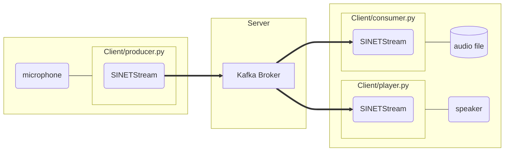

# audio streaming

Raspberry Piに接続したUSBマイクなどで集音した音声データをブローカに送信し、別のPCでそのデータを受信して音声ファイルに記録、または再生するシステムを構築します。システム構成を次図に示します。

構築するシステムは３つのパートから構成されます。

* 送信側
  * USBマイクなどで集音したデータをサーバに送信します(Client/producer.py)
* サーバ
  * 送信側と受信側の間で音声データの送受信を中継します
* 受信側
  * Kafkaブローカに送信された音声データを音声ファイルに保存します(Client/consumer.py)
  * Kafkaブローカに送信された音声データを再生します(Client/player.py)

サーバの構築手順は[/option/Server/Kafka/README.md](../option/Server/Kafka/README.md)に示したものと同じです。送信側、受信側の構築手順と実際に実行するスクリプトなどはサブディレクトリ[Client/](./Client/)に格納されています。
