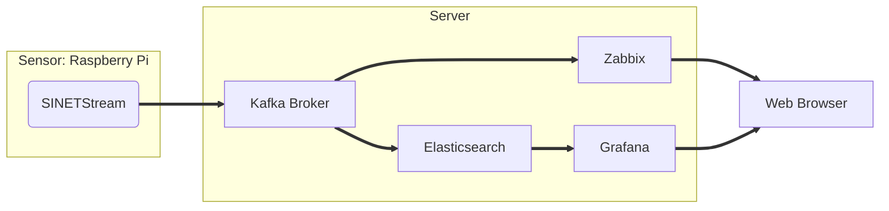

# Numerical Sensor Data

Send numerical values measured by sensors connected to Raspberry Pi to server for visualization with Zabbix/Grafana.

The system to be built consists of two parts:

* Sensor
  * Sends the values measured by the sensors connected to the Raspberry Pi to the server.
  * The measurement process for a sensor is different for each sensor actually connected. Here are some examples.
  * Sensor measurements are sent to the Kafka broker on the server via the [SINETStream library](https://www.sinetstream.net/).
  
* Server
  * The Kafka broker receives sensor readings sent from the Raspberry Pi.
  * Grafana/Zabbix visualizes the sensor readings sent to the Kafka broker.
  
Instructions and materials for building each part of the system are stored in a subdirectory.

* [Sensor/README.en.md](Sensor/README.en.md)
* [Server/README.en.md](Server/README.en.md)

All messages (sensor readings) sent and received in this system are exchanged via the Server's Kafka broker. Therefore, please build the Server first.
