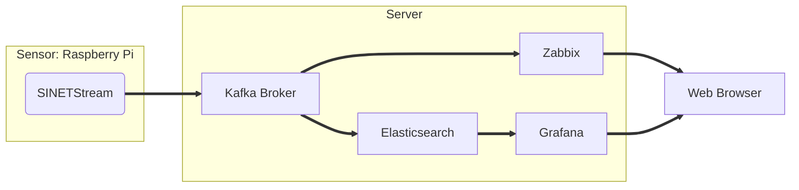

# numerical sensor data

Raspberry Piに接続したセンサーで計測した数値をサーバに送信し、Zabbix/Grafana で可視化を行います。

構築するシステムは２つのパートから構成されます。

* Sensor
  * Raspberry Pi に接続したセンサーで計測した数値をサーバに送信します
  * センサーの計測処理は実際に接続するセンサー毎に異なります。ここではいくつかの例を示します
  * センサーの計測値は [SINETStreamライブラリ](https://www.sinetstream.net/) によりサーバのKafkaブローカに送信されます

* Server
  * Raspberry Piから送信されたセンサーの計測値をKafkaブローカが受け取ります
  * Kafkaブローカに送信されたセンサーの計測値をGrafana/Zabbixでグラフ表示などの可視化を行います
  
システムの各パートの構築手順と構築のための資材がサブディレクトリに格納されています。

* [Sensor/README.md](Sensor/README.md)
* [Server/README.md](Server/README.md)

このシステムで送受信されるメッセージ（センサーの計測値）は、全て Server の Kafka ブローカを経由してやり取りされます。そのため Server の構築を始めに行ってください。
