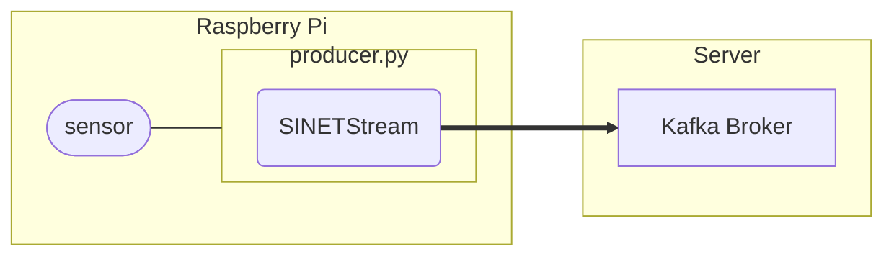

# Send sensor readings from a Raspberry Pi

Send the measurements from the sensor device connected to the Raspberry Pi to the Kafka broker using SINETStream.


<!--

-->

## 1. Prerequisites

* Raspberry Pi
  * The steps shown here have been tested on the Raspberry Pi OS.
* Python
  * Python 3.7 or later

The Kafka broker to which the sensor data will be sent must be available. Please build the Kafka broker in advance with one of the following configurations.

* [NumericalSensorData/Server/Kafka-Grafana](../Server/Kafka-Grafana/README.en.md)
* [NumericalSensorData/Server/Kafka-Zabbix](../Server/Kafka-Zabbix/README.en.md)
* [option/Server/Kafka](../../option/Server/Kafka/README.en.md)

## 2. Create a program to send sensor data

Create a Python script to send sensor measurements to the Kafka broker. Since the process of acquiring sensor readings differs for each sensor, this section first shows the steps for creating a send script, and then shows an example implementation for several sensors.

### 2.1. Creating the sending program

Create a Python script to send sensor readings to the Kafka broker. There are three main processes required.

1. calling the main loop process
1. preparing the sensor for use
1. reading measurements from the sensor

The main loop reads sensor data at regular intervals and sends the values to the Kafka broker. This is the function of the simple producer provided by [sinetstream-cmd](https://pypi.org/project/sinetstream-cmd/).

The following is an example implementation that serves as a model for a sender program. In this example, the program does not acquire values from the actual sensor, but uses random numbers as the sensor's measurement values.

```python
from random import seed, normalvariate
from sinetstream.cmd.producer import SimpleProducer


def get_sensor_data(device):
    """Read measurements from the sensor."""
    device["value"] += normalvariate(0, 5)
    return {"random": device["value"]}


def init():
    """"Prepare the sensor for use."""
    seed()
    return {"value": 50.0}


def main():
    """Call the main loop."""
    device = init()
    producer = SimpleProducer(lambda: get_sensor_data(device))
    producer.run()


if __name__ == "__main__":
    main()
```

> A file with the same contents as above can be found in [template/proudcer.py](template/producer.py). Use it as a template.

Descriptions of each process are given below.

#### 2.1.1. Calling the main loop

The process of calling the main loop is as follows:

```python
def main():
    device = init()
    producer = SimpleProducer(lambda: get_sensor_data(device))
    producer.run()
```

This process creates a `SimpleProducer` object provided by sinetstream-cmd and calls its method `run()`. The main loop is executed by calling the `run()` method.

In the main loop, the callback function specified in the constructor of `SimpleProducer` is called at regular intervals. Here, `lambda: get_sensor_data(device)` is specified as the callback function, so the sensor readings are read at regular intervals. The sensor readings returned by the callback function are sent to the Kafka broker by the main loop using the SINETStream functionality.

The main loop will continue unless interrupted by an error or signal notification. Therefore, `run()` is a method that never returns to the caller.

#### 2.1.2. Preparation for using the sensor

In this process, objects are created and initialized to use the sensor. In the previous example, we initialize the random number generator and set the initial values of the data.

```python
def init():
    seed()
    return {"value": 50.0}
```

When actually using the sensor, there is no specific interface for the process here, as each process is different. Implement the processing according to your needs. In general, the return value of this function is the object that operates the sensor. Check the specific processing in the implementation of each sensor shown in "[2.2. Implementation Examples] (#22-implementation-examples)".

#### 2.1.3. Process to read measured values from a sensor

This process implements a function that returns the measured value of the sensor. The return value of the function must conform to the following rules.

* The type of the return value should be a dictionary type (`dict`)
* The key must be a sensor type
* The value should be a measurement value of type `float` or `int`

In the previous example of the template, the current value plus a random number value is used as the return value of the function as a new measurement value.

```python
def get_sensor_data(device):
    device["value"] += normalvariate(0, 5)
    return {"random": device["value"]}
```

### 2.2. Implementation examples

The following are implementation examples for some sensors.

* DHT11: temperature/humidity sensor
    * Example implementation: [dht11/producer-dht11.py](dht11/producer-dht11.py)
    * Procedure: [dht11/README.en.md](dht11/README.en.md)
* [SHT3x](https://sensirion.com/jp/products/product-catalog/?filter_series=370b616d-de4c-469f-a22b-e5e8737481b5): Temperature/humidity sensor
    * Example implementation: [sht3x/producer-sht3x.py](sht3x/producer-sht3x.py)
    * Procedure: [sht3x/README.en.md](sht3x/README.en.md)
* [SCD41](https://sensirion.com/jp/products/product-catalog/SCD41/): CO2 sensor
    * Implementation example: [scd41/producer-scd41.py](scd41/producer-scd41.py)
    * Procedure: [scd41/README.en.md](scd41/README.en.md)

## 3. Execute the program to send sensor data

### 3.1. Install the library

Install the Python libraries that the transmitter program will use.

```console
$ pip install -U --user sinetstream-kafka sinetstream-cmd
````

> If you get an error because of conflicts with libraries you have already installed, use [venv](https://docs.python.org/ja/3/library/venv.html) or [pipenv](https://github.com/pypa/pipenv). Also, the `pip` command may be `pip3` in some environments. Replace it as necessary.

In addition to this, a library for using sensors is required to perform sensor measurements on Raspberry Pi. The libraries for using the sensors are different, so please install the appropriate one. The installation procedure for each sensor is shown in [2.2. Implementation Examples](#22-implementation-examples).

### 3.2. Configuration File

The sensor data transmission program uses the [SINETStream](https://www.sinetstream.net/) library to send measurements to the Kafka broker. SINETStream requires parameters such as the address of the message brokers, topic name, and type to be described in the configuration file `.sinetstream_config.yml`. An example of the configuration file is shown below.

```yaml
sensors:
  topic: sinetstream.sensor
  brokers: kafka.example.org:9092
  type: kafka
  consistency: AT_LEAST_ONCE
```

Modify the values of `brokers` and `topic` to match your environment. See [SINETstream - Configuration File](https://www.sinetstream.net/docs/userguide/config.html) for details on how to write `sinetstream_config.yml`, including other parameters. The configuration file should be placed in the same directory as the sending script.

> A file [example_sinetstream_config.yml](example_sinetstream_config.yml) with the same contents as the example is located in this directory. Use it as a template.

The data sent to the Kafka broker by the send program includes the sensor type and the hostname of the sender, so you can specify the same topic name for all sensor types and clients.

### 3.3. Executing the send program

This section describes the command line arguments of the send script.

``` .
$ . /producer.py --help
usage: producer.py [-h] [-s SERVICE] [-n NODE_NAME] [-I INTERVAL] [-v] [-R MAX_RETRY]

SINETStream Producer

optional arguments:
  -h, --help show this help message and exit
  -s SERVICE, --service SERVICE
  -n NODE_NAME, --name NODE_NAME
  -I INTERVAL, --interval INTERVAL
  -v, --verbose
  -R MAX_RETRY, --retry MAX_RETRY
```

* `-n`
    * hostname of data source
    * default value: ホスト名
* `-I`
    * Sensor measurement interval
    * Default value: 60 (seconds)
* `-v`
    * Display transmitted data on console
* `-s`
    * Service names defined in the SINETStream configuration file
    * Default value: `sensors`
* `-R`
    * Number of retries on error
    * If a negative value is specified, retry indefinitely
    * Default value: -1

### 3.4. Service Registration

If you want the sensor data transmission program to run constantly on the Raspberry Pi, registering it as a systemd service makes it easier to manage. This will make it possible to automatically run the sending program when the Raspberry Pi starts up, or to rerun the program when an error occurs.

The procedure for registering the transmission program as a service in systemd and starting it is shown below.

1. Create a configuration file for the service to be registered.
2. Instruct systemd to load the configuration file.
3. Start the service.
4. Configure automatic startup of the service.

> All of the above steps require administrator privileges. Please use `sudo` or similar to obtain administrator privileges.

#### 3.4.1. Create configuration file

Create a systemd configuration file in `/etc/systemd/system/`. The file name should be suffixed with `.service`, for example `sensor.service`. An example configuration file is shown below.

```ini
[Unit]
Description=Send sensor data

[Service]
Type=simple
User=user01
WorkingDirectory=/home/user01/sensor
ExecStart=/home/user01/sensor/producer.py
Restart=always

[Install]
WantedBy=multi-user.target
```

Change `Description`, `User`, `WorkingDirectory`, and `ExecStart` appropriately for your actual environment. Specify the path to the sending program in ``ExecStart`` and the directory where the SINETStream configuration file `.sinetstream_config.yml` is located in ``WorkingDirectory``. Also, for `User`, specify the user name under which you want to run the program. Specifying `User` is necessary to use libraries installed in the user's `$HOME/.local/lib/` from the sending program.

> A file [example_sensor.service](example_sensor.service) with the same contents as the description example is located in this directory. Use it as a template.

#### 3.4.2. Instruct systemd to read the configuration file

To tell systemd to read the configuration file you created in `/etc/systemd/system/`, issue the following command.

```console
$ sudo systemctl daemon-reload
````

Confirm that the service has been registered with the `systemctl status` command. The following is an example of execution when the service is registered with the service name ``sensor``.

```console
$ sudo systemctl status sensor
● sensor.service - Send sensor data
     Loaded: loaded (/etc/systemd/system/sensor.service; disabled; vendor prese>
     Active: inactive (dead)
```

#### 3.4.3. Start the service

Start the registered service with the `systemctl start` command.

The following is an example of execution when the service is registered with the service name `sensor`. After starting the service with `systemctl start`, check the status with `systemctl status`.

```console
$ sudo systemctl start sensor
$ sudo systemctl status sensor
● sensor.service - Send sensor data
     Loaded: loaded (/etc/systemd/system/sensor.service; disabled; vendor prese>
     Active: active (running) since Wed 2022-02-09 02:57:05 GMT; 3s ago
   Main PID: 732 (python)
      Tasks: 1 (limit: 4915)
        CPU: 2.395s
     CGroup: /system.slice/sensor.service
             └─732 python ./producer.py

Feb 09 02:57:05 raspberrypi systemd[1]: Started Send sensor data.
```

#### 3.4.4. Configuring automatic startup of services

Configure the registered service to start automatically when the Raspberry Pi is started. Run the `systemctl enable` command with the service name.

The following is an example of execution when the service name is registered as ``sensor``.

```console
$ sudo systemctl enable sensor
Created symlink /etc/systemd/system/multi-user.target.wants/sensor.service → /etc/systemd/system/sensor.service.
```

## 4. Check operation

[consumer.py](../../option/Consumer/NumericalSensorData/text-consumer/consumer.py) to check the sensor data sent from the RaspberryPi. For instructions on how to run consumer.py, please refer to the following link.

* [option/Consumer/NumericalSensorData/text-consumer/README.en.md](../../option/Consumer/NumericalSensorData/text-consumer/README.en.md)

Specify the same values for the message broker addresses (brokers), topic name (topic), and type (type) in the `.sinetstream_config.yml` configuration file for consumer.py as for the sensor data transmission program.