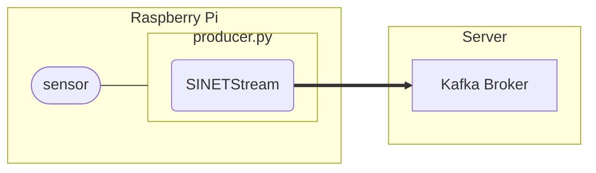

# Raspberry Piからセンサーの測定値を送信する

Raspberry Piに接続されたセンサーデバイスの測定値を SINETStream を利用してKafkaブローカに送信します。


<!--

-->

## 1. 前提条件

* Raspberry Pi
  * ここで示す手順は Raspberry Pi OS で動作確認を行っています
* Python
  * 3.7 以降

センサーデータの送信先となる Kafka ブローカが利用可能な状態になっている必要があります。以下に示すいずれかの構成でKafkaブローカを事前に構築してください。

* [NumericalSensorData/Server/Kafka-Grafana](../Server/Kafka-Grafana/README.md)
* [NumericalSensorData/Server/Kafka-Zabbix](../Server/Kafka-Zabbix/README.md)
* [option/Server/Kafka](../../option/Server/Kafka/README.md)

## 2. センサーデータの送信プログラムを作成する

センサーの測定値を Kafka ブローカに送信する Python スクリプトを作成します。センサーの測定値を取得する処理はセンサー毎に異なるので、ここではまず送信スクリプトの作成手順を示し、その後いくつかのセンサーに対する実装例を示します。

### 2.1. 送信プログラムの作成手順

センサーの測定値を Kafka ブローカに送信する Python スクリプトを作成します。 主に三つの処理が必要となります。

1. メインループを呼び出す処理
1. センサーを利用するための準備処理
1. センサーから測定値を読み出す処理

メインループは一定時間毎にセンサーのデータを読み出しその値をKafkaブローカに送信します。これは[sinetstream-cmd](https://pypi.org/project/sinetstream-cmd/) が提供する簡易プロデューサの機能になります。

送信プログラムのひな型となる実装例を以下に示します。この例では実際のセンサーから値を取得するのではなく乱数値をセンサーの測定値に見立てた実装となっています。

```python
from random import seed, normalvariate
from sinetstream.cmd.producer import SimpleProducer


def get_sensor_data(device):
    """センサーから測定値を読み出す処理"""
    device["value"] += normalvariate(0, 5)
    return {"random": device["value"]}


def init():
    """"センサーを利用するための準備処理"""
    seed()
    return {"value": 50.0}


def main():
    """メインループを呼び出す処理"""
    device = init()
    producer = SimpleProducer(lambda: get_sensor_data(device))
    producer.run()


if __name__ == "__main__":
    main()
```

> 上記と同じ内容のファイルが [template/proudcer.py](template/producer.py)にあります。テンプレートとして利用してください。

それぞれの処理についての説明を以下に記します。

#### 2.1.1. メインループを呼び出す処理

メインループを呼び出す処理は以下のようになります。

```python
def main():
    device = init()
    producer = SimpleProducer(lambda: get_sensor_data(device))
    producer.run()
```

この処理では sinetstream-cmd が提供する `SimpleProducer` オブジェクトを作成して、そのオブジェクトのメソッド `run()` を呼び出すという流れになっています。`run()`メソッドの呼び出しによりメインループが実行されます。

メインループでは `SimpleProducer` のコンストラクタに指定したコールバック関数を一定時間ごとに呼び出します。ここでは`lambda: get_sensor_data(device)` をコールバック関数として指定しているので、一定時間ごとにセンサーの測定値を読み出すことになります。またコールバック関数から返されたセンサーの測定値は、メインループによりSINETStreamの機能を利用して Kafka ブローカに送信されます。

メインループはエラーやシグナル通知などで中断さない限り継続して処理が行われます。そのため `run()` は呼び出し元に処理が戻ることのないメソッドになります。

#### 2.1.2. センサーを利用するための準備処理

この処理ではセンサーを利用するためのオブジェクト作成や初期化処理を行います。 先に示したひな型の例では乱数生成器の初期化とデータの初期値を設定しています。

```python
def init():
    seed()
    return {"value": 50.0}
```

実際にセンサーを利用する場合、ここでの処理はそれぞれ異なるため特に定められたインタフェースはありません。必要に応じた処理を実装してください。一般的にはセンサーを操作するオブジェクトをこの関数の返り値とすることになります。「[2.2 実装例](#22-実装例)」に示す各センサーの実装で具体的な処理を確認してください。

#### 2.1.3. センサーから測定値を読み出す処理

この処理ではセンサーの測定値を返す関数を実装します。関数の返り値は以下のルールに沿ったものにする必要があります。

* 返り値の型は辞書型(`dict`)とする
* キーにはセンサー種別を指定する
* バリューには`float`型または`int`型の測定値を指定する

先に示したひな型の例では、現在値に乱数値を加えたものを新たな測定値として関数の返り値にしています。

```python
def get_sensor_data(device):
    device["value"] += normalvariate(0, 5)
    return {"random": device["value"]}
```

### 2.2. 実装例

いくつかのセンサーにおける実装例を示します。

* DHT11: 温度湿度センサー
    * 実装例: [dht11/producer-dht11.py](dht11/producer-dht11.py)
    * 手順書: [dht11/README.md](dht11/README.md)
* [SHT3x](https://sensirion.com/jp/products/product-catalog/?filter_series=370b616d-de4c-469f-a22b-e5e8737481b5): 温度湿度センサー
    * 実装例: [sht3x/producer-sht3x.py](sht3x/producer-sht3x.py)
    * 手順書: [sht3x/README.md](sht3x/README.md)
* [SCD41](https://sensirion.com/jp/products/product-catalog/SCD41/): CO2センサー
    * 実装例: [scd41/producer-scd41.py](scd41/producer-scd41.py)
    * 手順書: [scd41/README.md](scd41/README.md)

## 3. センサーデータの送信プログラムを実行する

### 3.1. ライブラリのインストール

送信プログラムが利用する Python ライブラリをインストールします。

```console
$ pip install -U --user sinetstream-kafka sinetstream-cmd
```

> 既にインストールしているライブラリとconflictしてしまいエラーとなる場合は [venv](https://docs.python.org/ja/3/library/venv.html) や [pipenv](https://github.com/pypa/pipenv) などの仮想環境の利用を検討してください。また環境によっては `pip` コマンドは `pip3` となっていることがあります。必要に応じて読み替えて下さい。

Raspberry Piでセンサーでの計測を行うためには、これに加えてにセンサーを利用するためのライブラリが必要となります。センサーを利用するためのライブラリはそれぞれ異なるので適切なものをインストールしてください。[2.2 実装例](#22-実装例)に示した手順書では各センサーに対応するライブラリのインストール手順も示しています。

### 3.2. 設定ファイル

センサーデータ送信プログラムでは[SINETStream](https://www.sinetstream.net/)ライブラリを利用して Kafka ブローカに測定値を送信します。SINETStreamではメッセージブローカのアドレス(brokers)、トピック名(topic)、タイプ(type)などのパラメータを設定ファイル`.sinetstream_config.yml`に記述しておく必要があります。設定ファイルの記述例を以下に示します。

```yaml
sensors:
  topic: sinetstream.sensor
  brokers: kafka.example.org:9092
  type: kafka
  consistency: AT_LEAST_ONCE
```

`brokers` と `topic` の値を実行環境に合せて修正してください。他パラメータなど `.sinetstream_config.yml` の記述方法の詳細については [SINETStream - 設定ファイル](https://www.sinetstream.net/docs/userguide/config.html) を参照してください。設定ファイルは送信スクリプトと同じディレクトリに配置してください。

> 記述例と同じ内容のファイル[example_sinetstream_config.yml](example_sinetstream_config.yml)がこのディレクトリにあります。テンプレートとして利用してください。

送信プログラムによりKafkaブローカに送られるデータにはセンサー種別と送信元のホスト名が含まれているため全てのセンサータイプ、クライアントで同じトピック名を指定することができます。

### 3.3. 送信プログラムの実行

送信スクリプトのコマンドライン引数について説明します。

```
$ ./producer.py --help
usage: producer.py [-h] [-s SERVICE] [-n NODE_NAME] [-I INTERVAL] [-v] [-R MAX_RETRY]

SINETStream Producer

optional arguments:
  -h, --help            show this help message and exit
  -s SERVICE, --service SERVICE
  -n NODE_NAME, --name NODE_NAME
  -I INTERVAL, --interval INTERVAL
  -v, --verbose
  -R MAX_RETRY, --retry MAX_RETRY
```

* `-n`
    * データ送信元のホスト名
    * デフォルト値: ホスト名
* `-I`
    * センサーの測定間隔
    * デフォルト値: 60 (秒)
* `-v`
    * 送信データをコンソールに表示する
* `-s`
    * SINETStream設定ファイルに定義されているサービス名
    * デフォルト値: `sensors`
* `-R`
    * エラー時のリトライ回数
    * マイナスの値が指定された場合は無限にリトライを行う
    * デフォルト値: -1

### 3.4. サービス登録

センサーデータ送信プログラムをRaspberry Piで常時稼働させる場合 systemd のサービスとして登録すると管理が容易になります。systemdに登録することで Raspberry Pi の起動時に自動的に送信プログラムを実行したり、エラー終了時の再実行などが可能となります。

送信プログラムをsystemdにサービスとして登録し、起動する手順を以下に示します。

1. 登録するサービスの設定ファイルを作成する
2. systemd に設定ファイルを読み込むように指示する
3. サービスを起動する
4. サービスの自動起動を設定する

> 上記の全ての手順で管理者権限が必要となります。`sudo` などで管理者権限を得るようにしてください。

#### 3.4.1. 設定ファイルを作成する

`/etc/systemd/system/` にsystemdの設定ファイルを作成してください。ファイル名は `sensor.service` のように、サフィックスとして `.service` を付けてください。設定ファイルの例を以下に示します。

```ini
[Unit]
Description=Send sensor data

[Service]
Type=simple
User=user01
WorkingDirectory=/home/user01/sensor
ExecStart=/home/user01/sensor/producer.py
Restart=always

[Install]
WantedBy=multi-user.target
```

`Description`, `User`, `WorkingDirectory`, `ExecStart` を実際の環境に合せて適切に変更してください。`ExecStart`には送信プログラムのパスを、`WorkingDirectory` にはSINETStreamの設定ファイル`.sinetstream_config.yml`を配置したディレクトリを指定してください。また `User` には実行するユーザ名を指定してください。`User`を指定するのは、ユーザの`$HOME/.local/lib/` にインストールされているライブラリを送信プログラムから利用するために必要となります。

> 記述例と同じ内容のファイル[example_sensor.service](example_sensor.service)がこのディレクトリにあります。テンプレートとして利用してください。

#### 3.4.2. systemd に設定ファイルを読み込むように指示する

`/etc/systemd/system/` に作成した設定ファイルを systemd に読み込ませるために、以下のコマンドを実行してください。

```console
$ sudo systemctl daemon-reload
```

`systemctl status`コマンドで、サービスが登録されたことを確認します。サービス名を`sensor`で登録した場合の実行例を以下に示します。

```console
$ sudo systemctl status sensor
● sensor.service - Send sensor data
     Loaded: loaded (/etc/systemd/system/sensor.service; disabled; vendor prese>
     Active: inactive (dead)
```

#### 3.4.3. サービスを起動する

`systemctl start`コマンドで登録したサービスを起動します。

サービス名を`sensor`で登録した場合の実行例を以下に示します。`systemctl start`でサービスを起動した後に`systemctl status`で状態を確認しています。

```console
$ sudo systemctl start sensor
$ sudo systemctl status sensor
● sensor.service - Send sensor data
     Loaded: loaded (/etc/systemd/system/sensor.service; disabled; vendor prese>
     Active: active (running) since Wed 2022-02-09 02:57:05 GMT; 3s ago
   Main PID: 732 (python)
      Tasks: 1 (limit: 4915)
        CPU: 2.395s
     CGroup: /system.slice/sensor.service
             └─732 python ./producer.py

Feb 09 02:57:05 raspberrypi systemd[1]: Started Send sensor data.
```

#### 3.4.4. サービスの自動起動を設定する

登録したサービスを Raspberry Pi が起動した時に自動的に開始されるように設定します。サービス名を指定して`systemctl enable`コマンドを実行してください。

サービス名を`sensor`で登録した場合の実行例を以下に示します。

```console
$ sudo systemctl enable sensor
Created symlink /etc/systemd/system/multi-user.target.wants/sensor.service → /etc/systemd/system/sensor.service.
```

## 4. 動作確認

[consumer.py](../../option/Consumer/NumericalSensorData/text-consumer/consumer.py)を利用することでRaspberryPiから送信したセンサーデータを確認することができます。consumer.pyの実行手順については以下のリンク先を参照してください。

* [option/Consumer/NumericalSensorData/text-consumer/README.md](../../option/Consumer/NumericalSensorData/text-consumer/README.md)

consumer.pyの設定ファイル `.sinetstream_config.yml` に指定するメッセージブローカのアドレス(brokers)、トピック名(topic)、タイプ(type)には、センサーデータの送信プログラムと同じ値を指定してください。