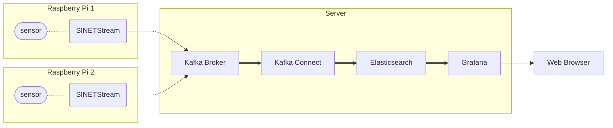

# Visualizing and monitoring sensor data with Grafana

Sensor data sent from the Raspberry Pi is collected by [Elasticsearch](https://www.elastic.co/jp/elasticsearch/) and then visualized and monitored by [Grafana](https://grafana.com/grafana/) to visualize and monitor the data.

- [1. Configuration](#1-configuration)
  - [1.1. Version](#11-version)
  - [1.2. Limitations](#12-limitations)
- [2. Preparation](#2-preparation)
  - [2.1. Docker](#21-docker)
- [3. Building Kafka Broker](#3-building-kafka-broker)
  - [3.1. Deploying Materials](#31-deploying-materials)
  - [3.2. Parameter Settings](#32-parameter-settings)
  - [3.3. Running the Container](#33-running-the-container)
  - [3.4. Checking Operation](#34-checking-operation)
- [4. Building Elasticsearch](#4-building-elasticsearch)
  - [4.1. Deploying Materials](#41-deploying-materials)
  - [4.2. Running the Container](#42-running-the-container)
- [5. Building Kafka Connect](#5-building-kafka-connect)
  - [5.1. Deploying Materials](#51-deploying-materials)
  - [5.2. Parameter Settings](#52-parameter-settings)
  - [5.3. Running the Container](#53-running-the-container)
  - [5.4. Registering the Connector](#54-registering-the-connector)
  - [5.5. Elasticsearch Index Names](#55-elasticsearch-index-names)
  - [5.6. Sending Test Data](#56-sending-test-data)
- [6. Building Grafana](#6-building-grafana)
  - [6.1. Deploying Materials](#61-deploying-materials)
  - [6.2. Parameter Settings](#62-parameter-settings)
  - [6.3. Running the Container](#63-running-the-container)
  - [6.4. Viewing the Dashboard](#64-viewing-the-dashboard)
  - [6.5. Sending Test Data](#65-sending-test-data)

## 1. Configuration



The server we are building here consists of four components:

- Kafka Broker
  - Kafka Broker, which receives sent sensor data
- Kafka Connect
  - A framework for passing data between Kafka and other components
  - Used to forward messages from the Kafka broker to Elasticsearch
- Elasticsearch
  - Search/analysis engine
  - Used as the final destination for sensor data
- Grafana
  - Visualize sensor data stored in Elasticsearch

Each component can run on the same node or on separate nodes.

### 1.1. Version

The version of each software component is listed below.

|software|version|
|---|---|
|[Apache Kafka](https://kafka.apache.org/)|3.4.0|
|[ElasticSearch Sink Connector](https://www.confluent.io/hub/confluentinc/kafka-connect-elasticsearch)|14.0.6|
|[Elasticsearch](https://www.elastic.co/jp/elasticsearch/)|7.17.10|
|[Grafana](https://grafana.com/grafana/)|9.5.2|

### 1.2. Limitations

The system built here is intended to show an example of a system built using SINETStream. Therefore, the Kafka broker and Elasticserch are configured as follows in order to simplify the construction.

- Kafka broker
  - 1 node configuration
  - No encryption of communication paths
  - No authentication
- Elasticsearch
  - 1 node configuration
  - No encryption of communication channel
  - No authentication

When using the system in actual operation, please take appropriate measures as necessary, such as using a multi-node configuration.

## 2. Preparation

### 2.1. Docker

Each component to be executed on the server runs as a Docker container. Therefore, Docker Engine and other software must be installed in advance.

#### 2.1.1. Docker Engine

Please refer to the following page to install Docker Engine. 19.03.0 or later version of Docker is required.

- [Install Docker Engine on CentOS](https://docs.docker.com/engine/install/centos/)
- [Install Docker Engine on Ubuntu](https://docs.docker.com/engine/install/ubuntu/)
- [Install Docker Engine on Debian](https://docs.docker.com/engine/install/debian/)

As noted in the installation instructions above, adding users to the `docker` group will allow them to run `docker` commands without administrative privileges. Please configure the group settings as needed.

```console
sudo gpasswd -a $USER docker
```

The following description assumes that you can execute `docker` commands without administrative privileges.

#### 2.1.2. Docker Compose

[Docker Compose](https://github.com/docker/compose) is used to manage multiple containers and container startup parameters in a configuration file.

The installation procedure for Docker Compose is shown below. Here are the installation instructions for Docker Compose v2.

```console
sudo mkdir -p /usr/local/libexec/docker/cli-plugins
sudo curl -L https://github.com/docker/compose/releases/download/v2.18.1/docker-compose-linux-x86_64 -o /usr/local/libexec/docker/cli-plugins/docker-compose
sudo chmod +x /usr/local/libexec/docker/cli-plugins/docker-compose
```

To verify that it has been installed, let's display the version.

```console
$ docker compose version
Docker Compose version v2.18.1
```

> All examples shown in this document are for Docker Compose v2. If you are using Docker Compose v1, run with `docker-compose` instead of `docker compose`. Docker Compose version 1.27.1 or higher is required.

## 3. Building Kafka Broker

### 3.1. Deploying Materials

Place the files in the subdirectory `kafka/` on the node where you will build the Kafka broker.

### 3.2. Parameter Settings

Parameters of the Kafka broker are set as environment variables of the container. Container environment variables are set by creating `.env` file in the same directory as `docker-compose.yml` and describing them in that file.

#### 3.2.1. Format

`.env` is a file in which each line is formatted as "(parameter name)=(value)". An example is shown below.

```bash
BROKER_HOSTNAME=kafka.example.org
```

In this example, ``kafka.example.org`` is specified as a value for the parameter ``BROKER_HOSTNAME``.

> An example .env file can be found in [kafka/example_dot_env](kafka/example_dot_env). Use it as a template.

See [Docker Compose/Environment File#Syntax rules](https://docs.docker.com/compose/env-file/#syntax-rules) for details on the `.env` format.

#### 3.2.2. BROKER_HOSTNAME

Specifies the host name or IP address to be given to the client as the address of the KAFKA broker.

If an IP address is specified, the client must be able to access the server at that IP address. If you specify a hostname, the hostname must be resolvable and accessible via DNS or `/etc/hosts` in the client environment.

#### 3.2.3. Kafka Broker Properties

The configuration parameters for the Kafka broker can be specified as described in [Kafka Documentation - 3.1 Broker Configs](https://kafka.apache.org/documentation/#brokerconfigs). In the Confluent Kafka container used here, Kafka broker properties can be set using the container's environment variables. The environment variable name to be specified in this case is the name of the property to be set for the Kafka broker, converted using the following rules.

- Prefix the environment variable name with `KAFKA_`
- Convert to all uppercase
- Convert periods `.` to underscores `_`
- Replace hyphens `-` with a 2-letter underscore `__`.
- replace an underscore `_` with a three-letter underscore `___`

For example, the property `message.max.bytes` is specified as the environment variable `KAFKA_MESSAGE_MAX_BYTES`.

For details on how to specify environment variables, see [Confluent Kafka configuration](https://docs.confluent.io/platform/current/installation/docker/config-reference.html#confluent-ak-configuration).

### 3.3. Running the Container

Execute the following command in the directory where you placed `docker-compose.yml` on the node where you want to run Kafka.

```console
docker compose up -d
```

> Here is an example of running Docker Compose v2; if you are using v1, use `docker-compose` instead of `docker compose`.

Check the state of the container.

```console
$ docker compose ps 
NAME                COMMAND                  SERVICE             STATUS              PORTS
broker              "/etc/confluent/dock…"   broker              running             
zookeeper           "/etc/confluent/dock…"   zookeeper           running             
```

Make sure that the state (STATUS) of the `broker` and `zookeeper` containers are both `running`.

If the STATUS value is not `running`, check the container logs to determine the cause of the error.

```console
docker compose logs
```

### 3.4. Checking Operation

You can confirm that the Kafka broker is ready to use by running the test producer and consumer. For instructions on how to run each of the test programs, please review the instructions at the following links.

- Producer
  - [NumericalSensorData/Sensor/template/README](../../Sensor/template/README.en.md)
- Consumer
  - [option/Consumer/NumericalSensorData/text-consumer/README.en.md](../../../option/Consumer/NumericalSensorData/text-consumer/README.en.md)

## 4. Building Elasticsearch

### 4.1. Deploying Materials

Place the files in the subdirectory `elasticsearch/` on the node where you want to run Elasticsearch.

### 4.2. Running the Container

Execute the following command on the node where you want to run Elasticsearch.

```console
docker compose up -d
```

Check the status of the container.

```console
$ docker compose ps
NAME                            COMMAND                  SERVICE             STATUS              PORTS
elasticsearch-elasticsearch-1   "/bin/tini -- /usr/l…"   elasticsearch       running             0.0.0.0:9200->9200/tcp, 0.0.0.0:9300->9300/tcp, :::9200->9200/tcp, :::9300->9300/tcp
```

Make sure that the STATUS is `running`.

Elasticsearch will take a while to start; to check the status of Elasticsearch, use [Cluster health API](https://www.elastic.co/guide/en/elasticsearch/reference/7.17/cluster-health.html). Run the following command and make sure the status is `green`.

```console
$ curl -s http://localhost:9200/_cluster/health?pretty
{
  "cluster_name" : "docker-cluster",
  "status" : "green",
  "timed_out" : false,
  "number_of_nodes" : 1,
  "number_of_data_nodes" : 1,
  "active_primary_shards" : 21,
  "active_shards" : 21,
  "relocating_shards" : 0,
  "initializing_shards" : 0,
  "unassigned_shards" : 0,
  "delayed_unassigned_shards" : 0,
  "number_of_pending_tasks" : 0,
  "number_of_in_flight_fetch" : 0,
  "task_max_waiting_in_queue_millis" : 0,
  "active_shards_percent_as_number" : 100.0
}
```

The Elasticsearch started in this step has one node configuration, and the number of replicas is set to 1 by default in Elasticsearch, so indexing in this state will result in a status of `yellow`. In order to deal with this, the default setting of Elasticsearch is to create one node. To deal with this, the default number of replicas can be changed. Run `setup.sh` in the same directory as `docker-compose.yml`.

```console
$ setup.sh
{"acknowledged":true}
```

If it runs successfully, you will see `{"acknowledged":true}`. Also, make sure that the value of `number_of_replicas` is 0 by executing the following command:

```console
$ curl -s http://localhost:9200/_index_template/template_1?pretty
{
  "index_templates" : [
    {
      "name" : "template_1",
      "index_template" : {
        "index_patterns" : [
          "*"
        ],
        "template" : {
          "settings" : {
            "index" : {
              "number_of_shards" : "1",
              "number_of_replicas" : "0"
            }
          }
        },
        "composed_of" : [ ],
        "priority" : 10
      }
    }
  ]
}
```

## 5. Building Kafka Connect

### 5.1. Deploying Materials

Place the files in the subdirectory ``kafka-connect-es/`` on the node where you want to run Kafka Connect.

### 5.2. Parameter Settings

Set parameters by container environment variables. Create `.env` in the directory where you placed `docker-compose.yml` and write the parameters there. An example of `.env` configuration can be found in [kafka-connect-es/example_dot_env](kafka-connect-es/example_dot_env).

The following table shows the parameters that must be set.

| Environment variable name | Description                                   | Example                           |
|---------------------------|-----------------------------------------------|-----------------------------------|
| BROKER_HOSTNAME           | Hostname of the Kafka broker                  | BROKER_HOSTNAME=kafka.example.org |
| KAFKA_TOPIC               | Topic name to which sensor data is sent       | KAFKA_TOPIC=sinetstream.sensor    |
| ES_URL                    | Elasticsearch URL where sensor data is stored | ES_URL=http://es.example.org:9200 |

### 5.3. Running the Container

Run the following command on the node where you want to run Kafka Connect.

```console
docker compose up -d
```

Check the status of the container, making sure that the STATUS is `running`.

```console
$ docker compose ps
NAME                               COMMAND                  SERVICE             STATUS              PORTS
kafka-connect-es-kafka-connect-1   "/etc/confluent/dock…"   kafka-connect       running (healthy)   0.0.0.0:8083->8083/tcp, :::8083->8083/tcp
```

After the container is started, it takes a few minutes for the Kafka Connect startup process to complete; STATUS is `running (starting)` during the Kafka Connect startup process, but becomes `running (healthy)` when the startup process is complete.

Once the startup process is complete, you can use Kafka Connect's REST API.

```console
$ curl -s http://localhost:8083/ | jq .
{
  "version": "7.1.0-ccs",
  "commit": "c86722379ab997cc",
  "kafka_cluster_id": "F0HMuvEfS0ejreUXlHvAOQ"
}
```

> The above example uses the `jq` command to format and display the output JSON. Please install the `jq` command in a package or omit the "`| jq .`" from the execution command.

If you specify a hostname (not an IP address) as the `BROKER_HOSTNAME` value in the `.env` of the Kafka broker, Kafka Connect must be able to resolve the name of the host in its environment. If you specify a hostname that is not registered in DNS, etc. as `BROKER_HOSTNAME`, please make sure to enable name resolution for the Kafka broker by specifying [extra_hosts](https://docs.docker.com/compose/compose-file/compose-file-v3/#extra_hosts) in `docker-compose.yml`. An example of specifying extra_hosts in `docker-compose.yml` is shown below with the change diff. In this example, an entry for the Kafka broker `kafka.example.org` with IP address `192.168.1.100` is registered in `extra_hosts`.

```diff
@@ -19,3 +19,5 @@ services:
       CONNECT_PLUGIN_PATH: /usr/share/java,/usr/share/confluent-hub-components
     ports:
       - "${REST_PORT:-8083}:8083"
+    extra_hosts:
+      - "kafka.example.org:192.168.1.100"
```

### 5.4. Registering the Connector

After starting the Kafka Connect container, register a connector that will transfer data from the topic to which the sensor data is sent to Elasticsearch. Run `register.sh` in the directory where you placed `docker-compose.yml`. The connector will be registered according to the parameters set in ``.env``.

```console
./register.sh
```

Running ``register.sh`` will register the following connectors:

- es-sink

You can check the status of connector registrations and tasks by running the Kafka Connect REST API.

```console
$ curl -s http://localhost:8083/connectors | jq .
[
  "es-sink"
]
$ curl -s http://localhost:8083/connectors/es-sink/tasks/0/status | jq .
{
  "id": 0,
  "state": "RUNNING",
  "worker_id": "kafka-connect:8083"
}
```

If you want to change the ``.env`` parameters and register the connector again, delete the already registered connector. To remove a connector, issue the following command.

```console
curl -s -X DELETE http://localhost:8083/connectors/es-sink
```

> For more information on Kafka Connect's REST API, see [Connect REST Interface](https://docs.confluent.io/platform/current/connect/references/restapi.html).

### 5.5. Elasticsearch Index Names

Once the connector is registered, the sensor data sent to the Kafka broker will be stored in Elasticsearch, and the Elasticsearch index name is automatically determined by the topic name of the Kafka broker and looks like "{topic name}-{date}". Elasticsearch indexes are changed daily.

For example, if you send sensor data to the topic `sinetstream.sensor`, the Elasticsearch index will look like this

```console
$ curl -s http://localhost:9200/_cat/indices?s=index
green open .geoip_databases            -Wal48fgQbKJLB0WxQ5UWQ 1 0   40 32  37.9mb  37.9mb
green open sinetstream.sensor-20220413 8f_34bJbTA6qSPrwZHjwrQ 1 0 2424  0 189.3kb 189.3kb
green open sinetstream.sensor-20220414 rFbDieUCQKiVqvYMNHAnEg 1 0 2876  0   180kb   180kb
green open sinetstream.sensor-20220415 _owQhIVMSXyVouFmIVoABg 1 0 2854  0   222kb   222kb
green open sinetstream.sensor-20220416 za7MP8WOTDyekRigfEHWOg 1 0 2872  0 214.2kb 214.2kb
green open sinetstream.sensor-20220417 rDq3QLb9Rq6IcYCv8P_egw 1 0 1774  0 226.3kb 226.3kb
```

### 5.6. Sending Test Data

You can send test data to the Kafka broker by executing a test producer. For instructions on how to run the test program, please review the instructions documented in the following link.

- [NumericalSensorData/Sensor/template/README](../../Sensor/template/README.en.md)

> The test program sends random values instead of actual sensor readings.

## 6. Building Grafana

### 6.1. Deploying Materials

Place the files in the subdirectory `grafana/` on the node where Grafana will run.

### 6.2. Parameter Settings

Set parameters by environment variables of the container. Create `.env` in the directory where you placed `docker-compose.yml` and write the parameters there. An example of `.env` configuration can be found in [grafana/example_dot_env](grafana/example_dot_env).

The following table shows the parameters that must be set.

|Environment variable name|Explanation|Specification example|
|---|---|---|
|KAFKA_TOPIC|Name of the topic to which sensor data is sent|KAFKA_TOPIC=sinetstream.sensor|
|ES_URL|Elasticsearch URL where sensor data is stored|ES_URL=http://es.example.org:9200|

For general settings related to Grafana containers other than the above parameters, see [Configure a Grafana Docker image](https://grafana.com/docs/grafana/latest/administration/configure-docker/).

### 6.3. Running the Container

Run the following command on the node where you want to run Grafana.

```console
docker compose up -d
```

Check the status of the container.

```console
$ docker compose ps
NAME                COMMAND             SERVICE             STATUS              PORTS
grafana             "/run.sh"           grafana             running             0.0.0.0:3000->3000/tcp, :::3000->3000/tcp
```

Make sure STATUS is `running`.

### 6.4. Viewing the Dashboard

Access `http://(hostname):3000` or `http://(IP address):3000` with a web browser from an environment that can access Grafana. The following login screen will appear. The user name and initial password for the administrative user are `admin` and `admin`.


After logging in, the home screen will be displayed.


Select [Dashboards]-[Browse] from the menu on the left. A list of dashboards will be displayed as shown in the following figure.


A dashboard [sensors] that displays data sent from the Raspberry Pi as a graph is registered. When selected, a graph like the one shown in the following figure will be displayed.


The graphs displayed on the dashboard are added dynamically according to the sensor type sent from the Raspberry Pi. You can also change the sensor type to be displayed by using the `sensor` checklist displayed at the top of the dashboard. The default setting is `All`, which displays graphs for all sensor types.

### 6.5. Sending Test Data

You can send test data to the Kafka broker by executing a test producer, which can be used to check the operation of Grafana or other server-side applications. For instructions on how to run the test program, please review the instructions noted in the following link.

- [NumericalSensorData/Sensor/template/README](../../Sensor/template/README.en.md)

> The above link is the same as "[5.6. Send Test Data](#56-sending-test-data)".

The sensor type sent by the test program will be `random`. Therefore, the graph title displayed in Grafana will be `random`.
