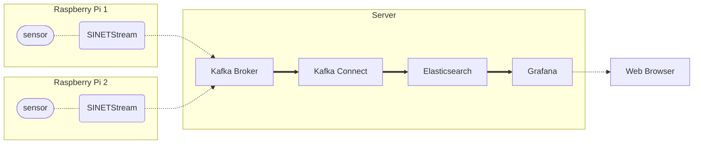
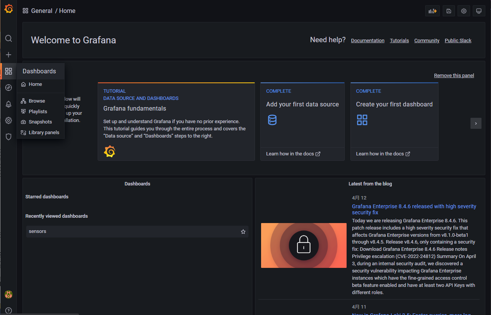
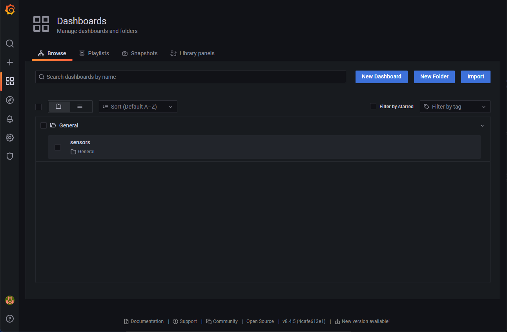
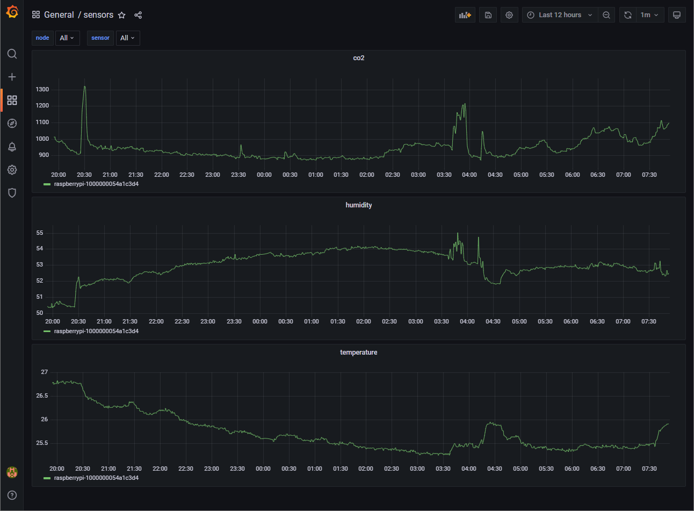

# Grafana によるセンサーデータの可視化と監視

Raspberry Piから送信されたセンサーデータを[Elasticsearch](https://www.elastic.co/jp/elasticsearch/)で収集し、それを[Grafana](https://grafana.com/grafana/)で可視化、監視します。

- [1. 構成](#1-構成)
  - [1.1. バージョン](#11-バージョン)
  - [1.2. 制限](#12-制限)
- [2. 準備](#2-準備)
  - [2.1. Docker](#21-docker)
- [3. Kafkaブローカの構築](#3-kafkaブローカの構築)
  - [3.1. 資材の配置](#31-資材の配置)
  - [3.2. パラメータの設定](#32-パラメータの設定)
  - [3.3. コンテナの実行](#33-コンテナの実行)
  - [3.4. 動作確認](#34-動作確認)
- [4. Elasticsearchの構築](#4-elasticsearchの構築)
  - [4.1. 資材の配置](#41-資材の配置)
  - [4.2. コンテナの実行](#42-コンテナの実行)
- [5. Kafka Connectの構築](#5-kafka-connectの構築)
  - [5.1. 資材の配置](#51-資材の配置)
  - [5.2. パラメータの設定](#52-パラメータの設定)
  - [5.3. コンテナの実行](#53-コンテナの実行)
  - [5.4. コネクタの登録](#54-コネクタの登録)
  - [5.5. Elasticsearchのインデックス名](#55-elasticsearchのインデックス名)
  - [5.6. テストデータの送信](#56-テストデータの送信)
- [6. Grafanaの構築](#6-grafanaの構築)
  - [6.1. 資材の配置](#61-資材の配置)
  - [6.2. パラメータの設定](#62-パラメータの設定)
  - [6.3. コンテナの実行](#63-コンテナの実行)
  - [6.4. ダッシュボードの表示](#64-ダッシュボードの表示)
  - [6.5. テストデータの送信](#65-テストデータの送信)

## 1. 構成



ここで構築するサーバは４つのコンポーネントにより構成されます。

- Kafka Broker
  - 送信されたセンサーデータを受け取るブローカ
- Kafka Connect
  - Kafkaと他のコンポーネントとの間でデータを受け渡すフレームワーク
  - Kafka ブローカから Elasticsearch にメッセージを転送するのに利用する
- Elasticsearch
  - 検索／分析エンジン
  - センサーデータの最終的な保存先として利用する
- Grafana
  - Elasticsearchに保存されたセンサーデータを可視化する

各コンポーネントは同一のノードで実行することもできますし、別々のノードで実行することもできます。

### 1.1. バージョン

各ソフトウェアコンポーネントのバージョンを以下に示します。

|ソフトウェア|バージョン|
|---|---|
|[Apache Kafka](https://kafka.apache.org/)|3.4.0|
|[ElasticSearch Sink Connector](https://www.confluent.io/hub/confluentinc/kafka-connect-elasticsearch)|14.0.6|
|[Elasticsearch](https://www.elastic.co/jp/elasticsearch/)|7.17.10|
|[Grafana](https://grafana.com/grafana/)|9.5.2|

### 1.2. 制限

ここで構築するシステムは SINETStream を利用した構築例を示すことを目的としています。そのため Kafkaブローカや Elasticserch は簡易に構築することを優先して以下のような構成となっています。

- Kafka ブローカ
  - 1ノード構成
  - 通信路の暗号化なし
  - 認証なし
- Elasticsearch
  - 1ノード構成
  - 通信路の暗号化なし
  - 認証なし

実際の運用に利用する際は、複数ノード構成にするなど必要に応じて適切な対応を行ってください。

## 2. 準備

### 2.1. Docker

サーバで実行する各コンポーネントは、いずれも Docker コンテナとして実行します。そのため Docker Engine などを事前にインストールしておく必要があります。

#### 2.1.1. Docker Engine

以下のページなどを参照し Docker Engine のインストールを行ってください。Dockerのバージョンは 19.03.0 以上が必要となります。

- [Install Docker Engine on CentOS](https://docs.docker.com/engine/install/centos/)
- [Install Docker Engine on Ubuntu](https://docs.docker.com/engine/install/ubuntu/)
- [Install Docker Engine on Debian](https://docs.docker.com/engine/install/debian/)

上記のインストール手順にも記されていますが、ユーザを `docker` グループに追加することで、管理者権限なしで `docker` コマンドを実行できるようになります。必要に応じてグループ設定を行ってください。

```console
sudo gpasswd -a $USER docker
```

以降の説明では、管理者権限なしで `docker` コマンドを実行できる前提で実行例を示します。

#### 2.1.2. Docker Compose

複数コンテナの管理やコンテナの起動パラメータなどを設定ファイルで管理するために[Docker Compose](https://github.com/docker/compose)を利用します。

Docker Compose のインストール手順を以下に示します。ここでは Docker Compose v2のインストール手順を示しています。

```console
sudo mkdir -p /usr/local/libexec/docker/cli-plugins
sudo curl -L https://github.com/docker/compose/releases/download/v2.18.1/docker-compose-linux-x86_64 -o /usr/local/libexec/docker/cli-plugins/docker-compose
sudo chmod +x /usr/local/libexec/docker/cli-plugins/docker-compose
```

インストールされたことを確認するためにバージョンを表示してみます。

```console
$ docker compose version
Docker Compose version v2.18.1
```

> Docker Compose v1 を利用している場合は `docker compose`のかわりに `docker-compose` を指定して実行してください。このドキュメントに示す実行例は全て Docker Compose v2 のものになります。v1 を利用する場合は`docker-compose`に読み替えてください。Docker Compose のバージョンは 1.27.1 以上が必要となります。

## 3. Kafkaブローカの構築

### 3.1. 資材の配置

サブディレクトリ`kafka/`にあるファイルをKafkaブローカを構築するノードに配置してください。

### 3.2. パラメータの設定

Kafkaブローカのパラメータはコンテナの環境変数として設定を行います。コンテナの環境変数は`docker-compose.yml`と同じディレクトリに `.env` を作成し、そのファイルの記述により設定が行われます。

#### 3.2.1. フォーマット

`.env` は各行が「（パラメータ名）=（値）」の形式になっているファイルとなります。記述例を以下に示します。

```bash
BROKER_HOSTNAME=kafka.example.org
```

この例では`BROKER_HOSTNAME` というパラメータに対して、`kafka.example.org` を値として指定しています。

> .env の記述例となるファイルが [kafka/example_dot_env](kafka/example_dot_env) にあります。テンプレートとして利用してください。

`.env`のフォーマットの詳細については[Docker Compose/Environment File#Syntax rules](https://docs.docker.com/compose/env-file/#syntax-rules)を参照してください。

#### 3.2.2. BROKER_HOSTNAME

KAFKAブローカのアドレスとしてクライアントに知らせるホスト名またはIPアドレスを指定します。

クライアントからはここで指定した値でアクセスできる必要があります。IPアドレスを指定した場合は、そクライアントからそのIPアドレスでアクセス可能となっている必要があります。ホスト名を指定した場合はDNSまたはクライアント環境の `/etc/hosts` などで名前解決できアクセス可能となっている必要があります。

#### 3.2.3. Kafka ブローカのプロパティ

Kafkaブローカに対する設定パラメータは [Kafka Documentation - 3.1 Broker Configs](https://kafka.apache.org/documentation/#brokerconfigs) に記されているものを指定することができます。ここで利用するConfluentのKafkaコンテナでは、コンテナの環境変数によりKafkaブローカのプロパティを設定することができます。この際に指定する環境変数名は、以下のようなルールでKafkaブローカに設定するプロパティ名を変換したものになります。

- 環境変数名のプレフィックスに `KAFKA_` をつける
- 全て大文字に変換する
- ピリオド `.` を アンダースコア `_` に置き換える
- ハイフン `-` を ２文字のアンダースコア `__` に置き換える
- アンダースコア`_` を ３文字のアンダースコア `___` に置き換える

例えば、プロパティ`message.max.bytes`は環境変数`KAFKA_MESSAGE_MAX_BYTES`として指定します。

環境変数の指定方法の詳細については[Confluent Kafka configuration](https://docs.confluent.io/platform/current/installation/docker/config-reference.html#confluent-ak-configuration)を参照してください。

### 3.3. コンテナの実行

Kafkaを実行するノードの`docker-compose.yml`を配置したディレクトリで以下のコマンドを実行してください。

```console
docker compose up -d
```

> ここでは Docker Compose v2 の実行例を示しています。v1を利用している場合は`docker compose`のかわりに`docker-compose`を用いてください。

コンテナの状態を確認します。

```console
$ docker compose ps 
NAME                COMMAND                  SERVICE             STATUS              PORTS
broker              "/etc/confluent/dock…"   broker              running             
zookeeper           "/etc/confluent/dock…"   zookeeper           running             
```

`broker`コンテナ`zookeeper`コンテナの状態(STATUS)がいずれも`running`となっていることを確認してください。

STATUSの値が`running`となっていない場合はコンテナのログなどを確認することによりエラーの原因を調査してください。

```console
docker compose logs
```

### 3.4. 動作確認

テスト用のプロデューサとコンシューマを実行することで Kafka ブローカが利用可能な状態になっていることを確認することができます。それぞれのテストプログラムの実行方法については以下のリンク先に記された手順を確認してください。

- プロデューサ
  - [NumericalSensorData/Sensor/template/README](../../Sensor/template/README.md)
- コンシューマ
  - [option/Consumer/NumericalSensorData/text-consumer/README.md](../../../option/Consumer/NumericalSensorData/text-consumer/README.md)

## 4. Elasticsearchの構築

### 4.1. 資材の配置

サブディレクトリ`elasticsearch/`にあるファイルをElasticsearchを実行するノードに配置してください。

### 4.2. コンテナの実行

Elasticsearchを実行するノードで以下のコマンドを実行してください。

```console
docker compose up -d
```

コンテナの状態を確認します。

```console
$ docker compose ps
NAME                            COMMAND                  SERVICE             STATUS              PORTS
elasticsearch-elasticsearch-1   "/bin/tini -- /usr/l…"   elasticsearch       running             0.0.0.0:9200->9200/tcp, 0.0.0.0:9300->9300/tcp, :::9200->9200/tcp, :::9300->9300/tcp
```

STATUSが`running`となっていることを確認してください。

Elasticsearchの起動にはしばらく時間がかかります。Elasticsearchの状態を確認するには[Cluster health API](https://www.elastic.co/guide/en/elasticsearch/reference/7.17/cluster-health.html)を実行することで確認できます。以下のコマンドを実行して `status`が`green`となっていることを確認してください。

```console
$ curl -s http://localhost:9200/_cluster/health?pretty
{
  "cluster_name" : "docker-cluster",
  "status" : "green",
  "timed_out" : false,
  "number_of_nodes" : 1,
  "number_of_data_nodes" : 1,
  "active_primary_shards" : 21,
  "active_shards" : 21,
  "relocating_shards" : 0,
  "initializing_shards" : 0,
  "unassigned_shards" : 0,
  "delayed_unassigned_shards" : 0,
  "number_of_pending_tasks" : 0,
  "number_of_in_flight_fetch" : 0,
  "task_max_waiting_in_queue_millis" : 0,
  "active_shards_percent_as_number" : 100.0
}
```

この手順で起動した Elasticsearch は１ノード構成となっています。Elasticsearchのデフォルト設定ではレプリカの数が 1 となっているため、この状態でインデックスを作成すると status が `yellow` となってしまいます。このことに対応するために、デフォルトのレプリカ数の設定を変更します。`docker-compose.yml`と同じディレクトリにある `setup.sh` を実行してください。

```console
$ setup.sh
{"acknowledged":true}
```

実行に成功すると `{"acknowledged":true}`と表示されます。また、以下のコマンドを実行して `number_of_replicas`の値が 0 となっていることを確認してください。

```console
$ curl -s http://localhost:9200/_index_template/template_1?pretty
{
  "index_templates" : [
    {
      "name" : "template_1",
      "index_template" : {
        "index_patterns" : [
          "*"
        ],
        "template" : {
          "settings" : {
            "index" : {
              "number_of_shards" : "1",
              "number_of_replicas" : "0"
            }
          }
        },
        "composed_of" : [ ],
        "priority" : 10
      }
    }
  ]
}
```

## 5. Kafka Connectの構築

### 5.1. 資材の配置

サブディレクトリ`kafka-connect-es/`にあるファイルをKafka Connectを実行するノードに配置してください。

### 5.2. パラメータの設定

コンテナの環境変数によりパラメータの設定を行います。`docker-compose.yml`を配置したディレクトリに `.env` を作成し、そこにパラメータの記述を行ってください。`.env`の設定例が [kafka-connect-es/example_dot_env](kafka-connect-es/example_dot_env) にあります。

設定が必須となるパラメータを次表に示します。

|環境変数名|説明|指定例|
|---|---|---|
|BROKER_HOSTNAME|Kafkaブローカのホスト名|BROKER_HOSTNAME=kafka.example.org|
|KAFKA_TOPIC|センサーデータが送信されるトピック名|KAFKA_TOPIC=sinetstream.sensor|
|ES_URL|センサーデータが保管されているElasticsearchのURL|ES_URL=http://es.example.org:9200|

### 5.3. コンテナの実行

Kafka Connectを実行するノードで以下のコマンドを実行してください。

```console
docker compose up -d
```

コンテナの状態を確認します。STATUSが`running`となっていることを確認してください。

```console
$ docker compose ps
NAME                               COMMAND                  SERVICE             STATUS              PORTS
kafka-connect-es-kafka-connect-1   "/etc/confluent/dock…"   kafka-connect       running (healthy)   0.0.0.0:8083->8083/tcp, :::8083->8083/tcp
```

コンテナが起動してからKafka Connectの起動処理が完了するまでに数分程度かかります。Kafka Connect の起動処理中は STATUS が `running (starting)`となっていますが、起動処理が完了すると`running (health)`となります。

起動処理が完了すると Kafka Connect の REST API を利用できます。Kafka Connectのバージョンを確認してみます。

```console
$ curl -s http://localhost:8083/ | jq .
{
  "version": "7.1.0-ccs",
  "commit": "c86722379ab997cc",
  "kafka_cluster_id": "F0HMuvEfS0ejreUXlHvAOQ"
}
```

> 上記の実行例では出力された JSON を整形して表示するために `jq` コマンドを利用しています。パッケージなどで `jq` コマンドをインストールするか "`| jq .`" の部分を実行コマンドから省くなどの対応を行ってください。

Kafkaブローカの`.env`に指定した`BROKER_HOSTNAME`の値が（IPアドレスでない）ホスト名の場合、Kafka Connectの環境からそのホストの名前解決が可能である必要があります。DNSなどに登録していないホスト名を`BROKER_HOSTNAME`に指定した場合は`docker-compose.yml`の[extra_hosts](https://docs.docker.com/compose/compose-file/compose-file-v3/#extra_hosts)の指定などを利用してKafkaブローカの名前解決が可能なようにしてください。`docker-compose.yml`にextra_hostsを指定する場合の例を変更差分で以下に示します。この例では Kafkaブローカ `kafka.example.org` のIPアドレス `192.168.1.100`のエントリをextra_hostsに登録しています。

```diff
@@ -19,3 +19,5 @@ services:
       CONNECT_PLUGIN_PATH: /usr/share/java,/usr/share/confluent-hub-components
     ports:
       - "${REST_PORT:-8083}:8083"
+    extra_hosts:
+      - "kafka.example.org:192.168.1.100"
```

### 5.4. コネクタの登録

Kafka Connectのコンテナを起動した後で、センサーデータの送信先となっているトピックから Elasticsearch にデータを転送するコネクタを登録します。`docker-compose.yml`を配置したディレクトリにある`register.sh`を実行してください。`.env`に設定されているパラメータに応じたコネクタが登録されます。

```console
./register.sh
```

`register.sh` を実行すると次のコネクタが登録されます。

- es-sink

コネクタの登録状態やタスクの状態は Kafka Connect のREST API を実行することで確認できます。

```console
$ curl -s http://localhost:8083/connectors | jq .
[
  "es-sink"
]
$ curl -s http://localhost:8083/connectors/es-sink/tasks/0/status | jq .
{
  "id": 0,
  "state": "RUNNING",
  "worker_id": "kafka-connect:8083"
}
```

`.env`のパラメータを変更してコネクタを登録し直す場合は、登録済のコネクタを削除してください。コネクタを削除するには以下のコマンドを実行してください。

```console
curl -s -X DELETE http://localhost:8083/connectors/es-sink
```

> Kafka ConnectのREST APIの詳細については[Connect REST Interface](https://docs.confluent.io/platform/current/connect/references/restapi.html)を参照してください。

### 5.5. Elasticsearchのインデックス名

コネクタが登録されるとKafkaブローカに送信されているセンサーデータがElasticsearchに保存されます。Elasticsearchのインデックス名はKafkaブローカのトピック名から自動的に定まり「{トピック名}-{日時}」のようになります。保存先となるElasticsearchのインデックスは日毎に変更されます。

例えば `sinetstream.sensor` というトピックにセンサーデータを送信した場合の Elasticsearch のインデックスは以下のようになります。

```console
$ curl -s http://localhost:9200/_cat/indices?s=index
green open .geoip_databases            -Wal48fgQbKJLB0WxQ5UWQ 1 0   40 32  37.9mb  37.9mb
green open sinetstream.sensor-20220413 8f_34bJbTA6qSPrwZHjwrQ 1 0 2424  0 189.3kb 189.3kb
green open sinetstream.sensor-20220414 rFbDieUCQKiVqvYMNHAnEg 1 0 2876  0   180kb   180kb
green open sinetstream.sensor-20220415 _owQhIVMSXyVouFmIVoABg 1 0 2854  0   222kb   222kb
green open sinetstream.sensor-20220416 za7MP8WOTDyekRigfEHWOg 1 0 2872  0 214.2kb 214.2kb
green open sinetstream.sensor-20220417 rDq3QLb9Rq6IcYCv8P_egw 1 0 1774  0 226.3kb 226.3kb
```

### 5.6. テストデータの送信

テスト用のプロデューサを実行することでKafkaブローカにテストデータを送信することができます。テストプログラムの実行方法については以下のリンク先に記された手順を確認してください。

- [NumericalSensorData/Sensor/template/README](../../Sensor/template/README.md)

> テストプログラムでは、実際のセンサーの測定値のかわりに乱数値を送信します。

## 6. Grafanaの構築

### 6.1. 資材の配置

サブディレクトリ`grafana/`にあるファイルをGrafanaを実行するノードに配置してください。

### 6.2. パラメータの設定

コンテナの環境変数によりパラメータの設定を行います。`docker-compose.yml`を配置したディレクトリに `.env` を作成し、そこにパラメータの記述を行ってください。`.env`の設定例が [grafana/example_dot_env](grafana/example_dot_env) にあります。

設定が必須となるパラメータを次表に示します。

|環境変数名|説明|指定例|
|---|---|---|
|KAFKA_TOPIC|センサーデータが送信されるトピック名|KAFKA_TOPIC=sinetstream.sensor|
|ES_URL|センサーデータが保管されているElasticsearchのURL|ES_URL=http://es.example.org:9200|

上記のパラメータ以外の、Grafanaコンテナに関する一般的な設定については[Configure a Grafana Docker image](https://grafana.com/docs/grafana/latest/administration/configure-docker/)を参照してください。

### 6.3. コンテナの実行

Grafanaを実行するノードで以下のコマンドを実行してください。

```console
docker compose up -d
```

コンテナの状態を確認します。

```console
$ docker compose ps
NAME                COMMAND             SERVICE             STATUS              PORTS
grafana             "/run.sh"           grafana             running             0.0.0.0:3000->3000/tcp, :::3000->3000/tcp
```

STATUSが`running`となっていることを確認してください。

### 6.4. ダッシュボードの表示

Grafanaにアクセスできる環境から Web ブラウザで `http://(ホスト名):3000`または `http://(IPアドレス):3000` にアクセスして下さい。以下のようなログイン画面が表示されます。管理ユーザのユーザ名、初期パスワードは `admin`, `admin` となっています。


ログインするとホーム画面が表示されます。



左側のメニューから[Dashboards]-[Browse]を選択してください。次図ののようなダッシュボードの一覧画面が表示されます。



Raspberry Piから送信されたデータをグラフ表示するダッシュボード[sensors]が登録されています。選択すると次図のようなグラフが表示されます。



ダッシュボードに表示されるグラフは、Raspberry Piから送信したセンサー種別により動的に追加されます。また、ダッシュボードの上部に表示されている`sensor`のチェックリストにより表示対象とするセンサー種別を変更することができます。デフォルトの設定では`All`となっており、全てのセンサー種別に関するグラフが表示されます。

### 6.5. テストデータの送信

テスト用のプロデューサを実行することでKafkaブローカにテストデータを送信することができます。Grafanaなどのサーバ側の動作確認に利用してください。テストプログラムの実行方法については以下のリンク先に記された手順を確認してください。

- [NumericalSensorData/Sensor/template/README](../../Sensor/template/README.md)

> 上記のリンクは「[5.6. テストデータの送信](#56-テストデータの送信)」と同じものになります。

テストプログラムにより送信されるセンサー種別は `random` となります。そのため Grafana に表示されるグラフタイトルなどは `random` となります。
