# Zabbix によるセンサーデータの可視化と監視

Raspberry Piから送信されたセンサーデータを Zabbix で収集し可視化、監視を行います。

- [1. 構成](#1-構成)
  - [1.1. バージョン](#11-バージョン)
  - [1.2. 制限](#12-制限)
- [2. 準備](#2-準備)
  - [2.1. Docker](#21-docker)
  - [2.2. Git](#22-git)
- [3. Kafkaブローカの構築](#3-kafkaブローカの構築)
  - [3.1. 資材の配置](#31-資材の配置)
  - [3.2. パラメータの設定](#32-パラメータの設定)
  - [3.3. コンテナの実行](#33-コンテナの実行)
  - [3.4. 動作確認](#34-動作確認)
- [4. Zabbixサーバの構築](#4-zabbixサーバの構築)
  - [4.1. 資材の配置](#41-資材の配置)
  - [4.2. コンテナの実行](#42-コンテナの実行)
  - [4.3. Zabbixサーバの設定](#43-zabbixサーバの設定)
  - [4.4. センサーデータの表示](#44-センサーデータの表示)
- [5. Zabbix senderの構築](#5-zabbix-senderの構築)
  - [5.1. 資材の配置](#51-資材の配置)
  - [5.2. パラメータの設定](#52-パラメータの設定)
  - [5.3. コンテナの実行](#53-コンテナの実行)
  - [5.4. テストデータの送信](#54-テストデータの送信)
- [6. 付録](#6-付録)
  - [6.1. ZabbixによるKafkaブローカの監視](#61-zabbixによるkafkaブローカの監視)

## 1. 構成


<!--
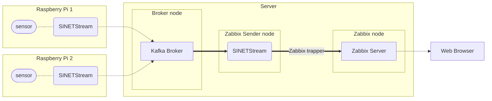
```mermaid
flowchart LR
  subgraph C1[Raspberry Pi 1]
    S1([sensor])-.-P1(SINETStream)
  end
  subgraph C2[Raspberry Pi 2]
    S2([sensor])-.-P2(SINETStream)
  end
  subgraph S[Server]
    subgraph K[Broker node]
      B[Kafka Broker]
    end
    subgraph ZSC[Zabbix Sender node]
      KC(SINETStream)
    end
    subgraph Z[Zabbix node]
      ZS[Zabbix Server]
    end
  end
  W[Web Browser]

  P1-.->B
  P2-.->B
  B==>KC==>|Zabbix trapper|ZS-.->W
```
-->

ここで構築するサーバは３つのノードで構成されます。

* Broker ノード
  * 送信されたセンサーデータを受け取るKafkaブローカを実行するノード
* Zabbix Sender ノード
  * Kafkaブローカに送信されたデータをZabbixサーバに転送するノード
  * KafkaブローカとZabbixとの間のメッセージ形式の変換などを行う
* Zabbix ノード
  * Zabbix サーバを実行するノード
  * Zabbix サーバはグラフ表示などの可視化や監視を行う
  * Zabbix サーバは送信されたデータの最終的な保管場所となる

各ノードで実行するソフトウェアコンポーネントは同一のノードで実行することもできます。

### 1.1. バージョン

各ソフトウェアコンポーネントのバージョンを以下に示します。

|ソフトウェア|バージョン|
|---|---|
|[Apache Kafka](https://kafka.apache.org/)|3.1.0|
|[Zabbix](https://www.zabbix.com/)|6.0 LTS|

### 1.2. 制限

ここで構築するシステムは SINETStream を利用した構築例を示すことを目的としています。そのため Kafkaブローカは簡易に構築することを優先して以下のような構成となっています。

* 1ノード構成
* 通信路の暗号化なし
* 認証なし

実際の運用に利用する際は、複数ノード構成にするなど必要に応じて適切な対応を行ってください。

## 2. 準備

### 2.1. Docker

サーバで実行する各コンポーネントは、いずれも Docker コンテナとして実行します。そのため Docker Engine などを事前にインストールしておく必要があります。

#### 2.1.1. Docker Engine

以下のページなどを参照し Docker Engine のインストールを行ってください。Dockerのバージョンは 19.03.0 以上が必要となります。

* [Install Docker Engine on CentOS](https://docs.docker.com/engine/install/centos/)
* [Install Docker Engine on Ubuntu](https://docs.docker.com/engine/install/ubuntu/)
* [Install Docker Engine on Debian](https://docs.docker.com/engine/install/debian/)

上記のインストール手順にも記されていますが、ユーザを `docker` グループに追加することで、管理者権限なしで `docker` コマンドを実行できるようになります。必要に応じてグループ設定を行ってください。

```console
$ sudo gpasswd -a $USER docker
```

以降の説明では、管理者権限なしで `docker` コマンドを実行できる前提で実行例を示します。

#### 2.1.2. Docker Compose

複数コンテナの管理やコンテナの起動パラメータなどを設定ファイルで管理するために[Docker Compose](https://github.com/docker/compose)を利用します。

Docker Compose のインストール手順を以下に示します。ここでは Docker Compose v2のインストール手順を示しています。

```console
$ sudo mkdir -p /usr/local/libexec/docker/cli-plugins
$ sudo curl -L https://github.com/docker/compose/releases/download/v2.2.3/docker-compose-linux-x86_64 -o /usr/local/libexec/docker/cli-plugins/docker-compose
$ sudo chmod +x /usr/local/libexec/docker/cli-plugins/docker-compose
```

インストールされたことを確認するためにバージョンを表示してみます。

```console
$ docker compose version
Docker Compose version v2.2.3
```

> Docker Compose v1 を利用している場合は `docker compose`のかわりに `docker-compose` を指定して実行してください。このドキュメントに示す実行例は全て Docker Compose v2 のものになります。v1 を利用する場合は`docker-compose`に読み替えてください。Docker Compose のバージョンは 1.27.1 以上が必要となります。

### 2.2. Git

Zabbixの構築には git コマンドを利用します。Zabbixサーバを構築するノードでは、OSのパッケージなどを利用してgitコマンドをインストールしてください。

CentOS / RHEL の場合は次のコマンドを実行してください。
```command
$ sudo yum install git
```

Debian / Ubuntu の場合は次のコマンドを実行してください。
```command
$ sudo apt install git
```

## 3. Kafkaブローカの構築

### 3.1. 資材の配置

サブディレクトリ`kafka/`にあるファイルをKafkaブローカを構築するノードに配置してください。

### 3.2. パラメータの設定

Kafkaブローカのパラメータはコンテナの環境変数として設定を行います。コンテナの環境変数は`docker-compose.yml`と同じディレクトリに `.env` を作成し、そのファイルの記述により設定が行われます。

#### 3.2.1. フォーマット

`.env` は各行が「（パラメータ名）=（値）」の形式になっているファイルとなります。記述例を以下に示します。

```
BROKER_HOSTNAME=kafka.example.org
```

この例では`BROKER_HOSTNAME` というパラメータに対して、`kafka.example.org` を値として指定しています。

> .env の記述例となるファイルが [kafka/example_dot_env](kafka/example_dot_env) にあります。テンプレートとして利用してください。

`.env`のフォーマットの詳細については[Docker Compose/Environment File#Syntax rules](https://docs.docker.com/compose/env-file/#syntax-rules)を参照してください。

#### 3.2.2. BROKER_HOSTNAME

KAFKAブローカのアドレスとしてクライアントに知らせるホスト名またはIPアドレスを指定します。

クライアントからはここで指定した値でアクセスできる必要があります。IPアドレスを指定した場合は、そクライアントからそのIPアドレスでアクセス可能となっている必要があります。ホスト名を指定した場合はDNSまたはクライアント環境の `/etc/hosts` などで名前解決できアクセス可能となっている必要があります。

#### 3.2.3. Kafka ブローカのプロパティ

Kafkaブローカに対する設定パラメータは [Kafka Documentation - 3.1 Broker Configs](https://kafka.apache.org/documentation/#brokerconfigs) に記されているものを指定することができます。ここで利用するConfluentのKafkaコンテナでは、コンテナの環境変数によりKafkaブローカのプロパティを設定することができます。この際に指定する環境変数名は、以下のようなルールでKafkaブローカに設定するプロパティ名を変換したものになります。

* 環境変数名のプレフィックスに `KAFKA_` をつける
* 全て大文字に変換する
* ピリオド `.` を アンダースコア `_` に置き換える
* ハイフン `-` を ２文字のアンダースコア `__` に置き換える
* アンダースコア`_` を ３文字のアンダースコア `___` に置き換える

例えば、プロパティ`message.max.bytes`は環境変数`KAFKA_MESSAGE_MAX_BYTES`として指定します。

環境変数の指定方法の詳細については[Confluent Kafka configuration](https://docs.confluent.io/platform/current/installation/docker/config-reference.html#confluent-ak-configuration)を参照してください。

### 3.3. コンテナの実行

Kafkaを実行するノードの`docker-compose.yml`を配置したディレクトリで以下のコマンドを実行してください。

```console
$ docker compose up -d
```

> ここでは Docker Compose v2 の実行例を示しています。v1を利用している場合は`docker compose`のかわりに`docker-compose`を用いてください。

コンテナの状態を確認します。

```console
$ docker compose ps 
NAME                COMMAND                  SERVICE             STATUS              PORTS
broker              "/etc/confluent/dock…"   broker              running             
zookeeper           "/etc/confluent/dock…"   zookeeper           running             
```

`broker`コンテナ`zookeeper`コンテナの状態(STATUS)がいずれも`running`となっていることを確認してください。

STATUSの値が`running`となっていない場合はコンテナのログなどを確認することによりエラーの原因を調査してください。

```console
$ docker compose logs
```

### 3.4. 動作確認

テスト用のプロデューサとコンシューマを実行することで Kafka ブローカが利用可能な状態になっていることを確認することができます。それぞれのテストプログラムの実行方法については以下のリンク先に記された手順を確認してください。

* プロデューサ
  * [NumericalSensorData/Sensor/template/README](../../Sensor/template/README.md)
* コンシューマ
  * [option/Consumer/NumericalSensorData/text-consumer/README.md](../../../option/Consumer/NumericalSensorData/text-consumer/README.md)

## 4. Zabbixサーバの構築

### 4.1. 資材の配置

GitHubの[zabbix/zabbix-docker](https://github.com/zabbix/zabbix-docker) からZabbixを構築するための資材を取得します。Zabbixサーバを構築するノードで以下のコマンドを実行してください。

```console
$ git clone https://github.com/zabbix/zabbix-docker.git -b 6.0 --depth 1
```

> ここで提示する構築手順では Zabbix サーバのバージョンとして 6.0 を想定しています。そのため `6.0` ブランチを指定して資材の取得を行っています。

### 4.2. コンテナの実行

Zabbixサーバはデータベース、Webサーバ(nginx)、Zabbixサーバ本体の３つのコンテナで構成されています。GitHubから取得した資材には、これら複数のコンテナをDocker Composeを用いて起動するための設定ファイルが含まれています。Docker Composeの設定ファイル `docker-compose-*.yaml` は、ベースとなるOSイメージ、データベースの異なるものが複数提供されています。

ベースイメージのOSは以下のもの用意されています。

* [Alpine Linux 3.12](https://hub.docker.com/_/alpine/)
* [Ubuntu 20.04](https://hub.docker.com/_/ubuntu/)
* [Oracle Linux 8](https://hub.docker.com/_/oraclelinux/)

> CentOS 8 はサポート期間外となりベースイメージが古くなったためOracle Linuxに置き換えられたとのことです([参照](https://github.com/zabbix/zabbix-docker#base-docker-image))。


データベースには以下のもの用意されています。

* [MySQL](https://www.mysql.com/jp/)
* [PostgreSQL](https://www.postgresql.org/)

提供されている Docker Composeの設定ファイルの詳細については[Zabbix Documentation - Installation from containers - Docker Compose](https://www.zabbix.com/documentation/current/en/manual/installation/containers#docker-compose)を参照してください。

Zabbixサーバを構成するコンテナを起動する手順以下に示します。ここではOSに ALpine Linuxを、データベースにPostgreSQLを選択した場合の例を示しています。

```console
$ cd zabbix-docker
$ ln -s docker-compose_v3_alpine_pgsql_latest.yaml docker-compose.yaml
$ docker compose up -d
[+] Running 7/7
 ⠿ Network zabbix-docker_zbx_net_backend             Created              0.1s
 ⠿ Network zabbix-docker_zbx_net_frontend            Created              0.1s
 ⠿ Network zabbix-docker_default                     Created              0.1s
 ⠿ Container zabbix-docker-postgres-server-1         Started              1.3s
 ⠿ Container zabbix-docker-db_data_pgsql-1           Started              1.3s
 ⠿ Container zabbix-docker-zabbix-server-1           Started              2.2s
 ⠿ Container zabbix-docker-zabbix-web-nginx-pgsql-1  Started              3.4s
```

コンテナの状態を確認します。

```console
$ docker compose ps
NAME                                     COMMAND                  SERVICE                  STATUS              PORTS
zabbix-docker-db_data_pgsql-1            "sh"                     db_data_pgsql            exited (0)
zabbix-docker-postgres-server-1          "docker-entrypoint.s…"   postgres-server          running
zabbix-docker-zabbix-server-1            "/sbin/tini -- /usr/…"   zabbix-server            running             0.0.0.0:10051->10051/tcp, :::10051->10051/tcp
zabbix-docker-zabbix-web-nginx-pgsql-1   "docker-entrypoint.sh"   zabbix-web-nginx-pgsql   running (healthy)   0.0.0.0:80->8080/tcp, 0.0.0.0:443->8443/tcp, :::80->8080/tcp, :::443->8443/tcp
```

`zabbix-docker-postgres-server-1`, `zabbix-docker-zabbix-server-1`, `zabbix-docker-zabbix-web-nginx-pgsql-1` のコンテナの STATUS が`running`となっていることを確認してください。各コンテナのプレフィックスは GitHub から取得した資材のディレクトリ名によって変わることがあります。

次に、Zabbixサーバのノード状態を取得するための Zabbix Agentのコンテナを起動します。

```console
$ docker compose up -d zabbix-agent
[+] Running 2/2
 ⠿ Volume "zabbix-docker_snmptraps"        Created                        0.0s 
 ⠿ Container zabbix-docker-zabbix-agent-1  Started                        0.9s 
$ docker compose ps zabbix-agent
NAME                           COMMAND                  SERVICE             STATUS              PORTS
zabbix-docker-zabbix-agent-1   "/sbin/tini -- /usr/…"   zabbix-agent        running
```

Zabbix Agent を v2 のコンテナイメージに変更する場合は、以下のコマンドを実行してください。センサーデータの表示には Zabbix Agent v2 を利用していないので任意の操作となります。

```console
$ sed -i -e '/image:/s/zabbix-agent:/zabbix-agent2:/' docker-compose.yaml
$ docker compose up -d zabbix-agent
```

### 4.3. Zabbixサーバの設定

起動したZabbixサーバにログインして設定を行います。

Zabbixサーバにアクセスできる環境から Web ブラウザで `http://(ホスト名)`または `http://(IPアドレス)` にアクセスして下さい。以下のようなログイン画面が表示されます。

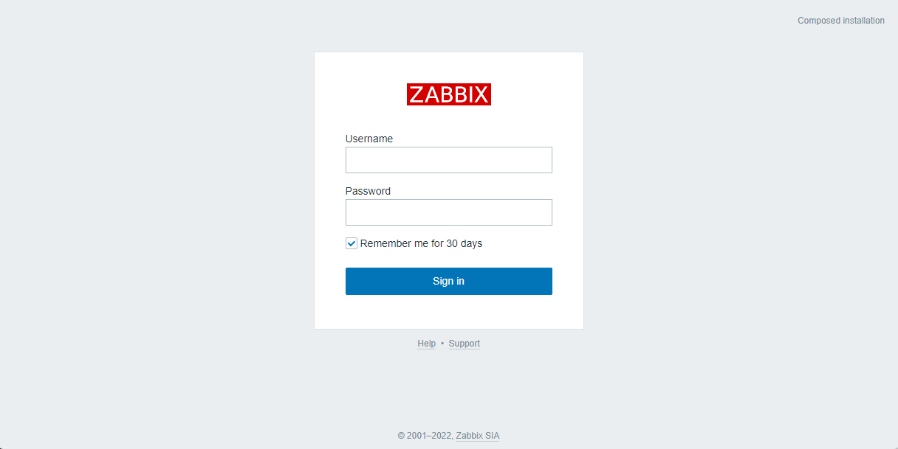

Usernameに `Admin` を Password に `zabbix` を入力することで、初期ユーザとしてログインすることができます。

この後、行う設定内容を以下に示します。

* Zabbix serverのアドレスを修正する
* タイムゾーンを設定する
* センサーデータの可視化、監視を設定する
  * テンプレートの登録
  * ホストの登録

それぞれの設定内容に関する説明を以下に記します。

#### 4.3.1. Zabbix server のアドレスを修正する

Zabbixにログインすると以下のようなダッシュボードが表示されます。

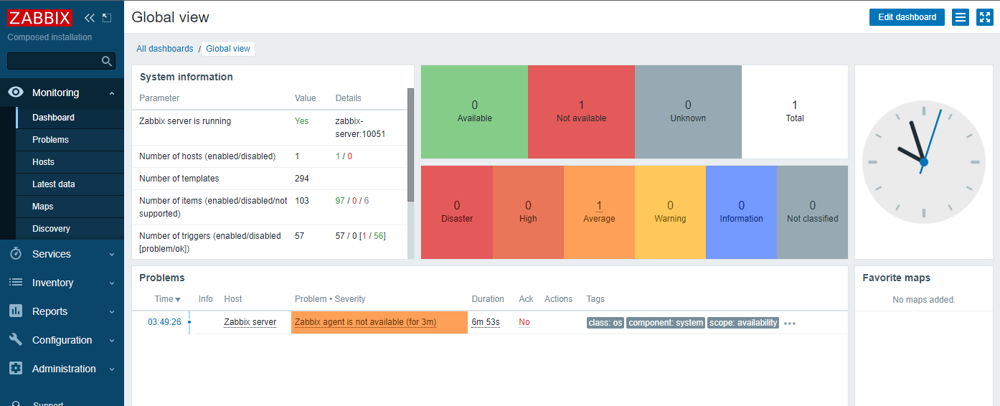

ダッシュボードのProblemsの欄に Zabbix server が `Zabbix agent is not available` であるとの表示があります。Dockerコンテナを利用してZabbixサーバを構築した場合、ZabbixサーバとZabbix Agentとが別々のコンテナとなるためにローカルホストの agent にアクセスできません。そのために表示されるエラーです。修正する手順を以下で説明します。

ZabbixのWeb画面の左側にあるメニューから[Configuration]-[Hosts]を選択してください。以下のような画面が表示されます。Availabilityの欄が赤く表示され、このホストに問題があることが示されています。

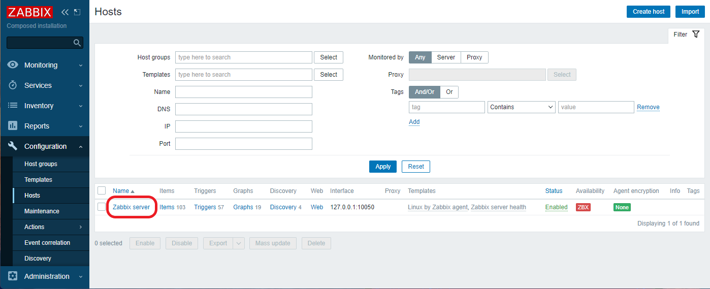

上図の赤丸で示されたリンクを選択してください。下図のようなホストの設定画面が表示されます。

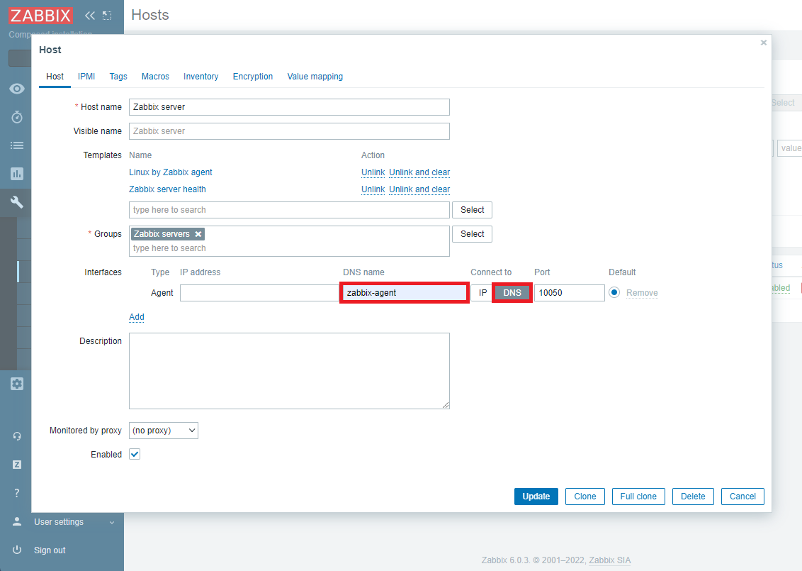

InterfaceのAgent欄のIP addressとして `127.0.0.1` が設定されています。これを上図の赤枠のように DNS name の欄に `zabbix-agent`を、 Connect to の欄に `DNS` を指定してください。入力後に画面下部に表示されている `Update` ボタンを選択してください。

設定後にダッシュボード(Global view)を表示してください。しばらく時間が経過すると状態が更新され下図のように Problems の欄の表示がなくなります。

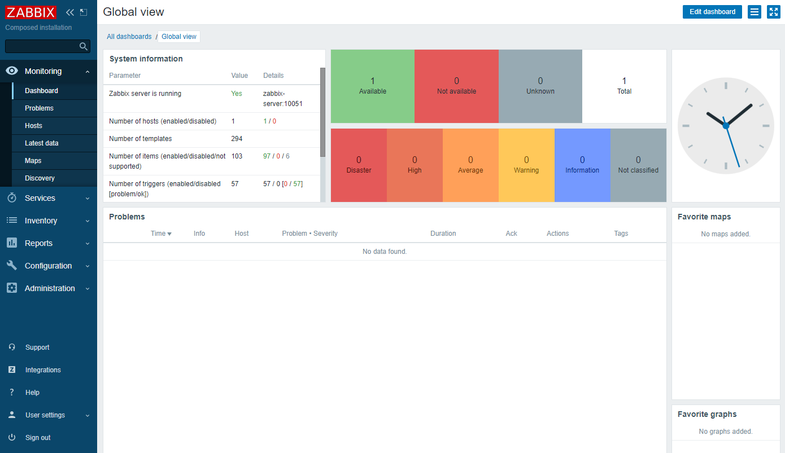

#### 4.3.2. タイムゾーンを設定する

Zabbix のデフォルトのタイムゾーンを日本標準時に変更する手順を説明します。

ZabbixのWeb画面の左側にあるメニューから[Administration]-[General]-[GUI]を選択してください。以下のような画面が表示されます。

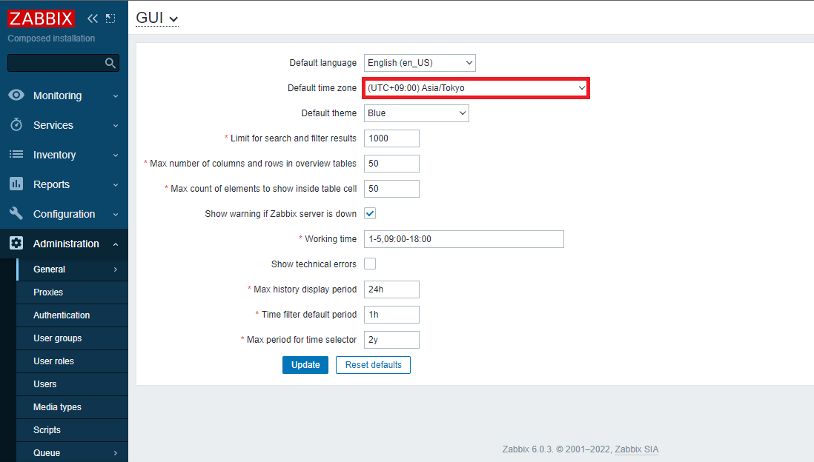

上図の赤枠のように Default time zone の値として Asia/Tokyo を選択してください。選択後に画面下部の `Update` ボタンをクリックすることでデフォルトのタイムゾーン設定が変更されます。

#### 4.3.3. センサーデータの可視化、監視を設定する

Raspberry Pi から送信されたセンサーデータを可視化、監視するためのテンプレートをZabbixに登録し、そのテンプレートをリンクしたホストの登録を行います。

##### 4.3.3.1. テンプレートの登録

SINETStreamを用いてRaspberry Piから送信したセンサーデータのためのテンプレートをZabbixに登録します。

ZabbixのWeb画面の左側にあるメニューから[Configuration]-[Templates]を選択してください。以下のような画面が表示されます。

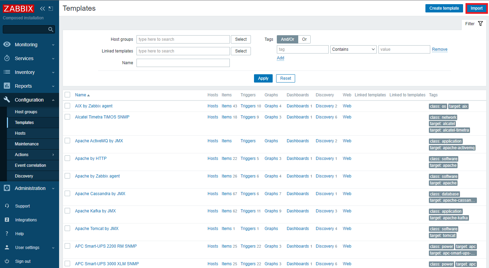

上図赤枠で示した[Import]ボタンをクリックすることで下図のようなダイアログが表示されます。

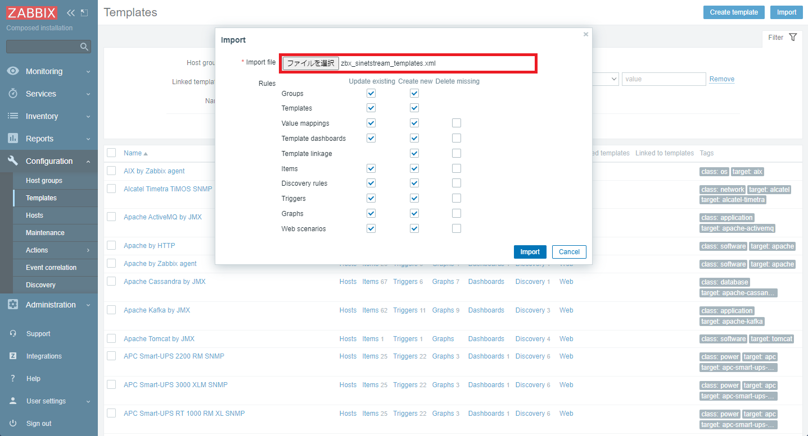

この配布物に含まれている `zabbix/zbx_sinetstream_templates.xml` を上図赤枠の Import file 欄から選択してください。その後[Import]ボタンをクリックすると、下図のような確認ダイアログが表示されます。

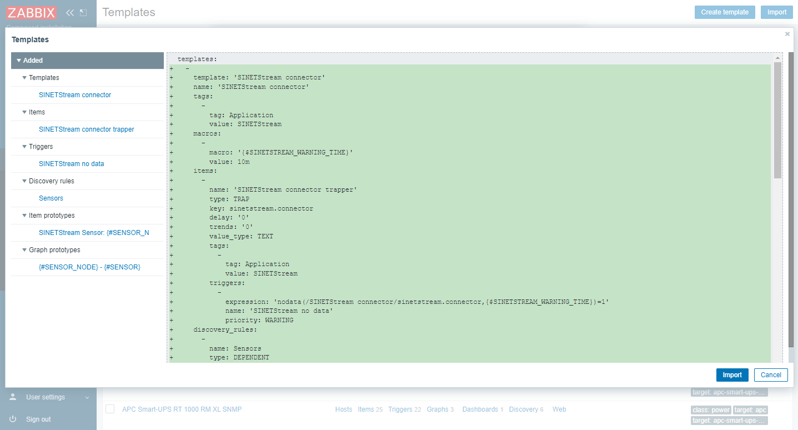

確認ダイアログの[Import]ボタンをクリックすることで、テンプレートが登録されます。

テンプレートの一覧画面（[Configuration]-[Templates]）で Filter の Tags 欄に、`Application`, `Contains`, `SINETStream` を入力し [Apply] ボタンをクリックすることで、下図のような表示となります。

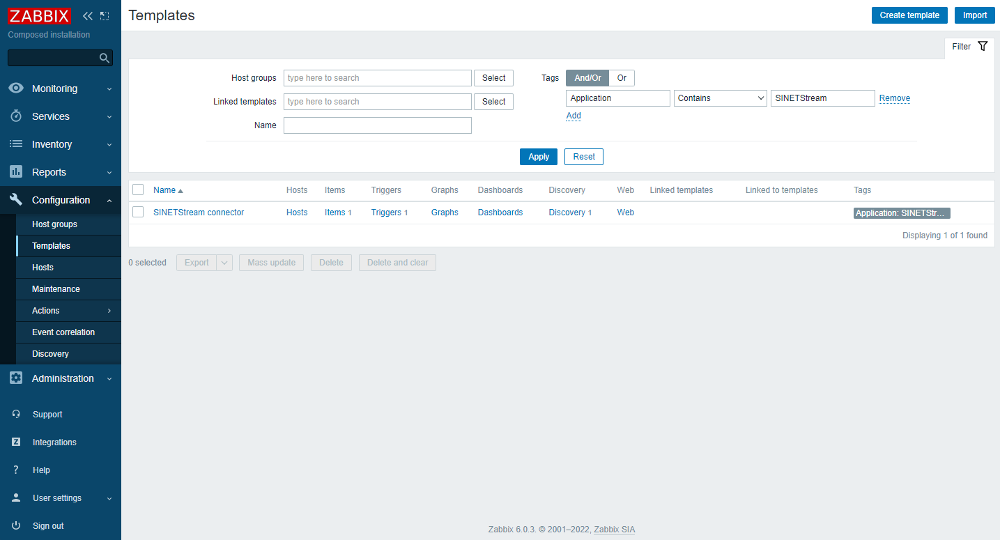

登録したテンプレート SINETStream connector が登録されていることを確認できます。

##### 4.3.3.2. ホストの登録

Zabbixにホストの登録を行います。

ホスト設定の一覧画面（[Configuration]-[Hosts]）を表示してください。

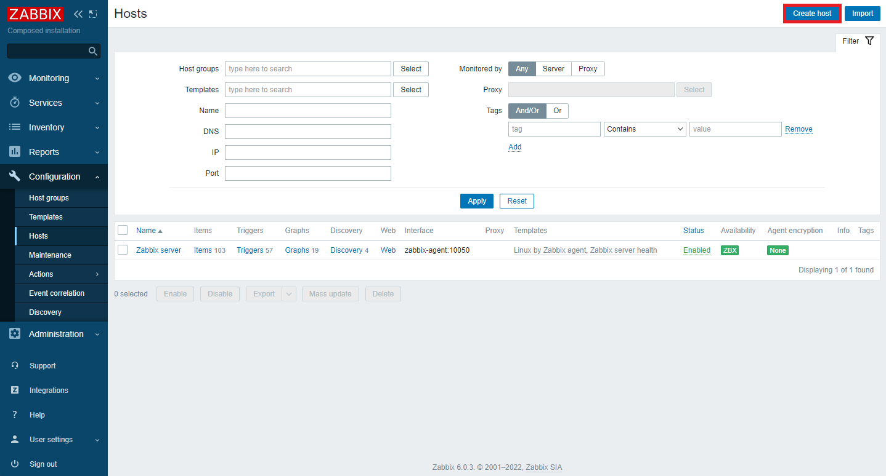

上図の赤枠で示した[Create host]ボタンをクリックしてください。下図のようなホストの登録画面が表示されます。

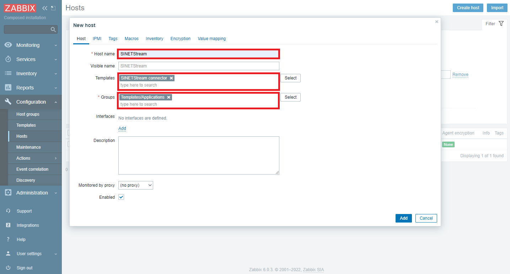

ホストを登録するには必須項目である以下の２項目

* Host name
* Groups

を入力し、さらに[Templates]欄に先ほど登録した[SINETStream connector]テンプレートを指定する操作を行います。

まず必須項目を入力します。[Host name]欄にはホストの名前を入力してください。ここで指定する名前はKafkaブローカからZabbixにセンサーデータを転送する際の送り先となります。後にZabbix Senderノードの構築手順（[5.2 パラメータの設定](#52-パラメータの設定)）で、ここで指定した値をデータの送信先として設定することになります。[Groups]欄にはホストのグループを選択してください。ホストは複数のグループに所属することができます。管理実態に応じて適切なもの選択してください。

次にセンサーデータのためのテンプレートを選択します。[Templates]欄の[Select]ボタンをクリックするとテンプレートの選択ダイアログが表示されます。テンプレートのホストグループが選択されていない場合、下図のようなホストグループ入力ダイアログが表示されます。

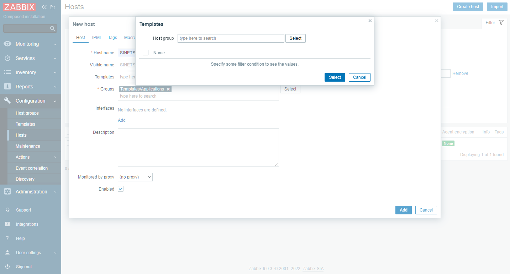

入力欄の右側にある[Select]ボタンをクリックすると選択肢のリストが表示されます。SINETStream connectorテンプレートが属するホストグループの `Templates/Applications` を選択してください（下図赤丸）。

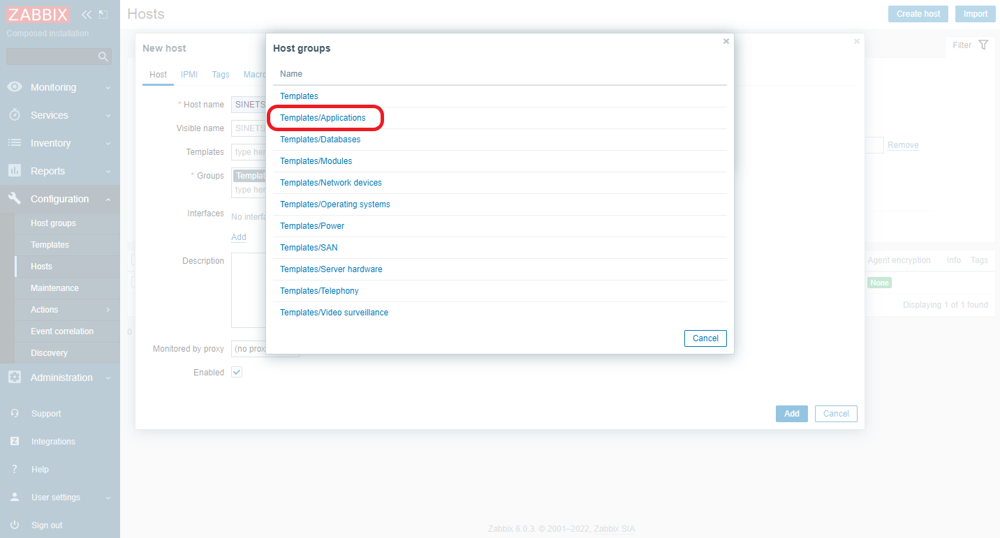

テンプレートのホストグループを選択すると`Templates/Applications`のテンプレートの一覧が表示されます（下図）。

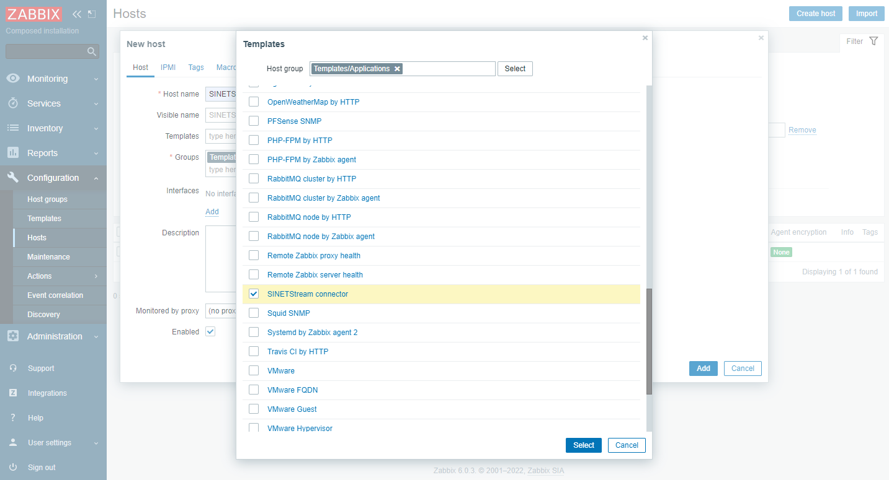

`SINETStream connector`テンプレートを選択して[Select]ボタンをクリックしてください。ホストの登録ダイアログの[Templates]欄に`SINETStream connector`が追加されます。最後にホストの登録画面の[Add]ボタンをクリックすることでホストの登録が完了します（下図）。

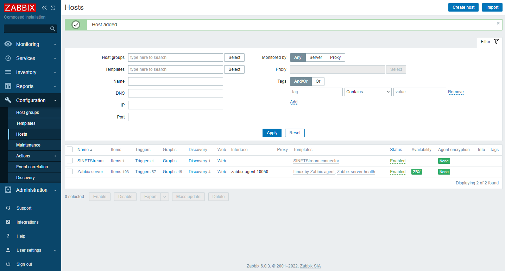

### 4.4. センサーデータの表示

センサーデータの表示手順を確認しておきます。

> この時点ではRaspberry Pi、Zabbix senderの設定を行っていないのでZabbixにセンサーデータの情報が表示されることはありません。Zabbix senderノードの構築を行い「[5.4 テストデータの送信](#54-テストデータの送信)」に示した手順でテストデータを投入することで、表示を確認するとが出来ます。

#### 4.4.1. テンプレートの設定内容

センサーデータを表示するためのテンプレート`SINETStream connector`に含まれる設定内容について説明します。

テンプレートには以下の設定が含まれています。

* センサーデータの送信先となるアイテム
    - `sinetstream.connector`
* センサー種別、送信元クライアント名のディスカバリールール
    - 送信元クライアント名: `{#SENSOR_NODE}`
    - センサー種別: `{#SENSOR}`
* センサーデータの送信が途切れたことを検出するトリガー

アイテム`sinetstream.connector`に送信されるデータは、以下のような JSON の形式であることを想定しています。

```json
{
  "temperature": 24.1,
  "humidity": 48.4,
  "node": "raspi3b"
}
```

このJSONデータでは`node`にセンサーデータを送信した Raspberry Pi を特定するための値（通常はホスト名）が指定され、他のキーバリューには、センサー種別とその測定値が指定されているものとして解釈します。例示したJSONデータの場合`raspi3b`というホストから温度センサー(`temperature`)の測定値が 24.1 °Ｃで 湿度センサー(`humidity`)の測定値が 48.4 % であることを表しています。


テンプレートに設定されているディスカバリールールでは、アイテム`sinetstream.connector`に送信されたデータの `node` の値から送信元クライアント名 `{#SENSOR_NODE}`を、他のキーからセンサー種別 `{#SENSOR}` を検出します。また検出した`{#SENSOR_NODE}`と`{#SENSOR}`に基づいた、新たなアイテムとグラフを追加するアイテムプロトタイプとグラフプロトタイプが定義されています。これによりセンサー種別や送信元となるRaspberry Piの変化に応じてアイテムやグラフが自動的に追加されます。

テンプレートにはセンサーデータの送信が途切れたことを検出するトリガーが定義されています。テンプレートのトリガーは、アイテム`sinetstream.connector`にデータが一定時間送信されていないことを検出するものとなっています。そのため個別のセンサーデータや、送信元となるホスト(Raspberry Pi)毎の検出とはなっていません。個別の検出が必要な場合は、対応するアイテムに対するトリガーを追加で設定してください。

#### 4.4.2. センサーデータのグラフ表示

センサーデータのグラフを表示する手順を説明します。

ZabbixのWeb画面の左側にあるメニューから[Monitoring]-[Hosts]を選択してください。下図のような登録ホストの一覧が表示されます。

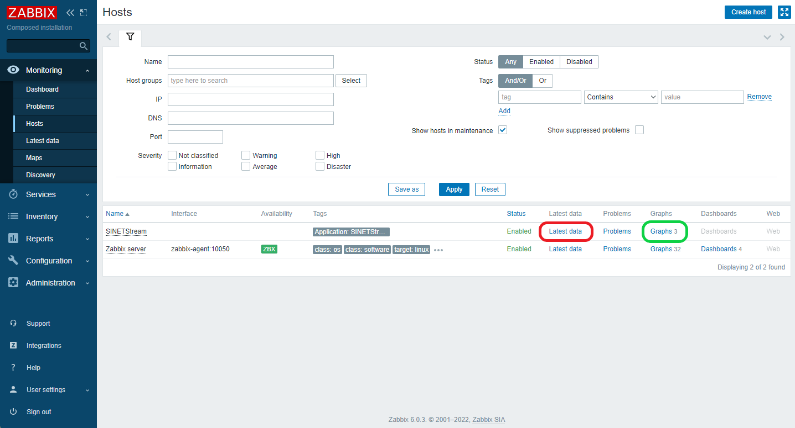

センサーデータの送信先として登録したホストの行にある `Graphs` のリンクをクリックしてください（上図緑丸部分）。下図のようなセンサーデータのグラフが表示されます。

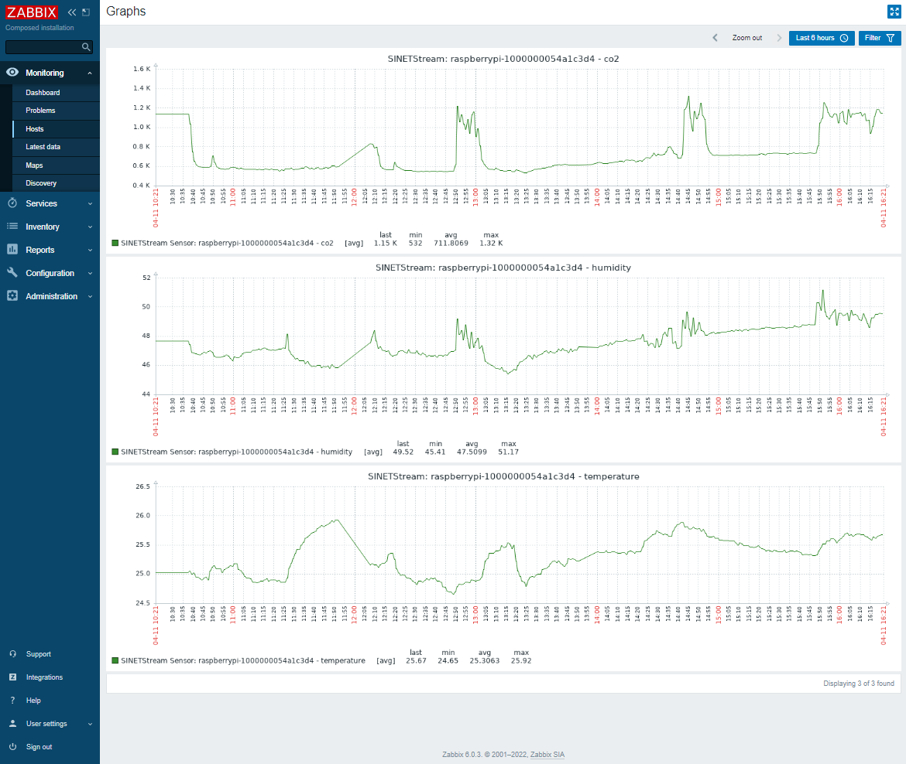

各グラフのタイトル部分に送信元となった Raspberry Piのホスト名とセンサー種別が表示されます。

また登録ホストの一覧画面にある `Latest data`（前々図の赤丸部分）のリンクをクリックすると、送信されたセンサーデータの最新値が表示されます（下図）。

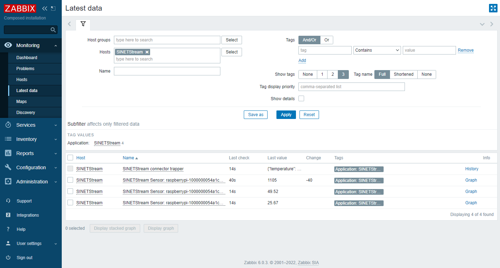

Latest data にはKafkaからの送信先となるアイテム`sinetstream.connector`の値以外に、ディスカバリールールで自動的に登録された各センサーの最新値が表示されます。この画面でアイテム`sinetstream.connector`の行に表示されている`History`リンクをクリックするとRaspberry Piから送信されたデータの履歴を確認することができます（下図）。

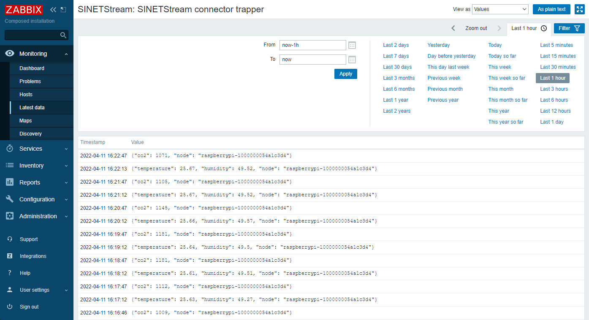

#### 4.4.3. センサーデータの送信が途切れたことの検出

アイテム`sinetstream.connector`へのデータ送信が一定時間途切れるとGlobal viewのダッシュボードに警告が表示されます（下図）。

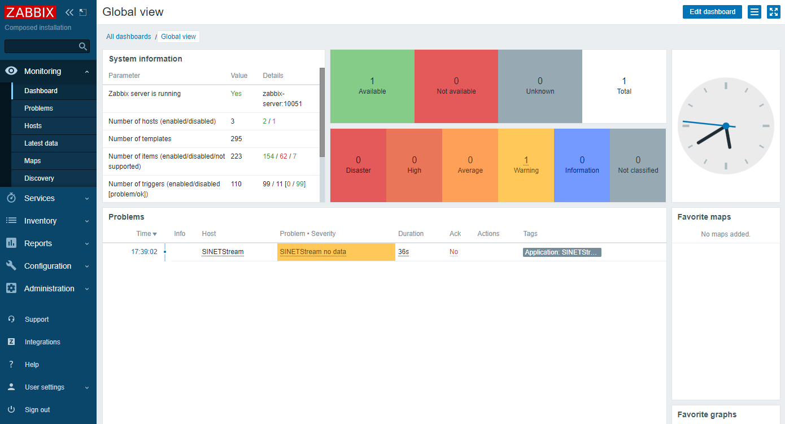

トリガーがデータの未達を検出するまでのデフォルトの時間間隔は１０分となっています。検出するまでの時間は`{$SINETSTREAM_WARNING_TIME}`マクロに値を設定することで変更可能です。

## 5. Zabbix senderの構築

### 5.1. 資材の配置

サブディレクトリ`zabbix-sender/`にあるファイルをZabbix senderを構築するノードに配置してください。

### 5.2. パラメータの設定


<!--
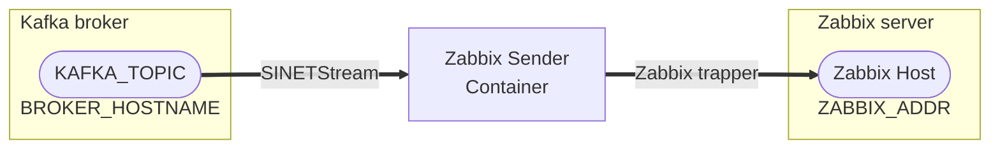
```mermaid
flowchart LR
  subgraph B["Kafka broker<br><br><br>BROKER_HOSTNAME"]
    ST([KAFKA_TOPIC])
  end
  ZS["Zabbix Sender<br>Container"]
  subgraph Z["Zabbix server<br><br><br>ZABBIX_ADDR"]
    ZH([Zabbix Host])
  end

  ST==>|SINETStream|ZS==>|Zabbix trapper|ZH
```
-->

Dockerコンテナの環境変数を設定するファイル `.env` で以下に示すパラメータを指定します。`.env`では`{環境変数名}={パラメータの値}`の形式で値を指定します。

|パラメータ|環境変数名|操作例でのパラメータの値|
|---|---|---|
|Kafkaブローカのアドレス<br>「[3.2.2 BROKER_HOSTNAME](#322-broker_hostname)」で設定した値|`BROKER_HOSTNAME`|`kafka.example.org`|
|Kafkaのトピック名<br>「[Sensor/README.md](../../Sensor/README.md#32-設定ファイル)」で指定したトピック名|`KAFKA_TOPIC`|`sinetstream.sensor`|
|Zabbixサーバのアドレス<br>ホスト名またはIPアドレス|`ZABBIX_ADDR`|`zabbix.example.org`|
|Zabbixの監視対象として登録するホストの名前<br>「[4.3.3.2 ホスト名の登録](#4332-ホストの登録)」で設定した値|`ZABBIX_HOST`|`SINETStream`|

操作手順を以下に示します。

```console
$ touch .env
$ echo "BROKER_HOSTNAME=kafka.example.org" >> .env
$ echo "KAFKA_TOPIC=sinetstream.sensor" >> .env
$ echo "ZABBIX_ADDR=zabbix.example.org" >> .env
$ echo "ZABBIX_HOST=SINETStream" >> .env
$ cat .env
BROKER_HOSTNAME=kafka.example.org
KAFKA_TOPIC=sinetstream.sensor
ZABBIX_ADDR=zabbix.example.org
ZABBIX_HOST=SINETStream
```

### 5.3. コンテナの実行

Kafkaのコンテナを起動します。

```console
$ docker compose up -d
```

初回起動時はコンテナイメージをビルドするので起動が完了するまでに時間がかかります。起動後にコンテナの状態を確認します。

```console
$ docker compose ps
NAME                    COMMAND                  SERVICE             STATUS              PORTS
sender-zabbix-sender-1  "/bin/sh -c './consu…"   zabbix-sender       running   
```

コンテナの STATUS が `running` となっていることを確認してください。

Kafkaブローカの`.env`に指定した`BROKER_HOSTNAME`の値が（IPアドレスでない）ホスト名の場合、Kafka Connectの環境からそのホストの名前解決が可能である必要があります。DNSなどに登録していないホスト名を`BROKER_HOSTNAME`に指定した場合は`docker-compose.yml`の[extra_hosts](https://docs.docker.com/compose/compose-file/compose-file-v3/#extra_hosts)の指定などを利用してKafkaブローカの名前解決が可能なようにしてください。`docker-compose.yml`にextra_hostsを指定する場合の例を変更差分で以下に示します。この例では Kafkaブローカ `kafka.example.org` のIPアドレス `192.168.1.100`のエントリをextra_hostsに登録しています。

```diff
@@ -5,3 +5,5 @@
     network_mode: host
     restart: always
     env_file: .env
+    extra_hosts:
+      - "kafka.example.org:192.168.1.100"
```

### 5.4. テストデータの送信

テスト用のプロデューサを実行することでKafkaブローカにテストデータを送信し、Zabbixなどのサーバ側の動作を確認することができます。Raspberry Piから実際のセンサーデータを送信する前にテストプログラムによる確認を行うことを推奨します。
 
テストプログラムの実行方法については以下のリンク先に記された手順を確認してください。

* [NumericalSensorData/Sensor/template/README](../../Sensor/template/README.md)

> テストプログラムでは、実際のセンサーの測定値のかわりに乱数値を送信します。そのため送信データのセンサー種別は`random`という名前になっています。

## 6. 付録

### 6.1. ZabbixによるKafkaブローカの監視


<!--
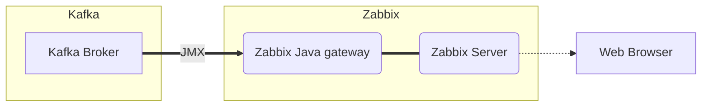
```mermaid
flowchart LR
  subgraph K[Kafka]
    B[Kafka Broker]
  end
  subgraph Z[Zabbix]
    ZS(Zabbix Server)
    ZJG(Zabbix Java gateway)
  end
  W[Web Browser]

  B==>|JMX|ZJG===ZS-.->W
```
-->

Zabbixが提供しているテンプレート[Apache Kafka by JMX](https://www.zabbix.com/integrations/kafka)を利用するとKafkaブローカをZabbixから監視することが出来ます。ここでは、その設定手順を説明します。

> この設定はセンサーデータの可視化、監視には直接関係しません。そのため任意の設定項目になります。

おもな設定手順を以下に示します。

1. [Java gateway](https://www.zabbix.com/documentation/current/en/manual/concepts/java)のコンテナを起動する
1. Kafkaブローカを Zabbix の監視対象のホストとして登録する

#### 6.1.1. 前提条件

ZabbixサーバからKafkaブローカに対してJMXによる監視を行うので、その間の通信が可能となるようにする必要があります。ここで構築したKafkaブローカはTCPのポート番号9101でJMXへのアクセスができます。ZabbixとKafkaを別のノードで構築する場合はファイアウォールの設定などを行い通信可能となるように設定してください。

#### 6.1.2. Java gatewayのコンテナを起動する

Zabbix サーバから JMX による監視を行う場合、[Zabbix Java gateway](https://www.zabbix.com/documentation/current/en/manual/concepts/java)と呼ばれるサービスを起動する必要があります。ここでは[zabbix/zabbix-java-gateway](https://hub.docker.com/r/zabbix/zabbix-java-gateway)コンテナイメージを利用して Java gateway の起動を行います。

コンテナの起動を行うために、Zabbixサーバを構築したノードの `docker-compose.yaml`を配置しているディレクトリで次のコマンドを実行してください。

```console
$ docker compose up -d zabbix-java-gateway
[+] Running 1/1
 ⠿ Container zabbix-docker-zabbix-java-gateway-1  Started     
```

コンテナの状態を確認します。STATUSの値が `running` となっていることを確認してください。

```console
$ docker compose ps zabbix-java-gateway    
NAME                                  COMMAND                  SERVICE               STATUS              PORTS
zabbix-docker-zabbix-java-gateway-1   "docker-entrypoint.s…"   zabbix-java-gateway   running
```

#### 6.1.3. Kafkaブローカを Zabbix の監視対象のホストとして登録する

KafkaブローカをZabbixサーバの監視対象のホストとして登録します。

ホスト設定の一覧画面（[Configuration]-[Hosts]）を表示して[Create host]ボタンをクリックすることでホストの登録画面を表示してください（下図）。

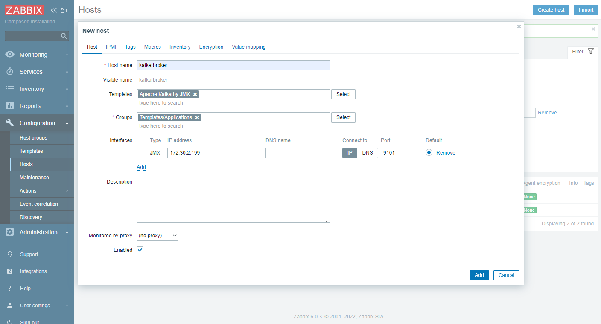

Interfaces欄のAddリンクをクリックして`JMX`を選択することで JMX のパラメータを指定する入力欄が表示されます。入力欄のIP addressまたは DNS name に「[3.2.2 BROKER_HOSTNAME](#322-broker_hostname)」で設定した Kafka ブローカのアドレスを入力してください。また JMX のポート番号の欄には `9101` を入力してください。

[Templates]欄の[Select]ボタンをクリックすることでテンプレートの選択が行えます。`Apache Kafka by JMX` を選択してください。

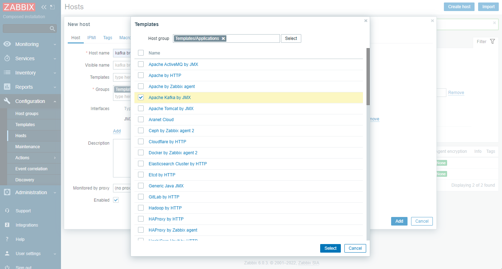

登録が成功すると Kafka ブローカに対応する行が追加されます（下図赤丸部分）。

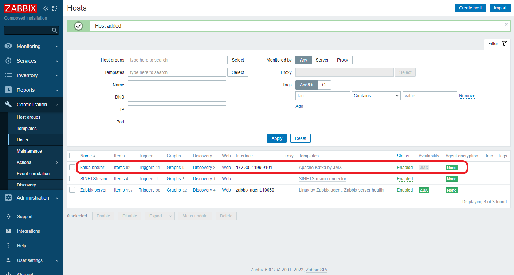

[Monitoring]-[Hosts]から Kafka ブローカの状態を確認することができます。
