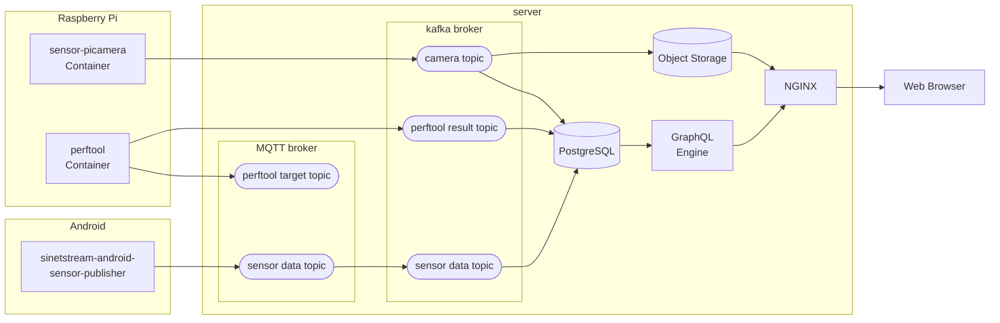

# AndroidセンサーデータとRaspberry Piカメラデータの可視化

## 1. 概要

AndroidのセンサーデータやRaspberry Piのカメラで撮影した画像などをサーバに送信し、そのデータを可視化するサーバを構築する手順を示します。

### 1.1. 全体構成

構築するシステムの全体構成を次図に示します。



左側に示したRaspberry PiとAndroidのブロックがデータの送信側となります。中央のserverで示したブロックが、Raspberry PiとAndroid端末から送信されたデータを受け取り可視化する機能を提供します。可視化結果はWebブラウザで確認することができます。

Raspberry Pi、Android端末からは[SINETStream](https://www.sinetstream.net/)を利用してそれぞれ以下のようなデータを送信します。

* Raspberry Pi
  * カメラデータ
    * [Raspberry Piカメラモジュール](https://www.raspberrypi.com/documentation/accessories/camera.html)で撮影した画像を送信する
    * [sensor-picameraコンテナ](https://harbor.vcloud.nii.ac.jp/harbor/projects/37/repositories/sensor-picamera/artifacts-tab)を利用する>
  * perftoolの計測結果
    * [perftool](https://github.com/nii-gakunin-cloud/sinetstream/tree/main/java/sample/perftool)で計測した結果を送信する
    * [perftoolコンテナ](https://harbor.vcloud.nii.ac.jp/harbor/projects/37/repositories/perftool/artifacts-tab)を利用する
* Android端末
  * Android端末のセンサーデータを送信する
  * データの送信にはSINETStreamのサンプルアプリ[sensor-publisher](https://github.com/nii-gakunin-cloud/sinetstream-android-sensor-publisher)を利用する

### 1.2. サーバの構築

サーバの構築は送信データの種別に応じて３つの部分から構成されています。

* Androidセンサーデータの可視化サーバを構築する
* Raspberry Piカメラの撮影データを表示するサーバを構築する
* perftool計測結果の可視化サーバを構築する

上記の手順の一部または全てを実行することでサーバを構築することができます。サーバの構築手順と構築に必要となる資材は[Server/](Server/README.md)ディレクトリ以下に配置されています。

### 1.3. データ送信環境の構築

データ送信環境の構築手順は実行環境に応じて以下に示す３つのサブディレクトリに配置されています。

* Android端末
  * [Sensor/Android/](Sensor/Android/11-setup-android.md)
* Raspberry Pi
  * [Sensor/RaspberryPi/](Sensor/RaspberryPi/README.md)
* perftool実行環境
  * [Sensor/Perftool/](Sensor/Perftool/README.md)

必要に応じてそれぞれのディレクトリ以下にある手順書を実行してください。またperftoolをRaspberry Piでカメラデータの送信と合わせて行う場合は`Sensor/Perftool/`にある手順書ではなく`Sensor/RaspberryPi/`の手順書を用いて構築を行なってください。カメラデータの送信とperftoolが協調して交互に実行する環境を構築する手順となっています。

### 1.4. 選択項目

直接的にはデータの可視化に関係しない選択項目に関する構築手順を[option/](option/README.md)以下のディレクトリに配置しています。現在提供している構築手順を以下に示します。

* ブローカに送信されたデータをオブジェクトストレージに保存する

## 2. 準備

サーバ構築手順、データ送信環境構築手順を実行する前に必要となる事前準備について説明します。

### 2.1. Docker, Docker Compose

Android端末以外の環境ではサーバ、データ送信のいずれを構築する場合もdockerコンテナを利用します。そのため事前にDocker Engineを実行環境にインストールしてください。Dockerのインストール手順は以下のリンク先などを参考にしてください。

* [Install Docker Engine](https://docs.docker.com/engine/install/)

またコンテナの起動には[Docker Compose V2](https://docs.docker.com/compose/)を利用します。最近のバージョンのDocker Engineではインストール時にDocker Composeも同時にインストールされています。古いバージョンのDocker Engineを利用している場合は別途追加でDocker Composeをインストールしてください。

### 2.2. jinja2

環境構築において入力されたパラメータに応じた設定ファイルを生成するために[jinja2-cli](https://github.com/mattrobenolt/jinja2-cli)コマンドを利用しています。以下のコマンドを実行してインストールを行なってください。

```console
pip install jinja2-cli
```

また上記のコマンドを実行する前提となるpython3, pipについてはあらかじめOSのパッケージなどを利用してインストールを行なってください。

### 2.3. Jupyter Notebook

Android端末以外の環境に対してはMarkdownとJupyter Notebook両方の構築手順書を用意しています。Jupyter Notebookの手順書を利用する場合は事前にJupyter Notebookの実行環境を構築環境に用意してください。Jupyter実行環境はJupyterLabとclassic Jupyter Notebookのいずれかを準備してください。

また構築手順書のNotebookは[bash kernel](https://github.com/takluyver/bash_kernel)で実行することを想定しています。これについてもインストールが必要となります。

それぞれの簡単なインストール手順を以下に示します。前提となるpython3, pipについてはあらかじめOSのパッケージなどを利用してインストールを行なってください。

> Markdownの手順書に従って環境構築を行う場合はこの節で説明している準備は不要となります。

#### 2.3.1. JupyterLab

JupyterLabをインストールする場合は以下のコマンドを実行してください。

```console
pip install jupyterlab
```

インストールが完了した後に以下のコマンドを実行するとJupyterLab環境が起動します。

```console
jupyter-lab
```

#### 2.3.2. classic Jupyter Notebook

classic Jupyter Notebookをインストールする場合は以下のコマンドを実行してください。

```console
pip install notebook
```

インストールが完了した後に以下のコマンドを実行するとJupyter Notebook環境が起動します。

```console
jupyter notebook
```

#### 2.3.3. bash kernel

構築手順書のNotebookは[bash kernel](https://github.com/takluyver/bash_kernel)で実行することを想定しています。以下のコマンドを実行してbash kernelをインストールしてください。

```console
pip install bash_kernel
python -m bash_kernel.install
```
