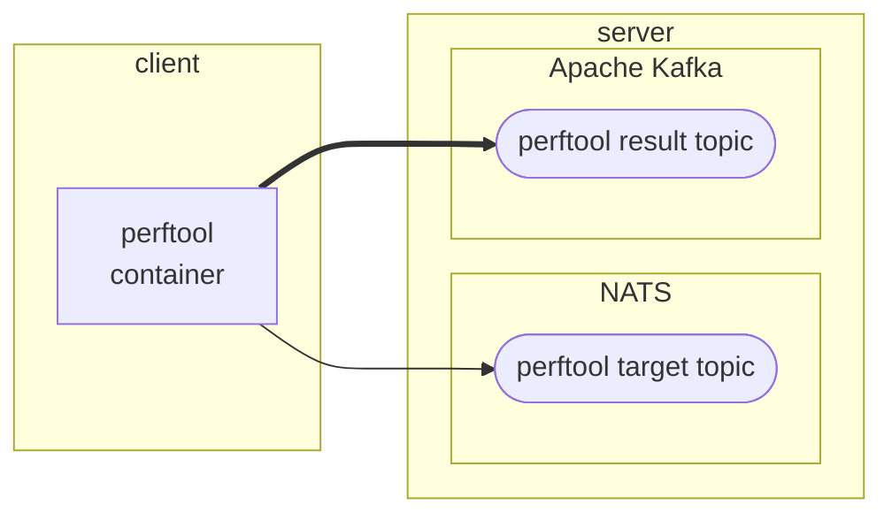

# Perftoolの計測結果をサーバに送信する

## 1. 概要

### 1.1. システム構成

システム構成を次図に示します。`client`で示された枠内がこのnotebookで構築する対象になります。



perftoolコンテナは[perftool](https://github.com/nii-gakunin-cloud/sinetstream/tree/main/java/sample/perftool)コマンドをコンテナ内で実行して、その計測結果をKafkaブローカに送信します。

### 1.2. 前提条件

環境を構築、実行するために必要となる前提条件を示します。

* docker, docker compose v2
  * perftoolコンテナを実行するために必要となリます

## 2. パラメータの指定

### 2.1. 配置場所

環境を構築するために必要となる資材を配置するディレクトリを変数`target_dir`に設定してください。

```bash
target_dir=$HOME/perftool
```

### 2.2. perftool

[perftoolコマンド](https://github.com/nii-gakunin-cloud/sinetstream/tree/main/java/sample/perftool)のオプションに対応する環境変数を指定します。

「[perftool - オプション](https://github.com/nii-gakunin-cloud/sinetstream/tree/main/java/sample/perftool#%E3%82%AA%E3%83%97%E3%82%B7%E3%83%A7%E3%83%B3)」に記述されているオプションのうち、以下に示したものを指定することができます。

* -c, --output-count OUTPUT_COUNT
  * OUTPUT_COUNT回メトリクス情報を計測し出力する。デフォルト:1
* -n, --num-samples NUM_SAMPLES
  * 一回のメトリクス情報を出力するまでにwriterがNUM_SAMPLES個のデータ送信を試行する。デフォルト:300
* -p, --payload-size PAYLOAD_SIZE
  * データ送信試行時にPAYLOAD_SIZEバイトのペイロード長のデータを使用する。デフォルト:1024
* -a, --async-api
  * 指定した場合はデータの送信/受信に非同期APIを使用する。指定しなかった場合は同期APIを使用する
* -t, --num-threads NUM_THREADS
  * NUM_THREADS個のreader/writerのペアを並列実行する。各ペアはOUTPUT_COUNT回メトリクス情報を計測する。デフォルト:1

perftoolコマンドのオプションと環境変数の対応を次表に示します。

|オプション|環境変数|指定例|
|---|---|---|
|--output-count|PERFTOOL_OUTPUT_COUNT|PERFTOOL_OUTPUT_COUNT=1|
|--num-samples|PERFTOOL_NUM_SAMPLES|PERFTOOL_NUM_SAMPLES=300|
|--payload-size|PERFTOOL_PAYLOAD_SIZE|PERFTOOL_PAYLOAD_SIZE=1024|
|--async-api|PERFTOOL_ASYNC_API|PERFTOOL_ASYNC_API=1|
|--num-threads|PERFTOOL_NUM_THREADS|PERFTOOL_NUM_THREADS=1|

`PERFTOOL_PARAMS`に上記の環境変数を指定するステートメントを設定して下さい。

```bash
PERFTOOL_PARAMS="
PERFTOOL_OUTPUT_COUNT=1
PERFTOOL_NUM_SAMPLES=300
PERFTOOL_PAYLOAD_SIZE=1024
PERFTOOL_NUM_THREADS=1
"
```

### 2.3. 計測対象

perftoolコマンドの計測対象となるブローカに関するパラメータの指定を行います。

計測対象となるブローカのホスト名（またはIPアドレス）を指定して下さい。

```bash
target_host=broker.example.org
```

ブローカのポート番号を指定して下さい。

```bash
target_port=1883
```

計測対象のトピック名を指定して下さい。

```bash
target_topic=perftool-sinetstream-target
```

ブローカの種別を指定して下さい。

```bash
target_type=mqtt
```

ブローカにメッセージを送信する際の`consistency`を指定して下さい。

```bash
target_consistency=AT_LEAST_ONCE
```

計測対象のブローカとの通信にて、上記で指定した以外のパラメータを指定する場合は`TARGET_PARAMS`に環境変数を指定するステートメントを設定して下さい。SINETStream設定ファイルのパラメータと環境変数との変換ルールを以下に示します。

* パラメータ名を全て大文字に変換する
* プレフィックスに `PERF_TGT_` をつける
* 複数階層をもつパラメータを指定する場合は階層の区切りに２文字のアンダースコア `__` を指定する

例えばパラメータ`data_compression`を指定する場合は環境変数`PERF_TGT_DATA_COMPRESSION`に値を設定します。

```bash
TARGET_PARAMS="
PERF_TGT_DATA_COMPRESSION=true
"
```

### 2.4. 結果送信先

perftoolコマンドの計測結果を送信するKafkaブローカに関するパラメータの指定を行います。

Kafkaの外部公開ホスト名（またはIPアドレス）を指定してください。

```bash
result_host=kafka.example.org
```

ブローカのポート番号を指定して下さい。

```bash
result_port=9092
```

送信先となるトピック名を指定して下さい。

```bash
result_topic=perftool-sinetstream-target
```

### 2.5. 実行間隔

perftoolコマンドを実行する時間間隔（秒）を環境変数`SCHEDULE`に指定して下さい。

```bash
SCHEDULE=60
```

### 2.6. 識別名

perftoolコマンドの実行環境を識別するための名前を指定します。ここで指定した値は、計測結果を可視化する際に表示対象を選択するために必要となります。

```bash
PERF_NAME=$target_topic
```

## 3. 資材の配置

環境を構築するために必要となる資材を配置します。

資材を配置するディレクトリを作成します。

```bash
mkdir -p $target_dir
```

コンテナの構成を記述した`docker-compose.yml`を配置します。

```bash
cp docker/docker-compose.yml $target_dir/docker-compose.yml
```

コンテナの環境変数を設定する`.env.perftool`ファイルを作成します。

```bash
cat > $target_dir/.env.perftool <<EOF
${PERFTOOL_PARAMS:-}
SCHEDULE=${SCHEDULE:-60}
PERF_TGT_BROKERS=${target_host}:${target_port:-1883}
PERF_TGT_TOPIC=${target_topic}
PERF_TGT_TYPE=${target_type:-mqtt}
PERF_TGT_CONSISTENCY=${target_consistency:-AT_LEAST_ONCE}
PERF_RST_BROKERS=${result_host}:${result_port:-9092}
PERF_RST_TOPIC=${result_topic}
PERF_RST_TYPE=kafka
PERF_RST_CONSISTENCY=AT_LEAST_ONCE
NAME=${PERF_NAME:-$target_topic}
${TARGET_PARAMS:-}
EOF
```

`.env.perftool`ファイルの記述例を示します。

```bash
PERFTOOL_NUM_SAMPLES=300
PERFTOOL_PAYLOAD_SIZE=1024
PERFTOOL_OUTPUT_COUNT=1
SCHEDULE=60
PERF_TGT_BROKERS=mqtt.example.org:1883
PERF_TGT_TOPIC=perftool-sinetstream-target
PERF_TGT_TYPE=mqtt
PERF_TGT_CONSISTENCY=AT_LEAST_ONCE
PERF_RST_BROKERS=kafka.example.org:9092
PERF_RST_TOPIC=perftool-sinetstream-result
PERF_RST_TYPE=kafka
PERF_RST_CONSISTENCY=AT_LEAST_ONCE
NAME=perftool-sinetstream-target
```

## 4. コンテナの起動

利用するコンテナイメージを取得します。

```bash
docker compose --project-directory ${target_dir} pull -q
```

コンテナを起動します。

```bash
docker compose --project-directory ${target_dir} up -d --remove-orphans
```

コンテナの実行状況を確認します。コンテナのSTATUSがUpとなっていることを確認して下さい。

```bash
docker compose --project-directory ${target_dir} ps
```
