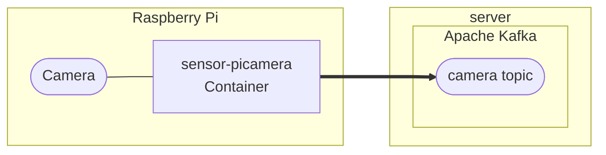

# Raspberry Pi Cameraのデータをサーバに送信する

## 1. 概要

### 1.1. システム構成

システム構成を次図に示します。`Raspberry Pi`で示された枠内がここで示す手順で構築する対象になります。



sensor-picameraコンテナはRaspberry Piに接続されたカメラの画像を取得して、そのデータをKafkaブローカに送信します。

### 1.2. 前提条件

環境を構築、実行するために必要となる前提条件を示します。

* Raspberry Pi OS (bullseye)
  * Raspberry Pi OS Legacyはサポート対象外になります
* [Raspberry Pi カメラモジュール](https://www.raspberrypi.com/documentation/accessories/camera.html)
  * USBカメラはサポート対象外になります
* docker, docker compose v2
  * カメラ画像を送信するコンテナを実行するために必要となリます

## 2. パラメータの指定

### 2.1. 配置場所

環境を構築するために必要となる資材を配置するディレクトリを変数`target_dir`に設定してください。

```bash
target_dir=$HOME/picamera
```

### 2.2. picamera

カメラデータを送信するコンテナsensor-picameraではRaspberry Piカメラでの撮影に[Picamera2](https://github.com/raspberrypi/picamera2)を利用します。ここではPicamera2に設定するパラメータを指定します。

カメラの画像サイズを指定します。画像の幅と高さを(width)x(height)で指定することができます。また典型的なサイズについては文字列で指定することもできます。

* QVGA
  * 320x240
* VGA
  * 640x480
* HD
  * 1280x720
* FHD, 2K
  * 1920x1080
* 4K
  * 3840x2160

```bash
PICAMERA2_SIZE=VGA
```

> `4K`などの大きなサイズの画像を指定する場合は、追加で最大メッセージサイズなどの設定を変更する必要があります。

画像サイズ以外のPicamera2のパラメータに関してもコンテナの環境変数により設定することができます。指定する環境変数名はPicamera2のコンフィギュレーションパラメータを以下のルールで変換したものになります。

* 全て大文字に変換する
* プレフィックスに `PICAMERA2_` をつける
* パラメータ名をプレフィックスの後に続ける
  * 例えばcolour_spaceに対応する環境変数名は`PICAMERA2_COLOUR_SPACE`になる
* stream-specific configurationパラメータはプレフィックスの後にパラメータ名を_でつなげる
  * 例えばsizeに対応する環境変数名は`PICAMERA2_SIZE`になる
* camera controlsのように子要素があるパラメータは、パラメータ名の後に_でつなげる
* またcontrol名のように大文字、小文字が混在している場合は大文字の箇所を_で区切る
  * 例えばcontrol名AwbModeに対応する環境変数名は`PICAMERA2_CONTROLS_AWB_MODE`になる

環境変数の設定例を次の表に示します。

|環境変数名|説明|設定例|
|---|---|---|
|PICAMERA2_TRANSFORM_HFLIP|水平反転|PICAMERA2_TRANSFORM_HFLIP=1|
|PICAMERA2_TRANSFORM_VFLIP|垂直反転|PICAMERA2_TRANSFORM_VFLIP=1|
|PICAMERA2_BUFFER_COUNT|バッファセット数|PICAMERA2_BUFFER_COUNT=2|
|PICAMERA2_CONTROLS_FRAME_RATE|フレームレート|PICAMERA2_CONTROLS_FRAME_RATE=5|
|PICAMERA2_CONTROLS_AF_MODE|オートフォーカス|PICAMERA2_CONTROLS_AF_MODE=Continuous|
|PICAMERA2_CONTROLS_AWB_MODE|ホワイトバランス|PICAMERA2_CONTROLS_AWB_MODE=Tungsten|

画像サイズ以外のpicamera2パラメータを設定する場合は変数`PICAMERA2_PARAMS`に環境変数を設定するステートメントを指定して下さい。

```bash
PICAMERA2_PARAMS="
PICAMERA2_TRANSFORM_HFLIP=1
PICAMERA2_TRANSFORM_VFLIP=1
"
```

### 2.3. 撮影間隔

カメラ画像を取得する時間間隔（秒）を環境変数`SCHEDULE`に指定して下さい。

```bash
SCHEDULE=60
```

`SCHEDULE`を指定しない場合は可能な限り連続的に画像を送信し続けます。

### 2.4. Kafka

カメラデータの送信先となるKafkaブローカに関するパラメータを指定します。

Kafkaの外部公開ホスト名を指定してください。Raspberry PiからKafkaブローカにアクセスするときは、ここで指定したホスト名（またはIPアドレス）でアクセス出来るように設定する必要があります。

```bash
kafka_host=kafka.example.org
```

Kafkaブローカのポート番号を指定して下さい。

```bash
kafka_port=9092
```

カメラデータの送信先となるKafkaのトピック名を指定してください。ここで指定する値は、サーバを構築した際に指定した値と一致したものである必要があります。

```bash
picamera_topic=image-sinetstream-picamera
```

## 3. 資材の配置

環境を構築するために必要となる資材を配置します。

資材を配置するディレクトリを作成します。

```bash
mkdir -p $target_dir
```

コンテナの構成を記述した`docker-compose.yml`を配置します。

```bash
cp docker/docker-compose.yml $target_dir/docker-compose.yml
```

コンテナの環境変数を設定する`.env`ファイルを作成します。

```bash
cat > $target_dir/.env <<EOF
PICAMERA2_SIZE=${PICAMERA2_SIZE:?Image size must be set.}
${PICAMERA2_PARAMS:-}
SS_BROKERS=${kafka_hostname:?The hostname of Kafka must be set.}:${kafka_port:-9092}
SS_TOPIC=${picamera_topic:?The topic name must be set.}
SS_CONSISTENCY=AT_LEAST_ONCE
EOF
if [ -n "$SCHEDULE" ]; then
cat >> $target_dir/.env <<EOF
SCHEDULE=$SCHEDULE
EOF
fi
```

`.env`ファイルの記述例を示します。

```bash
PICAMERA2_SIZE=VGA
PICAMERA2_TRANSFORM_HFLIP=1
PICAMERA2_TRANSFORM_VFLIP=1
SS_BROKERS=kafka.example.org:9092
SS_TOPIC=image-sinetstream-picamera
SS_CONSISTENCY=AT_LEAST_ONCE
SCHEDULE=60
```

## 4. コンテナの起動

利用するコンテナイメージを取得します。

```bash
docker compose --project-directory ${target_dir} pull -q
```

コンテナを起動します。

```bash
docker compose --project-directory ${target_dir} up -d --remove-orphans
```

コンテナの実行状況を確認します。コンテナのSTATUSがUpとなっていることを確認して下さい。

```bash
docker compose --project-directory ${target_dir} ps
```
