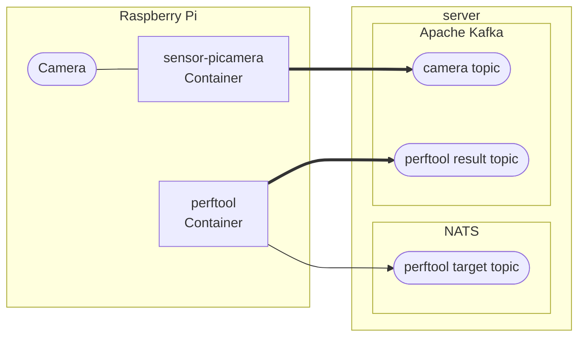

# Raspberry Pi Cameraとperftoolのデータをサーバに送信する

## 1. 概要

### 1.1. システム構成

システム構成を次図に示します。`Raspberry Pi`で示された枠内がこのnotebookで構築する対象になります。



sensor-picameraコンテナはRaspberry Piに接続されたカメラの画像を取得して、そのデータをKafkaブローカに送信します。またカメラ撮影の合間に[perftoolコマンド](https://github.com/nii-gakunin-cloud/sinetstream/tree/main/java/sample/perftool)を実行して、その計測結果をKafkaブローカに送信します。

### 1.2. 前提条件

環境を構築、実行するために必要となる前提条件を示します。

* Raspberry Pi OS (64-bit)
* [Raspberry Pi カメラモジュール](https://www.raspberrypi.com/documentation/accessories/camera.html)
  * USBカメラはサポート対象外になります
* docker, docker compose v2
  * カメラ画像を送信するコンテナを実行するために必要となリます

## 2. パラメータの指定

### 2.1. 配置場所

環境を構築するために必要となる資材を配置するディレクトリを変数`target_dir`に指定してください。

```bash
target_dir=$HOME/picamera
```

### 2.2. 　picamera

カメラデータを送信するコンテナsensor-picameraではRaspberry Piカメラでの撮影に[Picamera2](https://github.com/raspberrypi/picamera2)を利用します。ここではPicamera2に設定するパラメータを指定します。

カメラの画像サイズを指定します。画像の幅と高さを(width)x(height)で指定することができます。また典型的なサイズについては文字列で指定することもできます。

* QVGA
  * 320x240
* VGA
  * 640x480
* HD
  * 1280x720
* FHD, 2K
  * 1920x1080
* 4K
  * 3840x2160

```bash
PICAMERA2_SIZE=VGA
```

> `4K`などの大きなサイズの画像を指定する場合は、追加で最大メッセージサイズなどの設定を変更する必要があります。

画像サイズ以外のPicamera2のパラメータに関してもコンテナの環境変数により設定することができます。指定する環境変数名はPicamera2のコンフィギュレーションパラメータを以下のルールで変換したものになります。

* 全て大文字に変換する
* プレフィックスに `PICAMERA2_` をつける
* パラメータ名をプレフィックスの後に続ける
  * 例えばcolour_spaceに対応する環境変数名は`PICAMERA2_COLOUR_SPACE`になる
* stream-specific configurationパラメータはプレフィックスの後にパラメータ名を_でつなげる
  * 例えばsizeに対応する環境変数名は`PICAMERA2_SIZE`になる
* camera controlsのように子要素があるパラメータは、パラメータ名の後に_でつなげる
* またcontrol名のように大文字、小文字が混在している場合は大文字の箇所を_で区切る
  * 例えばcontrol名AwbModeに対応する環境変数名は`PICAMERA2_CONTROLS_AWB_MODE`になる

環境変数の設定例を次の表に示します。

|環境変数名|説明|設定例|
|---|---|---|
|PICAMERA2_TRANSFORM_HFLIP|水平反転|PICAMERA2_TRANSFORM_HFLIP=1|
|PICAMERA2_TRANSFORM_VFLIP|垂直反転|PICAMERA2_TRANSFORM_VFLIP=1|
|PICAMERA2_BUFFER_COUNT|バッファセット数|PICAMERA2_BUFFER_COUNT=2|
|PICAMERA2_CONTROLS_FRAME_RATE|フレームレート|PICAMERA2_CONTROLS_FRAME_RATE=5|
|PICAMERA2_CONTROLS_AF_MODE|オートフォーカス|PICAMERA2_CONTROLS_AF_MODE=Continuous|
|PICAMERA2_CONTROLS_AWB_MODE|ホワイトバランス|PICAMERA2_CONTROLS_AWB_MODE=Tungsten|

画像サイズ以外のpicamera2パラメータを設定する場合は変数PICAMERA2_PARAMSに環境変数を設定するステートメントを指定して下さい。

```bash
PICAMERA2_PARAMS="
PICAMERA2_TRANSFORM_HFLIP=1
PICAMERA2_TRANSFORM_VFLIP=1
"
```

### 2.3. 撮影間隔

カメラ画像を取得する時間間隔（秒）を環境変数`SCHEDULE`に指定して下さい。

```bash
SCHEDULE=60
```

### 2.4. 画像送信先

カメラデータの送信先となるKafkaブローカに関するパラメータを指定します。

Kafkaの外部公開ホスト名を指定してください。Raspberry PiからKafkaブローカにアクセスするときは、ここで指定したホスト名（またはIPアドレス）でアクセス出来るように設定する必要があります。

```bash
kafka_host=kafka.example.org
```

Kafkaブローカのポート番号を指定して下さい。

```bash
kafka_port=9092
```

カメラデータの送信先となるKafkaのトピック名を指定してください。ここで指定する値は、サーバを構築した際に指定した値と一致したものである必要があります。

```bash
picamera_topic=image-sinetstream-picamera
```

### 2.5. perftool

[perftoolコマンド](https://github.com/nii-gakunin-cloud/sinetstream/tree/main/java/sample/perftool)のオプションに対応する環境変数を指定します。

「[perftool - オプション](https://github.com/nii-gakunin-cloud/sinetstream/tree/main/java/sample/perftool#%E3%82%AA%E3%83%97%E3%82%B7%E3%83%A7%E3%83%B3)」に記述されているオプションのうち、以下に示したものを指定することができます。

* -c, --output-count OUTPUT_COUNT
  * OUTPUT_COUNT回メトリクス情報を計測し出力する。デフォルト:1
* -n, --num-samples NUM_SAMPLES
  * 一回のメトリクス情報を出力するまでにwriterがNUM_SAMPLES個のデータ送信を試行する。デフォルト:300
* -p, --payload-size PAYLOAD_SIZE
  * データ送信試行時にPAYLOAD_SIZEバイトのペイロード長のデータを使用する。デフォルト:1024
* -a, --async-api
  * 指定した場合はデータの送信/受信に非同期APIを使用する。指定しなかった場合は同期APIを使用する
* -t, --num-threads NUM_THREADS
  * NUM_THREADS個のreader/writerのペアを並列実行する。各ペアはOUTPUT_COUNT回メトリクス情報を計測する。デフォルト:1

perftoolコマンドのオプションと環境変数の対応を次表に示します。

|オプション|環境変数|指定例|
|---|---|---|
|--output-count|EXT_ARG_OUTPUT_COUNT|EXT_ARG_OUTPUT_COUNT=1|
|--num-samples|EXT_ARG_NUM_SAMPLES|EXT_ARG_NUM_SAMPLES=300|
|--payload-size|EXT_ARG_PAYLOAD_SIZE|EXT_ARG_PAYLOAD_SIZE=1024|
|--async-api|EXT_ARG_ASYNC_API|EXT_ARG_ASYNC_API=1|
|--num-threads|EXT_ARG_NUM_THREADS|EXT_ARG_NUM_THREADS=1|

`EXTTOOL_PARAMS`に上記の環境変数を指定するステートメントを設定して下さい。

```bash
EXTTOOL_PARAMS="
EXT_ARG_OUTPUT_COUNT=1
EXT_ARG_NUM_SAMPLES=300
EXT_ARG_PAYLOAD_SIZE=1024
EXT_ARG_NUM_THREADS=1
"
```

### 2.6. perftool計測対象

perftoolコマンドの計測対象となるブローカに関するパラメータの指定を行います。

計測対象となるブローカのホスト名（またはIPアドレス）を指定して下さい。

```bash
target_host=broker.example.org
```

ブローカのポート番号を指定して下さい。

```bash
target_port=1883
```

計測対象のトピック名を指定して下さい。

```bash
target_topic=perftool-sinetstream-target
```

ブローカの種別を指定して下さい。

```bash
target_type=mqtt
```

ブローカにメッセージを送信する際の`consistency`を指定して下さい。

```bash
target_consistency=AT_LEAST_ONCE
```

計測対象のブローカとの通信にて、上記で指定した以外のパラメータを指定する場合は`TARGET_PARAMS`に環境変数を指定するステートメントを設定して下さい。SINETStream設定ファイルのパラメータと環境変数との変換ルールを以下に示します。

* パラメータ名を全て大文字に変換する
* プレフィックスに `PERF_TGT_` をつける
* 複数階層をもつパラメータを指定する場合は階層の区切りに２文字のアンダースコア `__` を指定する

例えばパラメータ`data_compression`を指定する場合は環境変数`PERF_TGT_DATA_COMPRESSION`に値を設定します。

```bash
TARGET_PARAMS="
PERF_TGT_DATA_COMPRESSION=true
"
```

### 2.7. perftool結果送信先

perftoolコマンドの計測結果を送信するKafkaブローカに関するパラメータの指定を行います。

Kafkaの外部公開ホスト名（またはIPアドレス）を指定してください。

```bash
result_host=kafka.example.org
```

ブローカのポート番号を指定して下さい。

```bash
result_port=9092
```

送信先となるトピック名を指定して下さい。

```bash
result_topic=perftool-sinetstream-result
```

### 2.8. perftool識別名

perftoolコマンドの実行環境を識別するための名前を変数`PERF_NAME`に指定します。ここで指定した値は、計測結果を可視化する際に表示対象を選択するために必要となります。

```bash
PERF_NAME=$target_topic
```

## 3. 資材の配置

環境を構築するために必要となる資材を配置します。

資材を配置するディレクトリを作成します。

```bash
mkdir -p $target_dir
```

コンテナの構成を記述した`docker-compose.yml`を配置します。

```bash
cp ../Perftool/docker/docker-compose-picamera.yml $target_dir/docker-compose.yml
```

perftoolコンテナの環境変数を設定する`.env.perftool`ファイルを作成します。

```bash
cat > $target_dir/.env.perftool <<EOF
PERF_TGT_BROKERS=${target_host}:${target_port:-1883}
PERF_TGT_TOPIC=${target_topic}
PERF_TGT_TYPE=${target_type:-mqtt}
PERF_TGT_CONSISTENCY=${target_consistency:-AT_LEAST_ONCE}
NAME=${PERF_NAME:-$target_topic}
${TARGET_PARAMS:-}
EOF
```

`.env.perftool`ファイルの記述例を示します。

```bash
PERF_TGT_BROKERS=mqtt.example.org:1883
PERF_TGT_TOPIC=perftool-sinetstream-target
PERF_TGT_TYPE=mqtt
PERF_TGT_CONSISTENCY=AT_LEAST_ONCE
NAME=perftool-sinetstream-target
```

picameraコンテナの環境変数を設定する`.env.picamera`ファイルを作成します。

```bash
cat > $target_dir/.env.picamera <<EOF
${PICAMERA2_PARAMS:-}
PICAMERA2_SIZE=${PICAMERA2_SIZE:?Image size must be set.}
SS_BROKERS=${kafka_hostname:?The hostname of Kafka must be set.}:${kafka_port:-9092}
SS_TOPIC=${picamera_topic:?The topic name must be set.}
SS_CONSISTENCY=AT_LEAST_ONCE
SCHEDULE=$SCHEDULE
${EXTTOOL_PARAMS:-}
EXT_SS_BROKERS=${result_host}:${result_port:-9092}
EXT_SS_TOPIC=${result_topic}
EXT_SS_TYPE=kafka
EXT_SS_CONSISTENCY=AT_LEAST_ONCE
EOF
```

`.env.picamera`ファイルの記述例を示します。

```bash
PICAMERA2_TRANSFORM_HFLIP=1
PICAMERA2_TRANSFORM_VFLIP=1
PICAMERA2_SIZE=VGA
SS_BROKERS=kafka.example.org:9092
SS_TOPIC=image-sinetstream-picamera
SS_CONSISTENCY=AT_LEAST_ONCE
SCHEDULE=60

EXT_ARG_OUTPUT_COUNT=1
EXT_ARG_NUM_SAMPLES=300
EXT_ARG_PAYLOAD_SIZE=1024
EXT_ARG_NUM_THREADS=1
EXT_SS_BROKERS=kafka.example.org:9092
EXT_SS_TOPIC=perftool-sinetstream-result
EXT_SS_TYPE=kafka
EXT_SS_CONSISTENCY=AT_LEAST_ONCE
```

## 4. コンテナの起動

利用するコンテナイメージを取得します。

```bash
docker compose --project-directory ${target_dir} pull -q
```

コンテナを起動します。

```bash
docker compose --project-directory ${target_dir} up -d --remove-orphans
```

コンテナの実行状況を確認します。コンテナのSTATUSがUpとなっていることを確認して下さい。

```bash
docker compose --project-directory ${target_dir} ps
```
