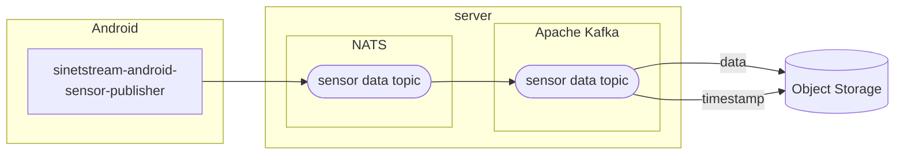

# アンドロイドセンサーデータをオブジェクトストレージに保存する

## 1. 概要

AndroidからKafkaブローカに送信されたセンサーデータを外部のオブジェクトストレージに保存するように設定します。この設定はKafkaブローカに送信されたデータのバックアップなどを目的としています。

### 1.1. システム構成

システム構成を次図に示します。



### 1.2. 前提条件

設定を行うための前提条件を示します。

* [01-setup-android-sensor-data.md](../../../Server/01-setup-android-sensor-data.md)に示した手順でサーバが構築済みであること
* 保存先となるオブジェクトストレージにサーバ構築環境からアクセスできること

## 2. パラメータの指定

設定を行うために必要となるパラメータを指定します。

### 2.1. 配置場所

サーバを構成する資材が配置されているディレクトリを変数`target_dir`に指定してください。

```bash
target_dir=$HOME/srv/sensor-viewer
```

指定されたディレクトリに想定するサーバが構築されていることを確認します。構成ファイルが配置されており、かつandroidセンサーデータ向けにサーバが構築されていることを確認します。

```bash
test -f ${target_dir}/params/00-config.yml && \
grep -q android ${target_dir}/params/00-config.yml
```

コンテナが実行中であることを確認します。

```bash
docker compose --project-directory ${target_dir} ps --services --status running | \
grep -q kafka-connect
```

Kafka ConnectのREST APIにアクセスできることを確認します。

```bash
curl -sf http://localhost:8083
```

### 2.2. オブジェクトストレージ

データ保存先となるオブジェクトストレージに関するパラメータを指定します。

オブジェクトストレージのURLを指定して下さい。

```bash
endpoint_url=http://bucket.s3-aws-region.amazonaws.com
```

保存先となるバケットの名前を指定して下さい。保存先となるバケットは既に作成されていることを想定しています。

```bash
bucket_name=android
```

オブジェクトストレージにアクセスするためのアクセスキーを指定して下さい。

```bash
access_key=access-key
```

オブジェクトストレージにアクセスするためのシークレットキーを指定して下さい。

```bash
secret_key=secret-key-change-me
```

### 2.3. Kafka Connect

Kafkaブローカからオブジェクトストレージにメッセージを保存するKafka Connectに関するパラメータの指定を行います。

#### 2.3.1. 登録名

Kafka Connectに登録する名前を指定します。

現在登録されているKafka Connectの名前を確認します。`jq`コマンドが利用できない場合は末尾の`| jq .`の部分を外して実行して下さい。

```bash
curl -sf http://localhost:8083/connectors | jq .
```

Kafka Connectの登録名を指定します。

```bash
kafka_connect_name=sink-s3-android
```

#### 2.3.2. トピック名

Androidセンサーデータの送信先となっているKafkaのトピック名を確認します。ここで確認したものがKafka Connectを登録する対象のトピック名になります。

```bash
topic_name=$(grep sensor_data $target_dir/params/01-android.yml | \
    awk '{print $2}' | tr -d '"')
echo $topic_name
```

## 3. Kafka Connectの設定

ブローカに送信されたセンサーデータをオブジェクトストレージに保存するKafka Connectを登録します。

### 3.1. センサーデータ

センサーデータをオブジェクトストレージに保存するKafka Connectを登録します。

```bash
script_dir=../../../Server/files/setup/kafka-connect
$script_dir/setup-sink-minio.sh -D -t $topic_name -b $bucket_name \
    -u $endpoint_url -A "$access_key" -S "$secret_key" \
    -n $kafka_connect_name -X .json
```

登録状況を確認します。`jq`コマンドが利用できない場合は末尾の`| jq .`の部分を外して実行して下さい。

```bash
curl -sf http://localhost:8083/connectors/$kafka_connect_name | jq .
```

### 3.2. タイムスタンプ

ブローカに送信されたセンサーデータの送信時刻をオブジェクトストレージに保存するKafka Connectを登録します。タイムスタンプの保存が不要な場合はこの節の実行をスキップできます。

```bash
$script_dir/setup-sink-minio.sh -T -t $topic_name -b $bucket_name \
    -u $endpoint_url -A "$access_key" -S "$secret_key" \
    -n ${kafka_connect_name}-timestamp
```

登録状況を確認します。`jq`コマンドが利用できない場合は、次のセルの末尾の`| jq .`の部分をコメントアウトして実行して下さい。

```bash
curl -sf http://localhost:8083/connectors/${kafka_connect_name}-timestamp | jq .
```
