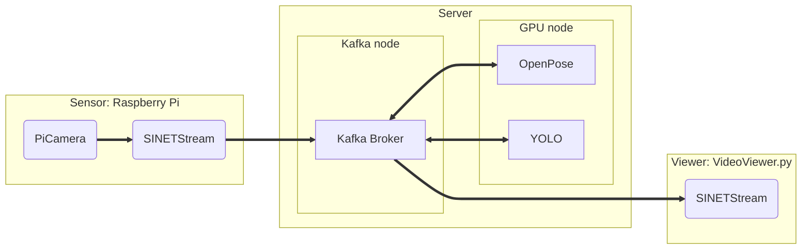

# video streaming

Raspberry Piのカメラで撮影した画像をGPUノードで処理し、その結果をクライアントで表示するシステムを構築します。システム構成を次図に示します。

構築するシステムは３つのパートから構成されます。

* Sensor
  * Raspberry Pi の[カメラ](https://www.raspberrypi.com/documentation/accessories/camera.html)で撮影した画像をサーバに送信します
  * カメラの撮影には Python ライブラリの [picamera](https://picamera.readthedocs.io/en/release-1.13/)を利用します
  * 撮影した画像は [SINETStreamライブラリ](https://www.sinetstream.net/) によりサーバのKafkaブローカに送信されます

* Server
  * Raspberry PiとViewerの間で画像の送信を中継します
  * ブローカに送信された画像を GPU ノードの OpenPose/YOLO で処理します
  
* Viewer
  * Kafkaブローカに送信された画像のストリームをクライアントで表示します
  * Kafkaのトピック名を指定することでビューアが表示する画像を選択することができます
  * Kafkaブローカからの画像の取得には[SINETStreamライブラリ](https://www.sinetstream.net/)を利用します

システムの各パートの構築手順と構築のための資材がサブディレクトリに格納されています。

* [Sensor/README.md](Sensor/README.md)
* [Server/README.md](Server/README.md)
* [Viewer/README.md](Viewer/README.md)

このシステムで送受信されるメッセージ（画像ファイル）は、全て Server の Kafka ブローカを経由してやり取りされます。そのため Server の構築を始めに行ってください。
