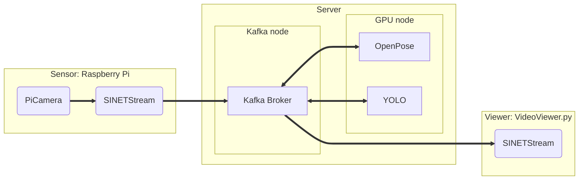

# video streaming

We will build a system in which images captured by a Raspberry Pi camera are processed by a GPU node and the results are displayed on the client. The system configuration is shown in the following figure.

<!--

-->

The system to be built consists of three parts:

* Sensor
  * The image taken by the [camera](https://www.raspberrypi.com/documentation/accessories/camera.html) of the Raspberry Pi is sent to the server
  * The Python library [picamera](https://picamera.readthedocs.io/en/release-1.13/) is used to take pictures from the camera
  * The captured images are sent to the Kafka broker on the server using the [SINETStream library](https://www.sinetstream.net/)

* Server
  * Relays the transmission of images between the Raspberry Pi and the Viewer
  * Processes images sent to the broker with the GPU node OpenPose/YOLO
  
* Viewer
  * View the stream of images sent to the Kafka broker on the client
  * Viewer can select which images to display by specifying the Kafka topic name
  * Use [SINETStream library](https://www.sinetstream.net/) to retrieve images from the Kafka broker

Instructions and materials for building each part of the system are stored in a subdirectory.

* [Sensor/README_en.md](Sensor/README_en.md)
* [Server/README_en.md](Server/README_en.md)
* [Viewer/README_en.md](Viewer/README_en.md)

All messages (image files) sent and received in this system are exchanged via the Server's Kafka broker. Therefore, please set up the Server first.