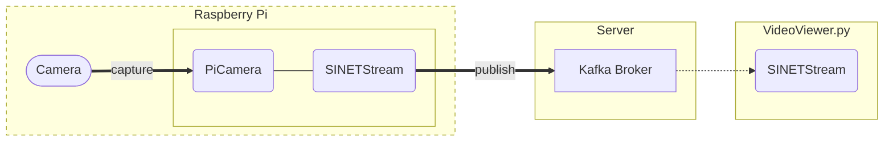

# Sending Raspberry Pi camera images to a server

The following are the steps to build an environment to send images captured by the Raspberry Pi camera to the server.


<!--

-->

## 1. Preparation

### 1.1. Execution environment

The following runtime environment is assumed:
* Raspberry Pi
* [Raspberry Pi camera module](https://www.raspberrypi.com/documentation/accessories/camera.html)

The following OS for Raspberry Pi is assumed:

* [Raspberry Pi OS](https://www.raspberrypi.com/software/operating-systems/#raspberry-pi-os-32-bit)
* [Raspberry Pi OS (Legacy)](https://www.raspberrypi.com/software/operating-systems/#raspberry-pi-os-legacy)

> [Raspberry Pi OS (64-bit)](https://www.raspberrypi.com/software/operating-systems/#raspberry-pi-os-64-bit) will not work.

## 1.2. Broker

The Kafka broker to which the images will be sent must be available in advance. Please build the Kafka broker with one of the following configurations.

* [VideoStreaming/Server/Kafka-OpenPose](https://gitlab.vcp-handson.org/niidp/sinetstream-demo/-/blob/main/VideoStreaming/Server/Kafka-OpenPose/README.en.md)
* [VideoStreaming/Server/Kafka-YOLO](https://gitlab.vcp-handson.org/niidp/sinetstream-demo/-/blob/main/VideoStreaming/Server/Kafka-YOLO/README.en.md)
* [option/Server/Kafka](https://gitlab.vcp-handson.org/niidp/sinetstream-demo/-/blob/main/option/Server/Kafka/README.en.md)

### 1.3. Camera module

To activate the camera module on Raspberry Pi, execute the following command.

```console
$ sudo raspi-config nonint do_camera 0
```

### 1.4. Configure MTU

If you continue to send camera images to the server via a mobile router using SINET SIM, the MTU may be too large to pass through the mobile network. In this case, set the MTU value to 1200.

Since a USB-connected mobile router is recognized as a device such as `usb1`, `eth1`, etc., please execute the following command.

```console
$ sudo ip link set dev usb1 mtu 1200
```

> Here is an example of execution when the device name is `usb1`. Please replace the device name with the one appropriate for your environment.

## 2. Configuration

We provide two ways for the build procedure:

* [Build procedure using containers](docker/README.en.md)
* [Build procedure using venv](venv/README.en.md)

Normally, it is recommended that you follow the instructions for building using containers. However, if you are running in an environment with limited resources such as [Raspberry Pi Zero W](https://www.raspberrypi.com/products/raspberry-pi-zero-w/), consider running the build procedure using venv.

Please refer to the respective links for detailed instructions.