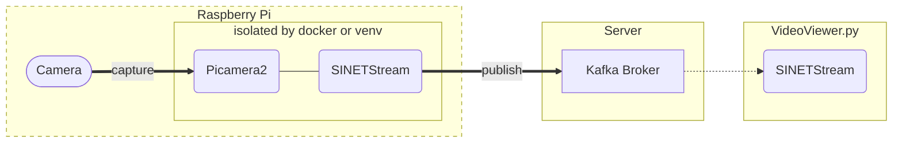

# Raspberry Piのカメラ画像をサーバに送信する

Raspberry Piのカメラで撮影した画像をサーバに送信する環境を構築する手順を示します。



## 1. 準備

### 1.1. 前提条件

実行環境として以下のものを想定します。

* Raspberry Pi
* [Raspberry Pi OS (bullseye)](https://www.raspberrypi.com/software/)
* [Raspberry Piカメラモジュール](https://www.raspberrypi.com/documentation/accessories/camera.html)

また画像の送信先となる Kafka ブローカが事前に利用可能な状態になっている必要があります。以下に示すいずれかの構成でKafkaブローカを構築してください。

* [VideoStreaming/Server/Kafka-OpenPose](../Server/Kafka-OpenPose/README.md)
* [VideoStreaming/Server/Kafka-YOLO](../Server/Kafka-YOLO/README.md)
* [option/Server/Kafka](../../option/Server/Kafka/README.md)

### 1.2. Docker

ここで示す構築手順ではカメラで撮影した画像をサーバに送信するソフトウェアをDockerコンテナで実行します。そのため事前に Docker Engine などをインストールする必要があります。[Install Docker Engine on Debian](https://docs.docker.com/engine/install/debian/)などを参考にインストールしてください。

また、コンテナの起動には Docker Compose v2 を利用します。[Install Docker Compose](https://docs.docker.com/compose/install/)などを参考にインストールしてください。

### 1.3. /boot/config.txt

通常はOSのインストール時に配置された`/boot/config.txt`を変更する必要はありません。ただし設定するパラメータによってはより多くのメモリ割り当てが必要となることがあります。[The Picamera2 Library](https://datasheets.raspberrypi.com/camera/picamera2-manual.pdf)の"8.3. Pixel formats and memory considerations"などを参考にCMAメモリの割り当てを増やすことを検討して下さい。

レガシーカメラスタックを利用していた場合`gpu_mem`の量を増やす設定を`/boot/config.txt`に記述しています。Picamera2ではこの設定は不要です。`/boot/config.txt`から`gpu_mem`を記述した行を削除して下さい。

### 1.4. MTUの設定

SINET SIMを使用したモバイルルータを経由してカメラ画像をサーバに送り続ける場合 MTU が大きくてモバイル網を通せないことがあります。その場合はMTUの値を 1200 に設定します。

USB接続したモバイルルータは `usb1`, `eth1` などのデバイスとして認識されるので、以下のコマンドを実行してください。

```console
sudo ip link set dev usb1 mtu 1200
```

> ここではデバイス名が`usb1`の場合の実行例を示しています。実行環境に応じたデバイス名に読み替えてください。

### 1.5. 資材の配置

`docker`ディレクトリにある`docker-compose.yml`ファイルを RaspberryPi に配置してください。また同じディレクトリに`.env`を作成してください。`.env` の記述方法については次章で説明します。

### 1.6. ホスト名の名前解決

Kafkaブローカの[advertise するアドレス](../../option/Server/Kafka/README.md#32-broker_hostname)としてホスト名が指定され、かつDNSによる名前解決ができない場合、他の手段で設定を行う必要があります。

`docker-compose.yml` の`extra_hosts`を利用してコンテナにおけるKafkaブローカの名前解決を行う例を以下に示します。ここでは`kafka.example.org`のIPアドレスとして `192.168.2.100` を設定します。

```yaml
services:
  picamera:
    image: harbor.vcloud.nii.ac.jp/sinetstream/sensor-picamera:0.2.13
    privileged: true
    volumes:
      - /dev:/dev
      - /run/udev:/run/udev
    restart: on-failure:5
    env_file: .env
    extra_hosts:
      - "kafka.example.org:192.168.2.100"
```

## 2. パラメータ

カメラの設定や画像の送信先に関するパラメータはコンテナの環境変数により設定します。`docker compose`を利用する場合、コンテナの環境変数は `.env` ファイルにまとめて記述することができます。

### 2.1. Picamera2に関するパラメータ

ここで構築する環境ではRaspberry Piカメラでの撮影に[Picamera2](https://github.com/raspberrypi/picamera2)を利用します。Picamera2のコンフィギュレーションパラメータの値はコンテナの環境変数により設定することができます。指定する環境変数名はPicamera2のコンフィギュレーションパラメータを以下のルールで変換したものになります。

* 全て大文字に変換する
* プレフィックスに `PICAMERA2_` をつける
* パラメータ名をプレフィックスの後に続ける
  * 例えば`colour_space`に対応する環境変数名は`PICAMERA2_COLOUR_SPACE`になる
* stream-specific configurationパラメータはプレフィックスの後にパラメータ名を`_`でつなげる
  * 例えば`size`に対応する環境変数名は`PICAMERA2_SIZE`になる
* camera controlsのように子要素があるパラメータは、パラメータ名の後に`_`でつなげる
* またcontrol名のように大文字、小文字が混在している場合は大文字の箇所を`_`で区切る
  * 例えばcontrol名`AwbMode`に対応する環境変数名は`PICAMERA2_CONTROLS_AWB_MODE`になる

Picamera2に関するおもな環境変数を次表に示します。

|環境変数名|説明|設定例|
|---|---|---|
|PICAMERA2_SIZE|画像のサイズ<br>画像の幅と高さを(width)x(height)で指定する QVGA,VGA,HD,2K,4Kなどの文字列で指定することも可|PICAMERA2_SIZE=640x480 PICAMERA2_SIZE=2K|
|PICAMERA2_TRANSFORM_HFLIP|水平反転|PICAMERA2_TRANSFORM_HFLIP=1|
|PICAMERA2_TRANSFORM_VFLIP|垂直反転|PICAMERA2_TRANSFORM_VFLIP=1|
|PICAMERA2_BUFFER_COUNT|バッファセット数|PICAMERA2_BUFFER_COUNT=2|
|PICAMERA2_CONTROLS_FRAME_RATE|フレームレート|PICAMERA2_CONTROLS_FRAME_RATE=5|
|PICAMERA2_CONTROLS_AF_MODE|オートフォーカス|PICAMERA2_CONTROLS_AF_MODE=Continuous|
|PICAMERA2_CONTROLS_AWB_MODE|ホワイトバランス|PICAMERA2_CONTROLS_AWB_MODE=Tungsten|

Picamera2のパラメータの詳細については[The Picamera2 Library](https://datasheets.raspberrypi.com/camera/picamera2-manual.pdf)の"Appendix B: Camera configuration parameters", "Appendix C: Camera controls"などを参照して下さい。

Raspberry Piのカメラ画像を送信するために以前利用していたコンテナイメージ`harbor.vcloud.nii.ac.jp/sinetstream/sample/sensor-picamera`では[Picamera](https://picamera.readthedocs.io/)を用いていました。そのためパラメータの指定方法が現在の指定方法と大きく異なります。最低限の互換性を保つために、次表に示すパラメータについては新しいコンテナイメージでもそのまま指定することができます。

|環境変数名|説明|設定例|
|---|---|---|
|PICAMERA_RESOLUTION|画像のサイズ<br>画像の幅と高さを(width)x(height)で指定する QVGA,VGA,HD,2Kなどの文字列で指定することも可|PICAMERA_RESOLUTION=640x480 PICAMERA_RESOLUTION=HD|
|PICAMERA_FRAMERATE|フレームレート|PICAMERA_FRAMERATE=5|


### 2.2. SINETStreamに関するパラメータ

ここで構築する環境ではカメラ画像をサーバに送信するのに[SINETStream](https://www.sinetstream.net/)を利用します。SINETStreamでは接続先のブローカに関するパラメータを設定ファイル`.sinetstream_config.yml`に記述しますが、ここで利用するコンテナイメージでは環境変数により同等の指定をおこなうことができます（コンテナの内部で環境変数からSINETStreamの設定ファイルを自動的に生成しています）。設定ファイルに指定するパラメータ名から環境変数名への変換ルールを以下に示します。

* パラメータ名を全て大文字に変換する
* プレフィックスに `SS_` をつける
* 複数階層をもつパラメータを指定する場合は階層の区切りに２文字のアンダースコア `__` を指定する

例えば設定ファイルに記述するパラメータ`brokers`に対応する環境変数は`SS_BROKERS`になります。SINETStreamに関するおもな環境変数を次表に示します。

|環境変数名|必須項目|説明|設定例|
|---|---|---|---|
|SS_BROKERS|&check;|ブローカのアドレス 複数指定する場合は`,`でつなげる|SS_BROKERS=kafka.example.org SS_BROKERS=kafka1:9092,kafka2:9092|
|SS_TOPIC|&check;|トピック名|SS_TOPIC=sinetstream.image.camera|
|SS_TYPE||ブローカタイプ デフォルト値は`kafka`|SS_TYPE=kafka|
|SS_CONSISTENCY||メッセージ配信の信頼性|SS_CONSISTENCY=AT_LEAST_ONCE SS_CONSISTENCY=AT_MOST_ONCE|

SINETStreamの設定ファイル`.sinetstream_config.yml`に指定するパラメータの詳細については[SINETStream - 設定ファイル](https://www.sinetstream.net/docs/userguide/config.html)を参照してください。

### 2.3. 画像取得タイミングに関するパラメータ

タイムラプスのように一定時間毎の画像を取得する場合は環境変数`SCHEDULE`を設定します。

|環境変数名|説明|設定例|
|---|---|---|
|SCHEDULE|画像取得のスケジュール|SCHEDULE=10<br>SCHEDULE=every 30 seconds|

`SCHEDULE`に数値のみを指定した場合、その値の時間間隔（秒）で画像取得を行います。

秒単位よりも長い時間間隔を設定する場合、スケジュール指定文字列を指定することができます。いくつかの指定例を以下に示します。

|指定文字列|説明|
|---|---|
|every 3 seconds|３秒ごと|
|every minute|１分ごと|
|every 3 minutes|３分ごと
|every 3 hours|３時間ごと|
|every minute at :23|毎分の23秒に|
|every day at 10:30|毎日10時30分に|

### 2.4. 設定例

`.env` の指定例をいくつか示します。ここで示す例ではKafka ブローカのアドレスを`kafka.example.org:9092`、トピック名を`sinetstream.image.camera`としています。

#### 2.4.1. フレームレートを指定する場合

フレームレートを指定して小さなサイズの画像を送信する場合の `.env` の例を示します。

```sh
PICAMERA2_SIZE=QVGA
PICAMERA2_CONTROLS_FRAME_RATE=5
SS_BROKERS=kafka.example.org:9092
SS_TOPIC=sinetstream.image.camera
SS_CONSISTENCY=AT_LEAST_ONCE
```

上記の指定例ではQVGA(320x240)の画像を１秒あたり5回送信します。

> 上記の例と同じ内容のファイルがこのディレクトリの `dot_env-high_rate-sample` にあります。`.env`のテンプレートとして利用してください。

通信帯域に対してフレームレートや画像サイズの指定が大きすぎる場合は、画像の送信処理が遅延し最終的には送信エラーとなります。

#### 2.4.2. 低頻度の画像送信を行う場合

タイムラプスのような一定の時間間隔で撮影したカメラ画像を送信する場合の`.env`の例を示します。

```sh
PICAMERA2_SIZE=VGA
SCHEDULE=10
SS_BROKERS=kafka.example.org:9092
SS_TOPIC=sinetstream.image.camera
SS_CONSISTENCY=AT_LEAST_ONCE
```

上記の指定例ではVGA(640x480)の画像を１０秒毎に送信する設定になります。

> 上記の例と同じ内容のファイルがこのディレクトリの `dot_env-low_rate-sample` にあります。`.env`のテンプレートとして利用してください。

## 3. 実行

`docker-compose.yml`と`.env`を配置したディレクトリで以下のコマンドを実行してください。コンテナが正常に起動するとRaspberryPiのカメラからブローカへと画像送信が開始されます。

```console
docker compose up -d
```

コンテナの状態を確認します。コンテナの状態(STATUS)が`running`となっていることを確認してください。

```console
$ docker compose ps
NAME                COMMAND                  SERVICE             STATUS              PORTS
images-picamera-1   "/opt/ss-camera/ss-c…"   picamera            running
```

RaspberryPi起動時に自動的に画像送信を開始するために`docker-compose.yml`の`restart`には`on-failure:5`を指定しています。Kafkaブローカに接続できないなどの理由でコンテナの実行がエラーとなった場合、所定の回数（５回）リトライした後にエラー終了します。エラーに関わらずコンテナを起動し続けるには `restart`に`always` を指定してください。

## 4. 動作確認

画像ストリームビューア[VideoViewer.py](../Viewer/README.md)を利用することでRaspberryPiから送信したカメラ画像を確認することができます。VideoViewer.pyが画像を読み込む対象とするトピック名には、ここで構築した環境の`SS_TOPIC`に指定したトピック名を指定してください。

## 5. 付録

### 5.1. 4Kサイズの画像を送信する場合

4Kサイズの画像を送信する場合、いくつか追加設定が必要となります。

#### 5.1.1. Raspberry Piの設定

Raspberry Piで実行するコンテナから送信するメッセージの最大サイズを変更するために `.env` で`SS_MAX_REQUEST_SIZE`を指定する必要があります。`.env`の記述例を以下に示します。

```sh
PICAMERA2_SIZE=4K
SCHEDULE=every minute
SS_BROKERS=kafka.example.org:9092
SS_TOPIC=sinetstream.image.camera
SS_CONSISTENCY=AT_LEAST_ONCE
SS_MAX_REQUEST_SIZE=8388620
```

#### 5.1.2. Kafkaブローカの設定

Kafkaブローカが受け取るメッセージサイズの最大値を変更するためにプロパティ[message.max.bytes](https://kafka.apache.org/documentation/#brokerconfigs_message.max.bytes) を指定する必要があります。

[option/Server/Kafka](../../option/Server/Kafka/README.md)などでKafkaブローカを構築している場合、`docker-compose.yml`を配置したディレクトリにある `.env` でに環境変数`KAFKA_MESSAGE_MAX_BYTES`の指定を追加することで、これを設定できます。`.env`の記述例を以下に示します。

```sh
BROKER_HOSTNAME=kafka.example.org
KAFKA_MESSAGE_MAX_BYTES=8388620
```

### 5.2. コンフィグサーバを利用する場合

[SINETStream v1.6](https://www.sinetstream.net/docs/news/20211223-release_v16.html)では、ローカルファイルの設定ファイルだけでなく、事前にサーバに登録した設定ファイルを利用してブローカに接続することが可能となりました。ブローカの設定ファイルを管理しているサーバをSINETStreamではコンフィグサーバと呼んでいます。ここではカメラ画像を送信するコンテナからコンフィグサーバを利用するための設定方法を説明します。

#### 5.2.1. 準備

コンフィグサーバにログインして以下の操作を行ってください。

* Raspberry Piのカメラ画像を送信するための設定ファイルを登録する
* コンフィグサーバへのアクセスキー`auth.json`をダウンロードする
* 秘匿情報を暗号化するための公開鍵ペアを登録する（設定ファイルに秘匿情報がふくまれている場合のみ）

`auth.json`はSINETStreamライブラリがコンフィグサーバにアクセスするための認証情報などが記されたJSONファイルです。コンフィグサーバからダウンロードしたファイルを Raspberry Piに配置しておいて下さい。

#### 5.2.2. コンテナへの設定

コンフィグサーバを利用するためのパラメータを次表に示します。

|パラメータ名|必須項目|説明|
|---|---|---|
|SSCFG_AUTH|&check;|コンフィグサーバから取得した`auth.json`|
|SSCFG_NAME|&check;|コンフィグサーバに登録してあるコンフィグ名|
|SSCFG_SERVICE||サービス名。指定したコンフィグ情報に単一のサービスのみが記述されている場合は指定不要。|
|SSCFG_PRIVATE_KEY||コンフィグ情報の秘匿情報を復号化するための秘密鍵。コンフィグ情報に秘匿情報が含まれていない場合は指定不要。|

パラメータをコンテナに設定するには２つの方法があります。

1. 環境変数
1. docker secrets

環境変数で指定する場合は `.env`ファイルなどにパラメータ名とその値を直接記述してください。`SSCFG_AUTH`, `SSCFG_PRIVATE_KEY` は秘匿情報となるので環境変数による指定ではなく docker secrets による指定を推奨します。

docker secretsで指定する場合は`docker-compose.yml`に[secrets](https://docs.docker.com/compose/compose-file/compose-file-v3/#secrets)の記述を追加することになります。`auth.json`をsecretsとして指定する場合の`docker-compose.yml`の記述例を以下に示します。`auth.json`ファイルは`docker-compose.yml`と同じディレクトリに配置してあることを想定しています。

```yaml
services:
  picamera:
    image: harbor.vcloud.nii.ac.jp/sinetstream/sensor-picamera:0.2.13
    privileged: true
    volumes:
      - /dev:/dev
      - /run/udev:/run/udev
    restart: on-failure:5
    env_file: .env
    secrets:
      - source: auth_json
        target: SSCFG_AUTH
        mode: 0440
secrets:
  auth_json:
    file: auth.json
```

#### 5.2.3. プロキシ経由でコンフィグサーバにアクセスする場合

コンフィグサーバへのアクセスにHTTPプロキシを利用する場合は、コンテナの環境変数`HTTPS_PROXY`にプロキシのアドレスを設定してください。

```sh
HTTPS_PROXY=socks5h://proxy.example.org:1080
```

## 6. 付録: venvを利用した構築手順

通常はコンテナを利用した構築手順を実行することを推奨します。ただし[Raspberry Pi Zero W](https://www.raspberrypi.com/products/raspberry-pi-zero-w/)などのリソースが限られた環境で実行する場合は venv を利用した構築手順を実行することを検討してください。

ここでは、カメラで撮影した画像をサーバに送信するソフトウェアを[venv](https://docs.python.org/ja/3/library/venv.html)の仮想環境に構築する手順を示します。

### 6.1. venv

venvを利用するために必要となるパッケージをインストールします。

```console
sudo apt update
sudo apt install python3-venv
```

### 6.2. 資材の配置

`venv`ディレクトリにあるファイルを Raspberry Pi に配置してください。

### 6.3. ライブラリのインストール

venv の仮想環境を作成して、画像を送信するのに必要となるライブラリのインストールを行います。前節で資材を配置したディレクトリで、以下のコマンドを実行してください。

```console
python -m venv --system-site-packages .
bin/pip install -r requirements.txt
sudo apt install python3-picamera2
```

### 6.4. ホスト名の名前解決

Kafkaブローカの[advertise するアドレス](../../../option/Server/Kafka/README.md#32-broker_hostname)としてホスト名が指定され、かつDNSによる名前解決ができない場合、`/etc/hosts` などに設定を追加する必要があります。

例えば`kafka.example.org`のIPアドレスとして `192.168.2.100` を設定する場合、以下の内容を `/etc/hosts` に追加します。

```
192.168.2.100    kafka.example.org
```

### 6.5. .env ファイル

環境変数は直接シェルに設定することも出来ますが`.env` ファイルにまとめて記述することができます。`.env`ファイルには(環境変数名)=(パラメータ値)の形式で記述を行います。

`.env`ファイルの書式に関する詳細については [python-dotenv - File format](https://saurabh-kumar.com/python-dotenv/#file-format) を参照してください。

### 6.6. Picameraに関するパラメータ

ここで構築する環境ではRaspberry Piカメラでの撮影に[Picamera2](https://github.com/raspberrypi/picamera2)を利用します。Picamera2のコンフィギュレーションパラメータの値は環境変数により設定することができます。

### 6.7. SINETStreamに関するパラメータ

画像送信スクリプトでは、設定ファイルにパラメータを記述する方法以外に環境変数による設定方法に対応しています。dockerをつかった場合と互換性を保つための設定方法となります。

画像送信スクリプトでは、環境変数により設定されたパラメータからSINETStreamの設定ファイルを生成しています。SINETStream設定ファイルのパラメータと環境変数との変換ルールを以下に示します。前表に示したもの以外のパラメータを設定する場合に用いて下さい。

* パラメータ名を全て大文字に変換する
* プレフィックスに `PICAMERA2_` をつける
* 複数階層をもつパラメータを指定する場合は階層の区切りに２文字のアンダースコア `__` を指定する

例えば設定ファイルに記述するパラメータ`tls`に対応する環境変数は`SS_TLS`になります。 SINETStreamの設定ファイル`.sinetstream_config.yml`に指定するパラメータの詳細については[SINETStream - 設定ファイル](https://www.sinetstream.net/docs/userguide/config.html)を参照してください。

### 6.8. 実行

画像送信スクリプトを実行します。Pythonスクリプトなどの資材を配置したディレクトリで以下のコマンドを実行してください。スクリプトが正常に起動するとRaspberry Piのカメラからブローカへと画像送信が開始されます。

```console
bin/python ss-camera.py
```

### 6.9. サービス登録

画像送信プログラムをRaspberry Piで常時稼働させる場合 systemd のサービスとして登録すると管理が容易になります。systemdに登録することで Raspberry Pi の起動時に自動的に送信プログラムを実行したり、エラー終了時の再実行などが可能となります。

送信プログラムをsystemdにサービスとして登録し、起動する手順を以下に示します。

1. 登録するサービスの設定ファイルを作成する
2. systemd に設定ファイルを読み込むように指示する
3. サービスを起動する
4. サービスの自動起動を設定する

> 上記の全ての手順で管理者権限が必要となります。`sudo` などで管理者権限を得るようにしてください。

#### 6.9.1. 設定ファイルを作成する

`/etc/systemd/system/` にsystemdの設定ファイルを作成してください。ファイル名は `picamera.service` のように、サフィックスとして `.service` を付けてください。設定ファイルの例を以下に示します。

```ini
[Unit]
Description=Send images from Pi Camera

[Service]
Type=simple
User=user01
WorkingDirectory=/home/user01/picamera
Environment="PATH=/home/user01/picamera/bin"
ExecStart=/home/user01/picamera/ss-camera.py
Restart=always

[Install]
WantedBy=multi-user.target
```

`Description`, `User`, `WorkingDirectory`, `Environment`, `ExecStart` を実際の環境に合せて適切に変更してください。

> 記述例と同じ内容のファイル[example_picamera.service](./example_picamera.service)がこのディレクトリにあります。テンプレートとして利用してください。

#### 6.9.2. systemd に設定ファイルを読み込むように指示する

`/etc/systemd/system/` に作成した設定ファイルを systemd に読み込ませるために、以下のコマンドを実行してください。

```console
sudo systemctl daemon-reload
```

`systemctl status`コマンドで、サービスが登録されたことを確認します。サービス名を`picamera`で登録した場合の実行例を以下に示します。

```console
$ sudo systemctl status picamera
● picamera.service - Send images from Pi Camera
     Loaded: loaded (/etc/systemd/system/picamera.service; disabled; vendor prese>
     Active: inactive (dead)
```

#### 6.9.3. サービスを起動する

`systemctl start`コマンドで登録したサービスを起動します。

サービス名を`picamera`で登録した場合の実行例を以下に示します。`systemctl start`でサービスを起動した後に`systemctl status`で状態を確認しています。

```console
$ sudo systemctl start picamera
$ sudo systemctl status picamera
● picamera.service - Send images from Pi Camera
     Loaded: loaded (/etc/systemd/system/picamera.service; disabled; vendor prese>
     Active: active (running) since Wed 2022-07-19 08:02:00 GMT; 5s ago
   Main PID: 1443 (python3)
      Tasks: 1 (limit: 724)
        CPU: 4.957
     CGroup: /system.slice/picamera.service
             └─732 python3 /home/user01/picamera/ss-camera.py

Feb 09 02:57:05 raspberrypi systemd[1]: Started Send sensor data.
```

RaspberryPi起動時に自動的に画像送信を開始するために`docker-compose.yml`の`restart`には`on-failure:5`を指定しています。Kafkaブローカに接続できないなどの理由でコンテナの実行がエラーとなった場合、所定の回数（５回）リトライした後にエラー終了します。エラーに関わらずコンテナを起動し続けるには `restart`に`always` を指定してください。

#### 6.9.4. サービスの自動起動を設定する

登録したサービスを Raspberry Pi が起動した時に自動的に開始されるように設定します。サービス名を指定して`systemctl enable`コマンドを実行してください。

サービス名を`picamera`で登録した場合の実行例を以下に示します。

```console
$ sudo systemctl enable picamera
Created symlink /etc/systemd/system/multi-user.target.wants/picamera.service → /etc/systemd/system/picamera.service.
```
