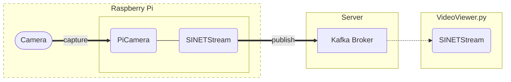

# Raspberry Piのカメラ画像をサーバに送信する

Raspberry Piのカメラで撮影した画像をサーバに送信する環境を構築する手順を示します。


<!--

-->

## 1. 準備

### 1.1. 実行環境

実行環境として以下のものを想定します。
* Raspberry Pi
* [Raspberry Piカメラモジュール](https://www.raspberrypi.com/documentation/accessories/camera.html)

Raspberry Pi のOSには以下のものを想定します。

* [Raspberry Pi OS](https://www.raspberrypi.com/software/operating-systems/#raspberry-pi-os-32-bit)
* [Raspberry Pi OS (Legacy)](https://www.raspberrypi.com/software/operating-systems/#raspberry-pi-os-legacy)

> [Raspberry Pi OS (64-bit)](https://www.raspberrypi.com/software/operating-systems/#raspberry-pi-os-64-bit)では動作しません。

## 1.2. ブローカ

画像の送信先となる Kafka ブローカが事前に利用可能な状態になっている必要があります。以下に示すいずれかの構成でKafkaブローカを構築してください。

* [VideoStreaming/Server/Kafka-OpenPose](https://gitlab.vcp-handson.org/niidp/sinetstream-demo/-/blob/main/VideoStreaming/Server/Kafka-OpenPose/README.md)
* [VideoStreaming/Server/Kafka-YOLO](https://gitlab.vcp-handson.org/niidp/sinetstream-demo/-/blob/main/VideoStreaming/Server/Kafka-YOLO/README.md)
* [option/Server/Kafka](https://gitlab.vcp-handson.org/niidp/sinetstream-demo/-/blob/main/option/Server/Kafka/README.md)

### 1.3. カメラモジュール

Raspberry Piのカメラモジュールを有効化するために、以下のコマンドを実行してください。

```console
$ sudo raspi-config nonint do_camera 0
```

### 1.4. MTUの設定

SINET SIMを使用したモバイルルータを経由してカメラ画像をサーバに送り続ける場合 MTU が大きくてモバイル網を通せないことがあります。その場合はMTUの値を 1200 に設定します。

USB接続したモバイルルータは `usb1`, `eth1` などのデバイスとして認識されるので、以下のコマンドを実行してください。

```console
$ sudo ip link set dev usb1 mtu 1200
```

> ここではデバイス名が`usb1`の場合の実行例を示しています。実行環境に応じたデバイス名に読み替えてください。

## 2. 構成

２通りの構築手順を提供しています。

* [コンテナを利用した構築手順](docker/README.md)
* [venvを利用した構築手順](venv/README.md)

通常はコンテナを利用した構築手順を実行することを推奨します。ただし[Raspberry Pi Zero W](https://www.raspberrypi.com/products/raspberry-pi-zero-w/)などのリソースが限られた環境で実行する場合は venv を利用した構築手順を実行することを検討してください。

構築手順の詳細についてはそれぞれのリンク先を確認してください。