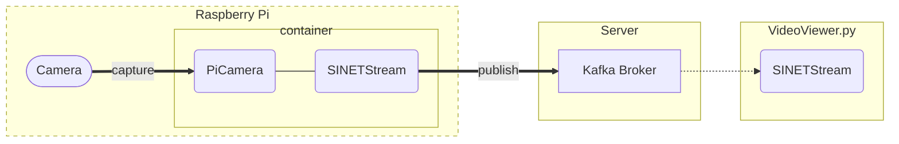

# Raspberry Piのカメラ画像をサーバに送信する

Raspberry Piのカメラで撮影した画像をサーバに送信する環境を構築する手順を示します。


<!--

-->

## 1. 準備

### 1.1. 前提条件

実行環境として以下のものを想定します。
* Raspberry Pi
* [Raspberry Piカメラモジュール](https://www.raspberrypi.com/documentation/accessories/camera.html)

また画像の送信先となる Kafka ブローカが事前に利用可能な状態になっている必要があります。以下に示すいずれかの構成でKafkaブローカを構築してください。

* [VideoStreaming/Server/Kafka-OpenPose](../Server/Kafka-OpenPose/README.md)
* [VideoStreaming/Server/Kafka-YOLO](../Server/Kafka-YOLO/README.md)
* [option/Server/Kafka](../../option/Server/Kafka/README.md)

### 1.2. Docker

ここで示す構築手順ではカメラで撮影した画像をサーバに送信するソフトウェアをDockerコンテナで実行します。そのため事前に Docker Engine などをインストールする必要があります。

https://docs.docker.com/engine/install/debian/

などを参考にRaspberry PiにDocker Engineをインストールしてください。Dockerのバージョンは 19.03.0 以上が必要となります。

また、コンテナの起動には Docker Compose を利用します。

https://github.com/docker/compose#linux

などを参考にインストールしてください。Docker Compose のバージョンは 1.27.1 以上が必要となります。

### 1.3. カメラモジュール

RaspberryPiのカメラモジュールを有効化するために、以下のコマンドを実行してください。

```
$ sudo raspi-config nonint do_camera 0
```

### 1.4. MTUの設定

SINET SIMを使用したモバイルルータを経由してカメラ画像をサーバに送り続ける場合 MTU が大きくてモバイル網を通せないことがあります。その場合はMTUの値を 1200 に設定します。

USB接続したモバイルルータは `usb1`, `eth1` などのデバイスとして認識されるので、以下のコマンドを実行してください。

```console
$ sudo ip link set dev usb1 mtu 1200
```

> ここではデバイス名が`usb1`の場合の実行例を示しています。実行環境に応じたデバイス名に読み替えてください。

### 1.5. 資材の配置

このディレクトリにある`docker-compose.yml`ファイルを RaspberryPi に配置してください。また同じディレクトリに`.env`を作成してください。`.env` の記述方法については次章で説明します。

### 1.6. ホスト名の名前解決

Kafkaブローカの[advertise するアドレス](../../option/Server/Kafka/README.md#32-broker_hostname)としてホスト名が指定され、かつDNSによる名前解決ができない場合、他の手段で設定を行う必要があります。

`docker-compose.yml` の`extra_hosts`を利用してコンテナにおけるKafkaブローカの名前解決を行う例を以下に示します。ここでは`kafka.example.org`のIPアドレスとして `192.168.2.100` を設定します。

```yaml
version: '3.7'
services:
  picamera:
    image: harbor.vcloud.nii.ac.jp/sinetstream/sample/sensor-picamera
    privileged: true
    init: true
    devices:
    - /dev/vchiq:/dev/vchiq
    restart: on-failure:5
    env_file: .env
    extra_hosts:
    - "kafka.example.org:192.168.2.100"
```

## 2. パラメータ

カメラの設定や画像の送信先に関するパラメータはコンテナの環境変数により設定します。`docker compose`を利用する場合、コンテナの環境変数は `.env` ファイルにまとめて記述することができます。

### 2.1. PiCameraに関するパラメータ

ここで構築する環境ではRaspberry Piカメラでの撮影に[PiCamera](https://picamera.readthedocs.io/)を利用します。PiCameraのコンストラクタ引数やプロパティに指定する値をコンテナの環境変数により設定することができます。指定する環境変数名は、PiCameraのコンストラクタ引数名やプロパティ名を以下のルールで変換したものになります。

* 全て大文字に変換する
* プレフィックスに `PICAMERA_` をつける

例えば `resolution` に対応する環境変数名は `PICAMERA_RESOLUTION` になります。

PiCameraに関するおもな環境変数を次表に示します。

|環境変数名|説明|設定例|
|---|---|---|
|PICAMERA_RESOLUTION|画像の解像度。<br>画像の幅と高さを "(width)x(height)"で指定する。QVGA,VGA,HD,2Kなどの文字列で指定することも可。|PICAMERA_RESOLUTION=640x480<br>PICAMERA_RESOLUTION=HD|
|PICAMERA_FRAMERATE|フレームレート|PICAMERA_FRAMERATE=5|
|PICAMERA_AWB_MODE|ホワイトバランス|PICAMERA_AWB_MODE=sunlight|
|PICAMERA_ISO|ISO|PICAMERA_ISO=400|

PiCameraのパラメータについては[API - The PiCamera Class](https://picamera.readthedocs.io/en/release-1.13/api_camera.html)を参照してください。

### 2.2. SINETStreamに関するパラメータ

ここで構築する環境ではカメラ画像をサーバに送信するのに[SINETStream](https://www.sinetstream.net/)を利用します。SINETStreamでは接続先のブローカに関するパラメータを設定ファイル`.sinetstream_config.yml`に記述しますが、ここで利用するコンテナイメージでは環境変数により同等の指定をおこなうことができます（コンテナの内部で環境変数からSINETStreamの設定ファイルを自動的に生成しています）。設定ファイルに指定するパラメータ名から環境変数名への変換ルールを以下に示します。

* パラメータ名を全て大文字に変換する
* プレフィックスに `SS_` をつける
* 複数階層をもつパラメータを指定する場合は階層の区切りに２文字のアンダースコア `__` を指定する

例えば設定ファイルに記述するパラメータ`brokers`に対応する環境変数は`SS_BROKERS`になります。SINETStreamに関するおもな環境変数を次表に示します。

|環境変数名|必須項目|説明|設定例|
|---|---|---|---|
|SS_BROKERS|&check;|ブローカのアドレス<br>複数指定する場合は`,`でつなげる。|SS_BROKERS=kafka.example.org<br>SS_BROKERS=kafka1:9092,kafka2:9092|
|SS_TOPIC|&check;|トピック名|SS_TOPIC=sinetstream.image.camera|
|SS_TYPE||ブローカタイプ<br>デフォルト値は`kafka`|SS_TYPE=kafka|
|SS_CONSISTENCY||メッセージ配信の信頼性|SS_CONSISTENCY=AT_LEAST_ONCE<br>SS_CONSISTENCY=AT_MOST_ONCE|

SINETStreamの設定ファイル`.sinetstream_config.yml`に指定するパラメータの詳細については[SINETStream - 設定ファイル](https://www.sinetstream.net/docs/userguide/config.html)を参照してください。

### 2.3. 画像取得タイミングに関するパラメータ

タイムラプスのように一定時間毎の画像を取得する場合は環境変数`SCHEDULE`を設定します。

|環境変数名|説明|設定例|
|---|---|---|
|SCHEDULE|画像取得のスケジュール|SCHEDULE=10<br>SCHEDULE=every 30 seconds|

`SCHEDULE`に数値のみを指定した場合、その値の時間間隔（秒）で画像取得を行います。

秒単位よりも長い時間間隔を設定する場合、スケジュール指定文字列を指定することができます。いくつかの指定例を以下に示します。

|指定文字列|説明|
|---|---|
|every 3 seconds|３秒ごと|
|every minute|１分ごと|
|every 3 minutes|３分ごと
|every 3 hours|３時間ごと|
|every minute at :23|毎分の23秒に|
|every day at 10:30|毎日10時30分に|

### 2.4. 設定例

`.env` の指定例をいくつか示します。ここで示す例ではKafka ブローカのアドレスを`kafka.example.org:9092`、トピック名を`sinetstream.image.camera`としています。


#### 2.4.1. フレームレートを指定する場合

フレームレートを指定して小さなサイズの画像を送信する場合の `.env` の例を示します。

```
PICAMERA_RESOLUTION=QVGA
PICAMERA_FRAMERATE=5
SS_BROKERS=kafka.example.org:9092
SS_TOPIC=sinetstream.image.camera
SS_CONSISTENCY=AT_LEAST_ONCE
```

上記の指定例ではQVGA(320x240)の画像を１秒あたり5回送信します。

> 上記の例と同じ内容のファイルがこのディレクトリの `dot_env-high_rate-sample` にあります。`.env`のテンプレートとして利用してください。

通信帯域に対してフレームレートや画像サイズの指定が大きすぎる場合は、画像の送信処理が遅延し最終的には送信エラーとなります。

#### 2.4.2. 低頻度の画像送信を行う場合

タイムラプスのような一定の時間間隔で撮影したカメラ画像を送信する場合の`.env`の例を示します。

```
PICAMERA_RESOLUTION=VGA
SCHEDULE=10
SS_BROKERS=kafka.example.org:9092
SS_TOPIC=sinetstream.image.camera
SS_CONSISTENCY=AT_LEAST_ONCE
```

上記の指定例ではVGA(640x480)の画像を１０秒毎に送信する設定になります。

> 上記の例と同じ内容のファイルがこのディレクトリの `dot_env-low_rate-sample` にあります。`.env`のテンプレートとして利用してください。

## 3. 実行

`docker-compose.yml`と`.env`を配置したディレクトリで以下のコマンドを実行してください。コンテナが正常に起動するとRaspberryPiのカメラからブローカへと画像送信が開始されます。

```console
$ docker compose up -d
```

> Docker Compose v1 を利用する場合は `docker compose` コマンドのかわりに `docker-compose` を指定してください。

コンテナの状態を確認します。コンテナの状態(STATUS)が`running`となっていることを確認してください。

```console
$ docker compose ps 
NAME                COMMAND                  SERVICE             STATUS              PORTS
images-picamera-1   "/opt/ss-camera/ss-c…"   picamera            running       
```

RaspberryPi起動時に自動的に画像送信を開始するために`docker-compose.yml`の`restart`には`on-failure:5`を指定しています。Kafkaブローカに接続できないなどの理由でコンテナの実行がエラーとなった場合、所定の回数（５回）リトライした後にエラー終了します。エラーに関わらずコンテナを起動し続けるには `restart`に`always` を指定してください。

## 4. 動作確認

画像ストリームビューア[VideoViewer.py](../Viewer/README.md)を利用することでRaspberryPiから送信したカメラ画像を確認することができます。VideoViewer.pyが画像を読み込む対象とするトピック名には、ここで構築した環境の`SS_TOPIC`に指定したトピック名を指定してください。

## 5. 付録

### 5.1. 4Kサイズの画像を送信する場合

[Raspberry Pi High Quality Camera](https://www.raspberrypi.com/products/raspberry-pi-high-quality-camera/)を用いて４Kサイズの画像を送信する場合、いくつか追加設定が必要となります。

#### 5.1.1. Raspberry Piの設定

RaspberryPiのカメラで4Kサイズの撮影を行うために`/boot/config.txt`で指定している [gpu_mem](https://www.raspberrypi.com/documentation/computers/config_txt.html#gpu_mem) の値を 256または 512 に設定する必要があります。

```
gpu_mem=256
```

またRaspberry Piで実行するコンテナから送信するメッセージの最大サイズを変更するために `.env` で`SS_MAX_REQUEST_SIZE`を指定する必要があります。`.env`の記述例を以下に示します。

```
PICAMERA_RESOLUTION=4K
SCHEDULE=every minute
SS_BROKERS=kafka.example.org:9092
SS_TOPIC=sinetstream.image.camera
SS_CONSISTENCY=AT_LEAST_ONCE
SS_MAX_REQUEST_SIZE=8388620
```

#### 5.1.2. Kafkaブローカの設定

Kafkaブローカが受け取るメッセージサイズの最大値を変更するためにプロパティ[message.max.bytes](https://kafka.apache.org/documentation/#brokerconfigs_message.max.bytes) を指定する必要があります。

[option/Server/Kafka](../../option/Server/Kafka/README.md)などでKafkaブローカを構築している場合、`docker-compose.yml`を配置したディレクトリにある `.env` でに環境変数`KAFKA_MESSAGE_MAX_BYTES`の指定を追加することで、これを設定できます。`.env`の記述例を以下に示します。

```
BROKER_HOSTNAME=kafka.example.org
KAFKA_MESSAGE_MAX_BYTES=8388620
```

### 5.2. コンフィグサーバを利用する場合

[SINETStream v1.6](https://www.sinetstream.net/docs/news/20211223-release_v16.html)では、ローカルファイルの設定ファイルだけでなく、事前にサーバに登録した設定ファイルを利用してブローカに接続することが可能となりました。ブローカの設定ファイルを管理しているサーバをSINETStreamではコンフィグサーバと呼んでいます。ここではカメラ画像を送信するコンテナからコンフィグサーバを利用するための設定方法を説明します。

#### 5.2.1. 準備

コンフィグサーバにログインして以下の操作を行ってください。

* Raspberry Piのカメラ画像を送信するための設定ファイルを登録する
* コンフィグサーバへのアクセスキー`auth.json`をダウンロードする
* 秘匿情報を暗号化するための公開鍵ペアを登録する（設定ファイルに秘匿情報がふくまれている場合のみ）

`auth.json`はSINETStreamライブラリがコンフィグサーバにアクセスするための認証情報などが記されたJSONファイルです。コンフィグサーバからダウンロードしたファイルを Raspberry Piに配置しておいて下さい。

#### 5.2.2. コンテナへの設定

コンフィグサーバを利用するためのパラメータを次表に示します。

|パラメータ名|必須項目|説明|
|---|---|---|
|SSCFG_AUTH|&check;|コンフィグサーバから取得した`auth.json`|
|SSCFG_NAME|&check;|コンフィグサーバに登録してあるコンフィグ名|
|SSCFG_SERVICE||サービス名<br>指定したコンフィグ情報に単一のサービスのみが記述されている場合は指定不要|
|SSCFG_PRIVATE_KEY||コンフィグ情報の秘匿情報を復号化するための秘密鍵<br>コンフィグ情報に秘匿情報が含まれていない場合は指定不要|

パラメータをコンテナに設定するには２つの方法があります。

1. 環境変数
1. docker secrets

環境変数で指定する場合は `.env`ファイルなどにパラメータ名とその値を直接記述してください。`SSCFG_AUTH`, `SSCFG_PRIVATE_KEY` は秘匿情報となるので環境変数による指定ではなく docker secrets による指定を推奨します。

docker secretsで指定する場合は`docker-compose.yml`に[secrets](https://docs.docker.com/compose/compose-file/compose-file-v3/#secrets)の記述を追加することになります。`auth.json`をsecretsとして指定する場合の`docker-compose.yml`の記述例を以下に示します。`auth.json`ファイルは`docker-compose.yml`と同じディレクトリに配置してあることを想定しています。

```yaml
version: '3.7'
services:
  picamera:
    image: harbor.vcloud.nii.ac.jp/sinetstream/sample/sensor-picamera
    privileged: true
    init: true
    devices:
    - /dev/vchiq:/dev/vchiq
    restart: on-failure:5
    env_file: .env
    secrets:
    - source: auth_json
      target: SSCFG_AUTH
      mode: 0440
secrets:
  auth_json:
    file: auth.json
```

#### 5.2.3. プロキシ経由でコンフィグサーバにアクセスする場合

コンフィグサーバへのアクセスにHTTPプロキシを利用する場合は、コンテナの環境変数`HTTPS_PROXY`にプロキシのアドレスを設定してください。

```
HTTPS_PROXY=socks5h://proxy.example.org:1080
```
