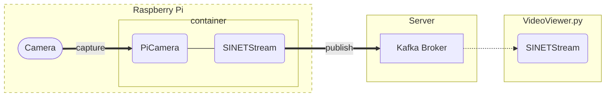

# Sending Raspberry Pi camera images to a server - docker

Here are the steps to build an environment to send images taken by the Raspberry Pi camera to a server.


<!--

-->

## 1. Preparation

### 1.1. Docker

In this step, we will use a Docker container to run the software that sends images captured by the camera to the server. Therefore, it is necessary to install Docker Engine etc. beforehand.

Please refer to: https://docs.docker.com/engine/install/debian/

Docker version 19.03.0 or higher is required.

Also, use Docker Compose to launch containers.

Please refer to: https://docs.docker.com/compose/install/compose-plugin/

Docker Compose version 1.27.1 or higher is required, but Docker Compose v2 is recommended.

### 1.2. Deployment of Materials

Place the `docker-compose.yml` file in this directory on your Raspberry Pi. Also create `.env` in the same directory. How to write `.env` is explained in the next chapter.

### 1.3. Host Name Resolution

If a hostname is specified as the [address to advertise](../../../option/Server/Kafka/README.en.md#32-broker_hostname) for the Kafka broker and DNS name resolution is not available, you will need to configure it by other means.

Here is an example of using `extra_hosts` in `docker-compose.yml` to resolve the name of the Kafka broker in a container. Here we set `192.168.2.100` as the IP address of `kafka.example.org`.

```yaml
services:
  picamera:
    image: harbor.vcloud.nii.ac.jp/sinetstream/sample/sensor-picamera
    privileged: true
    init: true
    devices:
    - /dev/vchiq:/dev/vchiq
    restart: on-failure:5
    env_file: .env
    extra_hosts:
    - "kafka.example.org:192.168.2.100"
```

## 2. Parameters

Parameters for camera settings and image destinations are set by container environment variables.

### 2.1. .env file

When using `docker compose`, the container environment variables can be grouped together in a `.env` file. In the `.env` file, use the format (environment variable name)=(parameter value). An example is shown below.

```
SS_BROKERS=kafka.example.org:9092
SS_TOPIC=sinetstream.image.camera
PICAMERA_RESOLUTION=VGA
SCHEDULE=60
```

See [Docker Compose - Environment file - Syntax rules](https://docs.docker.com/compose/env-file/#syntax-rules) for the format of the ``.env`` file.

### 2.2. Parameters for PiCamera

The environment we will build here uses [PiCamera](https://picamera.readthedocs.io/) to take pictures with the Raspberry Pi camera. The values specified for PiCamera's constructor arguments and properties can be set by the container's environment variables. The name of the environment variable to be specified is the name of the PiCamera constructor argument or property converted using the following rules:

* Convert to all uppercase
* Prefix the name with `PICAMERA_`

For example, the environment variable name corresponding to `resolution` is `PICAMERA_RESOLUTION`.

The following table lists the main environment variables related to PiCamera:

|Environment variable name|Description|Setting example|
|---|---|---|
|PICAMERA_RESOLUTION|The resolution of the image. <br>The width and height of the image are specified as "(width)x(height)", which can also be specified as a string such as QVGA, VGA, HD, 2K, etc. |PICAMERA_RESOLUTION=640x480<br>PICAMERA_RESOLUTION=HD|
|PICAMERA_FRAMERATE|frame rate|PICAMERA_FRAMERATE=5|
|PICAMERA_AWB_MODE|white balance|PICAMERA_AWB_MODE=sunlight|
|PICAMERA_ISO|ISO|PICAMERA_ISO=400|

See [API - The PiCamera Class](https://picamera.readthedocs.io/en/release-1.13/api_camera.html) for more information on PiCamera parameters.

### 2.3. Image Acquisition Timing Parameters

Set the environment variable `SCHEDULE` if you wish to acquire images at regular intervals, such as in a time lapse.

|Environment variable name|Explanation|Setting example|
|---|---|---|
|SCHEDULE|Schedule for image acquisition|SCHEDULE=10<br>SCHEDULE=every 30 seconds|

If only a number is specified for `SCHEDULE`, image acquisition will be performed at the time interval (in seconds) of that value.

If you want to set a time interval longer than seconds, you can specify a schedule specification string. Some examples are shown below.

| Specified string    | Explanation                       |
|---------------------|-----------------------------------|
| every 3 seconds     |                                   |
| every minute        |                                   |
| every 3 minutes     |                                   |
| every 3 hours       |                                   |
| every minute at :23 | every 23rd second of every minute |
| every day at 10:30  |                                   |

### 2.4. Parameters for SINETStream

The environment we will build here uses [SINETStream](https://www.sinetstream.net/) to send camera images to the server. SINETStream provides parameters related to the broker to connect to in the configuration file `.sinetstream_ config.yml`, but the container image used here allows you to specify the same parameters using environment variables (the SINETStream configuration file is automatically generated from the environment variables inside the container). The conversion rules from parameter names to environment variable names specified in the configuration file are as follows:

* Convert parameter names to all uppercase
* Prefix parameter names with `SS_`
* Specify two underscores `__` to delimit the hierarchy when specifying parameters with multiple hierarchies

For example, the environment variable corresponding to the parameter `brokers` in the configuration file is `SS_BROKERS`. The following table lists the main environment variables for SINETStream.

|Environment variable name|Required item|Description|Setting example|
|---|---|---|---|
|SS_BROKERS|&check;|addresses of brokers<br>To specify multiple addresses, use `,` to connect them. |SS_BROKERS=kafka.example.org<br>SS_BROKERS=kafka1:9092,kafka2:9092|
|SS_TOPIC|&check;|topic name|SS_TOPIC=sinetstream.image.camera|
|SS_TYPE|-|broker type<br>The default value is `kafka`|SS_TYPE=kafka|
|SS_CONSISTENCY|-|message delivery reliability|SS_CONSISTENCY=AT_LEAST_ONCE<br>SS_CONSISTENCY=AT_MOST_ONCE|

For details on the parameters to be specified in the SINETStream configuration file `.sinetstream_config.yml`, see [SINETStream - Configuration File](https://www.sinetstream.net/docs/userguide/config.html).

### 2.5. Example Configuration

Here are some examples of specifying `.env`. In the example shown here, the address of the Kafka broker is `kafka.example.org:9092` and the topic name is `sinetstream.image.camera`.


#### 2.5.1. When specifying the frame rate

Here is an example of `.env` for sending a small size image with a specified frame rate.

```
PICAMERA_RESOLUTION=QVGA
PICAMERA_FRAMERATE=5
SS_BROKERS=kafka.example.org:9092
SS_TOPIC=sinetstream.image.camera
SS_CONSISTENCY=AT_LEAST_ONCE
```

The above specified example sends a QVGA (320x240) image 5 times per second.

> A file with the same contents as the above example can be found in `dot_env-high_rate-sample` in this directory. Use it as a template for your `.env`.

If the frame rate or image size is specified too large for the communication bandwidth, the image transmission process will be delayed and eventually result in a transmission error.

#### 2.5.2. For low frequency image transmission

Here is an example of `.env` for sending camera images taken at regular time intervals, such as time lapse.

```
PICAMERA_RESOLUTION=VGA
SCHEDULE=10
SS_BROKERS=kafka.example.org:9092
SS_TOPIC=sinetstream.image.camera
SS_CONSISTENCY=AT_LEAST_ONCE
```

The above example specifies that a VGA (640x480) image is to be sent every 10 seconds.

> A file with the same contents as the above example can be found in `dot_env-low_rate-sample` in this directory. Use it as a template for `.env`.

## 3. Execution

Run the following command in the directory where you placed `docker-compose.yml` and `.env`. If the container starts successfully, the RaspberryPi camera will start sending images to the broker.

```console
$ docker compose up -d
```

> If you are using Docker Compose v1, specify `docker-compose` instead of the `docker compose` command.

Check the state of the container. Make sure that the container status is `running`.

```console
$ docker compose ps 
NAME                COMMAND                  SERVICE             STATUS              PORTS
images-picamera-1   "/opt/ss-camera/ss-c…"   picamera            running       
```

In order to automatically start sending images when the RaspberryPi starts, `restart` in `docker-compose.yml` is set to `on-failure:5`. If the container fails to run for some reason, such as not being able to connect to the Kafka broker, the container will retry a specified number of times (5) before exiting with an error. To keep running the container regardless of the error, specify `always` for `restart`.

## 4. Check Operation

Use the image stream viewer [VideoViewer.py](../../Viewer/README.en.md). For the topic name that VideoViewer.py reads images from, specify the topic name in `SS_TOPIC` of the environment built here.

## 5. Appendix

### 5.1. When sending a 4K size image

When sending 4K size images using [Raspberry Pi High Quality Camera](https://www.raspberrypi.com/products/raspberry-pi-high-quality-camera/), some additional settings are required.

#### 5.1.1. Raspberry Pi Settings

In order to take 4K size images with the RaspberryPi camera, the settings specified in `/boot/config.txt` [gpu_mem](https://www.raspberrypi.com/documentation/computers/config_txt.html#gpu_mem) must be set to 256 or 512.

```
gpu_mem=256
```

You also need to specify `SS_MAX_REQUEST_SIZE` in `.env` to change the maximum size of messages sent from the container running on the Raspberry Pi. An example description of `.env` is shown below.

```
PICAMERA_RESOLUTION=4K
SCHEDULE=every minute
SS_BROKERS=kafka.example.org:9092
SS_TOPIC=sinetstream.image.camera
SS_CONSISTENCY=AT_LEAST_ONCE
SS_MAX_REQUEST_SIZE=8388620
```

#### 5.1.2. Configuring the Kafka broker

To change the maximum message size that the Kafka broker will receive, the property [message.max.bytes](https://kafka.apache.org/documentation/#brokerconfigs_message.max.bytes) must be specified.

If you have built your Kafka broker with [option/Server/Kafka](../../../option/Server/Kafka/README.en.md) or similar, you can set this by adding the `.env` environment variable `KAFKA_MESSAGE_MAX_BYTES` in the directory where you have placed `docker-compose.yml`. An example of `.env` description is shown below.

```
BROKER_HOSTNAME=kafka.example.org
KAFKA_MESSAGE_MAX_BYTES=8388620
```

### 5.2. When using a config server

In [SINETStream v1.6](https://www.sinetstream.net/docs/news/20211223-release_v16.html), you can not only place SINETStream configuration files as local files, but you can also register the configuration files with the server in advance. The server that manages the contents of the configuration files is called a configuration server in SINETStream. This section describes how to configure the configuration server to be used from the container for image transmission.

#### 5.2.1. Preparation

Log in to the config server and perform the following operations:

* Register the configuration file for sending Raspberry Pi camera images
* Download the access key `auth.json` to the config server
* Register a public key pair for encrypting confidential information (only if the configuration file contains confidential information)

The `auth.json` is a JSON file containing authentication information for the SINETStream library to access the configuration server. Please download the file from the configuration server and place it on your Raspberry Pi.

#### 5.2.2. Setting up the container

The following table shows the parameters for using the configuration server.

|Parameter name|Required field|Description|
|---|---|---|
|SSCFG_AUTH|&check;|`auth.json` obtained from the config server|
|SSCFG_NAME|&check;|config name registered in the config server|
|SSCFG_SERVICE|-|Service name<br>No need to specify if only a single service is described in the specified config information|
|SSCFG_PRIVATE_KEY|-|Secret key to decrypt the secret information in the configuration information<br>Not required if the configuration information does not contain any secret information|

There are two ways to set parameters to the container:

1. environment variable
2. docker secrets

If you use environment variables, you must put the parameter name and its value directly in the `.env` file, for example. Since `SSCFG_AUTH` and `SSCFG_PRIVATE_KEY` are confidential information, it is recommended to use docker secrets instead of environment variables.

If you want to use docker secrets, add the description [secrets](https://docs.docker.com/compose/compose-file/compose-file-v3/#secrets) to `docker-compose.yml`. The following is an example of specifying `auth.json` as secrets in `docker-compose.yml`. The `auth.json` file is assumed to be located in the same directory as `docker-compose.yml`.

```yaml
services:
  picamera:
    image: harbor.vcloud.nii.ac.jp/sinetstream/sample/sensor-picamera
    privileged: true
    init: true
    devices:
    - /dev/vchiq:/dev/vchiq
    restart: on-failure:5
    env_file: .env
    secrets:
    - source: auth_json
      target: SSCFG_AUTH
      mode: 0440
secrets:
  auth_json:
    file: auth.json
```

#### 5.2.3. Accessing the config server via a proxy

If you use an HTTP proxy to access the config server, set the proxy address in the `HTTPS_PROXY` environment variable of the container.

```
HTTPS_PROXY=socks5h://proxy.example.org:1080
```