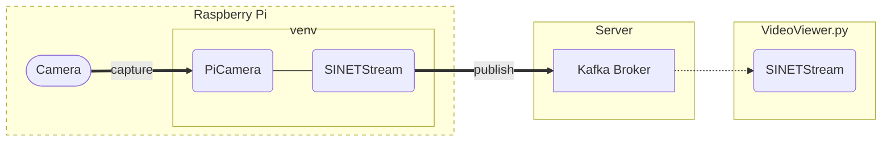

# Raspberry Piのカメラ画像をサーバに送信する - venv

Raspberry Piのカメラで撮影した画像をサーバに送信する環境を構築する手順を示します。


<!--

-->

## 1. 準備

ここでは、カメラで撮影した画像をサーバに送信するソフトウェアを[venv](https://docs.python.org/ja/3/library/venv.html)の仮想環境に構築する手順を示します。

### 1.1. venv

venvを利用するために必要となるパッケージをインストールします。

```console
$ sudo apt update
$ sudo apt install python3-venv
```

### 1.2. 資材の配置

このディレクトリにあるファイルを Raspberry Pi に配置してください。

### 1.3. ライブラリのインストール

venv の仮想環境を作成して、画像を送信するのに必要となるライブラリのインストールを行います。前節で資材を配置したディレクトリで、以下のコマンドを実行してください。

```console
$ python -m venv .
$ source bin/activate
$ pip install -r requirements.txt
```

### 1.4. ホスト名の名前解決

Kafkaブローカの[advertise するアドレス](../../../option/Server/Kafka/README.md#32-broker_hostname)としてホスト名が指定され、かつDNSによる名前解決ができない場合、`/etc/hosts` などに設定を追加する必要があります。

例えば`kafka.example.org`のIPアドレスとして `192.168.2.100` を設定する場合、以下の内容を `/etc/hosts` に追加します。

```
192.168.2.100    kafka.example.org
```

## 2. パラメータ

カメラの設定や画像の送信先に関するパラメータは環境変数により設定します。

### 2.1. .env ファイル

環境変数は直接シェルに設定することも出来ますが`.env` ファイルにまとめて記述することができます。`.env`ファイルには(環境変数名)=(パラメータ値)の形式で記述を行います。記述例を以下に示します。

```
SS_BROKERS=kafka.example.org:9092
SS_TOPIC=sinetstream.image.camera
PICAMERA_RESOLUTION=VGA
SCHEDULE=60
```

`.env`ファイルの書式に関する詳細については [python-dotenv - File format](https://saurabh-kumar.com/python-dotenv/#file-format) を参照してください。

### 2.2. PiCameraに関するパラメータ

ここで構築する環境ではRaspberry Piカメラでの撮影に[PiCamera](https://picamera.readthedocs.io/)を利用します。PiCameraのコンストラクタ引数やプロパティに指定する値を環境変数により設定できます。指定する環境変数名は、PiCameraのコンストラクタ引数名やプロパティ名を以下のルールで変換したものになります。

* 全て大文字に変換する
* プレフィックスに `PICAMERA_` をつける

例えば `resolution` に対応する環境変数名は `PICAMERA_RESOLUTION` になります。

PiCameraに関するおもな環境変数を次表に示します。

|環境変数名|説明|設定例|
|---|---|---|
|PICAMERA_RESOLUTION|画像の解像度。<br>画像の幅と高さを "(width)x(height)"で指定する。QVGA,VGA,HD,2Kなどの文字列で指定することも可。|PICAMERA_RESOLUTION=640x480<br>PICAMERA_RESOLUTION=HD|
|PICAMERA_FRAMERATE|フレームレート|PICAMERA_FRAMERATE=5|
|PICAMERA_AWB_MODE|ホワイトバランス|PICAMERA_AWB_MODE=sunlight|
|PICAMERA_ISO|ISO|PICAMERA_ISO=400|

PiCameraのパラメータについては[API - The PiCamera Class](https://picamera.readthedocs.io/en/release-1.13/api_camera.html)を参照してください。

### 2.3. 画像取得タイミングに関するパラメータ

タイムラプスのように一定時間毎の画像を取得する場合は環境変数`SCHEDULE`を設定します。

|環境変数名|説明|設定例|
|---|---|---|
|SCHEDULE|画像取得のスケジュール|SCHEDULE=10<br>SCHEDULE=every 30 seconds|

`SCHEDULE`に数値のみを指定した場合、その値の時間間隔（秒）で画像取得を行います。

秒単位よりも長い時間間隔を設定する場合、スケジュール指定文字列を指定することができます。いくつかの指定例を以下に示します。

|指定文字列|説明|
|---|---|
|every 3 seconds|３秒ごと|
|every minute|１分ごと|
|every 3 minutes|３分ごと
|every 3 hours|３時間ごと|
|every minute at :23|毎分の23秒に|
|every day at 10:30|毎日10時30分に|

### 2.4. SINETStreamに関するパラメータ

ここで構築する環境ではカメラ画像をサーバに送信するのに[SINETStream](https://www.sinetstream.net/)を利用します。通常 SINETStream では接続先となるブローカに関するパラメータなどを設定ファイル`.sinetstream_config.yml`に記述します。画像送信スクリプトでは、設定ファイルにパラメータを記述する方法以外に環境変数による設定方法に対応しています。これは[docker コンテナによる画像送信](../docker/README.md)と互換性を保つための設定方法となります。ここでは環境変数による設定方法を説明します。

SINETStreamのパラメータに関する主な環境変数を次表に示します。

|環境変数名|必須項目|説明|設定例|
|---|---|---|---|
|SS_BROKERS|&check;|ブローカのアドレス<br>複数指定する場合は`,`でつなげる。|SS_BROKERS=kafka.example.org<br>SS_BROKERS=kafka1:9092,kafka2:9092|
|SS_TOPIC|&check;|トピック名|SS_TOPIC=sinetstream.image.camera|
|SS_TYPE||ブローカタイプ<br>デフォルト値は`kafka`|SS_TYPE=kafka|
|SS_CONSISTENCY||メッセージ配信の信頼性|SS_CONSISTENCY=AT_LEAST_ONCE<br>SS_CONSISTENCY=AT_MOST_ONCE|

画像送信スクリプトでは、環境変数により設定されたパラメータからSINETStreamの設定ファイルを生成しています。SINETStream設定ファイルのパラメータと環境変数との変換ルールを以下に示します。前表に示したもの以外のパラメータを設定する場合に用いて下さい。

* パラメータ名を全て大文字に変換する
* プレフィックスに `SS_` をつける
* 複数階層をもつパラメータを指定する場合は階層の区切りに２文字のアンダースコア `__` を指定する

例えば設定ファイルに記述するパラメータ`tls`に対応する環境変数は`SS_TLS`になります。 SINETStreamの設定ファイル`.sinetstream_config.yml`に指定するパラメータの詳細については[SINETStream - 設定ファイル](https://www.sinetstream.net/docs/userguide/config.html)を参照してください。

### 2.5. 設定例

`.env` の指定例をいくつか示します。ここで示す例ではKafka ブローカのアドレスを`kafka.example.org:9092`、トピック名を`sinetstream.image.camera`としています。

#### 2.5.1. フレームレートを指定する場合

フレームレートを指定して小さなサイズの画像を送信する場合の `.env` の例を示します。

```
PICAMERA_RESOLUTION=QVGA
PICAMERA_FRAMERATE=5
SS_BROKERS=kafka.example.org:9092
SS_TOPIC=sinetstream.image.camera
SS_CONSISTENCY=AT_LEAST_ONCE
```

上記の指定例ではQVGA(320x240)の画像を１秒あたり5回送信します。

> 上記の例と同じ内容のファイルがこのディレクトリの `dot_env-high_rate-sample` にあります。`.env`のテンプレートとして利用してください。

通信帯域に対してフレームレートや画像サイズの指定が大きすぎる場合は、画像の送信処理が遅延し最終的には送信エラーとなります。

#### 2.5.2. 低頻度の画像送信を行う場合

タイムラプスのような一定の時間間隔で撮影したカメラ画像を送信する場合の`.env`の例を示します。

```
PICAMERA_RESOLUTION=VGA
SCHEDULE=10
SS_BROKERS=kafka.example.org:9092
SS_TOPIC=sinetstream.image.camera
SS_CONSISTENCY=AT_LEAST_ONCE
```

上記の指定例ではVGA(640x480)の画像を１０秒毎に送信する設定になります。

> 上記の例と同じ内容のファイルがこのディレクトリの `dot_env-low_rate-sample` にあります。`.env`のテンプレートとして利用してください。

## 3. 実行

画像送信スクリプトを実行します。Pythonスクリプトなどの資材を配置したディレクトリで以下のコマンドを実行してください。スクリプトが正常に起動するとRaspberry Piのカメラからブローカへと画像送信が開始されます。

```console
$ source bin/activate
$ ./ss-camera.py
```

## 4. 動作確認

画像ストリームビューア[VideoViewer.py](../../Viewer/README.md)を利用することでRaspberryPiから送信したカメラ画像を確認することができます。VideoViewer.pyが画像を読み込む対象とするトピック名には、ここでの構築環境で送信先に指定したトピック名（環境変数で指定した場合は`SS_TOPIC`に設定した値）を指定してください。

## 5. 付録

### 5.1. サービス登録

画像送信プログラムをRaspberry Piで常時稼働させる場合 systemd のサービスとして登録すると管理が容易になります。systemdに登録することで Raspberry Pi の起動時に自動的に送信プログラムを実行したり、エラー終了時の再実行などが可能となります。

送信プログラムをsystemdにサービスとして登録し、起動する手順を以下に示します。

1. 登録するサービスの設定ファイルを作成する
2. systemd に設定ファイルを読み込むように指示する
3. サービスを起動する
4. サービスの自動起動を設定する

> 上記の全ての手順で管理者権限が必要となります。`sudo` などで管理者権限を得るようにしてください。

#### 5.1.1. 設定ファイルを作成する

`/etc/systemd/system/` にsystemdの設定ファイルを作成してください。ファイル名は `picamera.service` のように、サフィックスとして `.service` を付けてください。設定ファイルの例を以下に示します。

```ini
[Unit]
Description=Send images from Pi Camera

[Service]
Type=simple
User=user01
WorkingDirectory=/home/user01/picamera
Environment="PATH=/home/user01/picamera/bin"
ExecStart=/home/user01/picamera/ss-camera.py
Restart=always

[Install]
WantedBy=multi-user.target
```

`Description`, `User`, `WorkingDirectory`, `Environment`, `ExecStart` を実際の環境に合せて適切に変更してください。

> 記述例と同じ内容のファイル[example_picamera.service](./example_picamera.service)がこのディレクトリにあります。テンプレートとして利用してください。

#### 5.1.2. systemd に設定ファイルを読み込むように指示する

`/etc/systemd/system/` に作成した設定ファイルを systemd に読み込ませるために、以下のコマンドを実行してください。

```console
$ sudo systemctl daemon-reload
```

`systemctl status`コマンドで、サービスが登録されたことを確認します。サービス名を`picamera`で登録した場合の実行例を以下に示します。

```console
$ sudo systemctl status picamera
● picamera.service - Send images from Pi Camera
     Loaded: loaded (/etc/systemd/system/picamera.service; disabled; vendor prese>
     Active: inactive (dead)
```

#### 5.1.3. サービスを起動する

`systemctl start`コマンドで登録したサービスを起動します。

サービス名を`picamera`で登録した場合の実行例を以下に示します。`systemctl start`でサービスを起動した後に`systemctl status`で状態を確認しています。

```console
$ sudo systemctl start picamera
$ sudo systemctl status picamera
● picamera.service - Send images from Pi Camera
     Loaded: loaded (/etc/systemd/system/picamera.service; disabled; vendor prese>
     Active: active (running) since Wed 2022-07-19 08:02:00 GMT; 5s ago
   Main PID: 1443 (python3)
      Tasks: 1 (limit: 724)
        CPU: 4.957
     CGroup: /system.slice/picamera.service
             └─732 python3 /home/user01/picamera/ss-camera.py

Feb 09 02:57:05 raspberrypi systemd[1]: Started Send sensor data.
```

#### 5.1.4. サービスの自動起動を設定する

登録したサービスを Raspberry Pi が起動した時に自動的に開始されるように設定します。サービス名を指定して`systemctl enable`コマンドを実行してください。

サービス名を`picamera`で登録した場合の実行例を以下に示します。

```console
$ sudo systemctl enable picamera
Created symlink /etc/systemd/system/multi-user.target.wants/picamera.service → /etc/systemd/system/picamera.service.
```

### 5.2. 4Kサイズの画像を送信する場合

[Raspberry Pi High Quality Camera](https://www.raspberrypi.com/products/raspberry-pi-high-quality-camera/)を用いて４Kサイズの画像を送信する場合、いくつか追加設定が必要となります。

> Raspberry Pi Zero W などのリソースが乏しい環境で実行している場合は、ここで示す設定を行い画像送信スクリプトを実行することはできません。

#### 5.2.1. Raspberry Piの設定

RaspberryPiのカメラで4Kサイズの撮影を行うために`/boot/config.txt`で指定している [gpu_mem](https://www.raspberrypi.com/documentation/computers/config_txt.html#gpu_mem) の値を 256または 512 に設定する必要があります。

```
gpu_mem=256
```

また画像送信スクリプトから送信するメッセージの最大サイズを変更するために `.env` で`SS_MAX_REQUEST_SIZE`を指定する必要があります。`.env`の記述例を以下に示します。

```
PICAMERA_RESOLUTION=4K
SCHEDULE=every minute
SS_BROKERS=kafka.example.org:9092
SS_TOPIC=sinetstream.image.camera
SS_CONSISTENCY=AT_LEAST_ONCE
SS_MAX_REQUEST_SIZE=8388620
```

#### 5.2.2. Kafkaブローカの設定

Kafkaブローカが受け取るメッセージサイズの最大値を変更するためにプロパティ[message.max.bytes](https://kafka.apache.org/documentation/#brokerconfigs_message.max.bytes) を指定する必要があります。

[option/Server/Kafka](../../../option/Server/Kafka/README.md)などでKafkaブローカを構築している場合、`docker-compose.yml`を配置したディレクトリにある `.env` でに環境変数`KAFKA_MESSAGE_MAX_BYTES`の指定を追加することで、これを設定できます。`.env`の記述例を以下に示します。

```
BROKER_HOSTNAME=kafka.example.org
KAFKA_MESSAGE_MAX_BYTES=8388620
```

### 5.3. コンフィグサーバを利用する場合

[SINETStream v1.6](https://www.sinetstream.net/docs/news/20211223-release_v16.html)では、SINETStreamの設定ファイルをローカルファイルとして配置するだけではなく事前にサーバに登録した設定内容を利用することが可能となりました。設定ファイルの内容を管理するサーバをSINETStreamではコンフィグサーバと呼んでいます。ここでは画像送信スクリプトからコンフィグサーバを利用するための設定方法について説明します。

#### 5.3.1. 準備

コンフィグサーバにログインして以下の操作を行ってください。

* Raspberry Piのカメラ画像を送信するための設定ファイルを登録する
* コンフィグサーバへのアクセスキー`auth.json`をダウンロードする
* 秘匿情報を暗号化するための公開鍵ペアを登録する（設定ファイルに秘匿情報がふくまれている場合のみ）

`auth.json`はSINETStreamライブラリがコンフィグサーバにアクセスするための認証情報などが記されたJSONファイルです。コンフィグサーバからダウンロードしたファイルを Raspberry Piの `$HOME/.config/sinetstream/auth.json` に配置してください。また設定ファイルに秘匿情報が含まれている場合は、コンフィグサーバに登録した公開鍵ペアの秘密鍵を Raspberry Pi の `$HOME/.config/sinetstream/private_key.pem` に配置してください。

#### 5.3.2. パラメータ

コンフィグサーバを利用するためのパラメータを次表に示します。

|パラメータ名|必須項目|説明|
|---|---|---|
|SSCFG_NAME|&check;|コンフィグサーバに登録してあるコンフィグ名|
|SSCFG_SERVICE||サービス名<br>指定したコンフィグ情報に単一のサービスのみが記述されている場合は指定不要|

環境変数を`.env`ファイルなどで設定してください。

#### 5.3.3. プロキシ経由でコンフィグサーバにアクセスする場合

コンフィグサーバへのアクセスにHTTPプロキシを利用する場合は、環境変数`HTTPS_PROXY`にプロキシのアドレスを設定してください。

```console
$ export HTTPS_PROXY=socks5h://proxy.example.org:1080
```

直接環境変数として設定するのではなく `.env` に記述することも可能です。