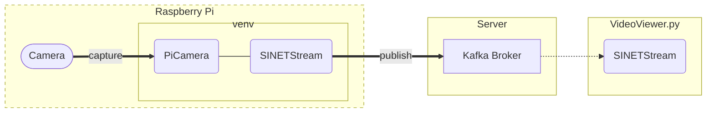

# Sending Raspberry Pi camera images to a server - venv

Here are the steps to build an environment to send images taken by the Raspberry Pi's camera to the server.


<!--

-->

## 1. Preparation

Here are the steps to build software to send images captured by a camera to a server in the virtual environment of [venv](https://docs.python.org/ja/3/library/venv.html).

### 1.1. venv

Install the packages required to use venv.

```console
$ sudo apt update
$ sudo apt install python3-venv
```

### 1.2. Deploying Materials

Place the files in this directory on your Raspberry Pi.

### 1.3. Installing the libraries

Create a venv virtual environment and install the libraries needed to send images. In the directory where you placed the materials in the previous section, execute the following command:

```console
$ python -m venv .
$ source bin/activate
$ pip install -r requirements.txt
```

### 1.4. Host Name Resolution

If a hostname is specified as the [address to advertise](../../../option/Server/Kafka/README_en.md#32-broker_hostname) for the Kafka broker and DNS name resolution is not available, you will need to add a setting to `/etc/hosts` or similar.

For example, to set `192.168.2.100` as the IP address of `kafka.example.org`, add the following to `/etc/hosts`:

```
192.168.2.100 kafka.example.org
```

## 2. Parameters

Parameters for camera settings and image destinations are set by environment variables.

### 2.1. .env file

Environment variables can be set directly in the shell or in a `.env` file. In the `.env` file, use the format (environment variable name)=(parameter value). An example is shown below.

```
SS_BROKERS=kafka.example.org:9092
SS_TOPIC=sinetstream.image.camera
PICAMERA_RESOLUTION=VGA
SCHEDULE=60
```

See [python-dotenv - File format](https://saurabh-kumar.com/python-dotenv/#file-format) for more information on the ``.env`` file format.

### 2.2. Parameters for PiCamera

The environment we will build here uses [PiCamera](https://picamera.readthedocs.io/) to take pictures with the Raspberry Pi camera, and the values specified for PiCamera's constructor arguments and properties can be set using environment variables. The names of the environment variables you specify are the names of PiCamera's constructor arguments and properties converted using the following rules:

* Convert to all uppercase
* Prefix with `PICAMERA_`

For example, the environment variable name corresponding to `resolution` is `PICAMERA_RESOLUTION`.

The following table lists the main environment variables related to PiCamera.

|Environment variable name|Description|Setting example|
|---|---|---|
|PICAMERA_RESOLUTION|The resolution of the image. <br>The width and height of the image are specified as "(width)x(height)", which can also be specified as a string such as QVGA, VGA, HD, 2K, etc. |PICAMERA_RESOLUTION=640x480<br>PICAMERA_RESOLUTION=HD|
|PICAMERA_FRAMERATE|frame rate|PICAMERA_FRAMERATE=5|
|PICAMERA_AWB_MODE|white balance|PICAMERA_AWB_MODE=sunlight|
|PICAMERA_ISO|ISO|PICAMERA_ISO=400|

See [API - The PiCamera Class](https://picamera.readthedocs.io/en/release-1.13/api_camera.html) for more information on PiCamera parameters.

### 2.3. Image Acquisition Timing Parameters

Set the environment variable `SCHEDULE` if you wish to acquire images at regular intervals, such as in a time lapse.

|Environment variable name|Explanation|Setting example|
|---|---|---|
|SCHEDULE|Schedule for image acquisition|SCHEDULE=10<br>SCHEDULE=every 30 seconds|

If only a number is specified for `SCHEDULE`, image acquisition will be performed at the time interval (in seconds) of that value.

If you want to set a time interval longer than seconds, you can specify a schedule specification string. Some examples are shown below.

| Specified string    | Explanation                       |
|---------------------|-----------------------------------|
| every 3 seconds     |                                   |
| every minute        |                                   |
| every 3 minutes     |                                   |
| every 3 hours       |                                   |
| every minute at :23 | every 23rd second of every minute |
| every day at 10:30  |                                   |

### 2.4. Parameters for SINETStream

The environment we are building here uses [SINETStream](https://www.sinetstream.net/) to send camera images to the server. Normally, SINETStream requires a configuration file `.sinetstream_config.yml` that contains parameters related to the broker to be connected to. Besides writing parameters into the configuration file, the image transmission script also supports the use of environment variables. This is described in [Sending images by docker container](. /docker/README_en.md). This section describes how to configure the settings by environment variables.

The following table shows the main environment variables related to SINETStream parameters:

|Environment variable name|Required item|Description|Setting example|
|---|---|---|---|
|SS_BROKERS|&check;|addresses of brokers<br>To specify multiple addresses, use `,` to connect them. |SS_BROKERS=kafka.example.org<br>SS_BROKERS=kafka1:9092,kafka2:9092|
|SS_TOPIC|&check;|topic name|SS_TOPIC=sinetstream.image.camera|
|SS_TYPE|-|broker type<br>The default value is `kafka`|SS_TYPE=kafka|
|SS_CONSISTENCY|-|message delivery reliability|SS_CONSISTENCY=AT_LEAST_ONCE<br>SS_CONSISTENCY=AT_MOST_ONCE|

The image transmission script generates the SINETStream configuration file from the parameters set by the environment variables; the conversion rules between parameters and environment variables in the SINETStream configuration file are listed below. Use these rules when setting parameters other than those listed in the previous table.

* Convert parameter names to all uppercase.
* Prefix the parameter name with `SS_`.
* Specify two underscores `__` to delimit the hierarchy when specifying parameters with multiple hierarchies.

For example, the environment variable corresponding to the parameter `tls` in the configuration file is `SS_TLS`. For details on the parameters to be specified in the SINETStream configuration file `.sinetstream_config.yml`, see [SINETStream - Configuration File](https://www.sinetstream.net/docs/userguide/config.html).

### 2.5. Example Configuration

Here are some examples of specifying `.env`. In the example shown here, the address of the Kafka broker is `kafka.example.org:9092` and the topic name is `sinetstream.image.camera`.

#### 2.5.1. When specifying the frame rate

Here is an example of `.env` for sending a small size image with a specified frame rate.

```
PICAMERA_RESOLUTION=QVGA
PICAMERA_FRAMERATE=5
SS_BROKERS=kafka.example.org:9092
SS_TOPIC=sinetstream.image.camera
SS_CONSISTENCY=AT_LEAST_ONCE
```

The above specified example sends a QVGA (320x240) image 5 times per second.

> Files with the same contents as the above example can be found in `dot_env-high_rate-sample` in this directory. Use it as a template for your `.env`.

If the frame rate or image size is specified too large for the communication bandwidth, the image transmission process will be delayed and eventually result in a transmission error.

#### 2.5.2. For low frequency image transmission

Here is an example of `.env` for sending camera images taken at regular time intervals, such as time lapse.

```
PICAMERA_RESOLUTION=VGA
SCHEDULE=10
SS_BROKERS=kafka.example.org:9092
SS_TOPIC=sinetstream.image.camera
SS_CONSISTENCY=AT_LEAST_ONCE
```

The above example specifies that a VGA (640x480) image is to be sent every 10 seconds.

> A file with the same contents as the above example can be found in `dot_env-low_rate-sample` in this directory. Use it as a template for `.env`.

## 3. Execution

Execute the image transmission script by running the following command in the directory where you placed the Python script and other materials. If the script runs successfully, it will start sending images from the Raspberry Pi camera to the broker.

```console
$ source bin/activate
$ . /ss-camera.py
```

## 4. Check Operation

Use the image stream viewer [VideoViewer.py](https://gitlab.vcp-handson.org/niidp/sinetstream-demo/-/blob/main/VideoStreaming/Viewer/README_en.md). For the topic name that VideoViewer.py reads the images from, specify the name of the topic that you specified as the destination in your environment (if you specify it by environment variable, please specify the value set in `SS_TOPIC`).

## 5. Appendix

### 5.1. Service Registration

If you want the sensor data transmission program to run constantly on the Raspberry Pi, registering it as a systemd service makes it easier to manage. This will make it possible to automatically run the sending program when the Raspberry Pi starts up, or to rerun the program when an error occurs.

The procedure for registering the transmission program as a service in systemd and starting it is shown below.

1. Create a configuration file for the service to be registered.
2. Instruct systemd to load the configuration file.
3. Start the service.
4. Configure automatic startup of the service.

> All of the above steps require administrator privileges. Please use `sudo` or similar to obtain administrator privileges.

#### 5.1.1. Create a configuration file

Create a systemd configuration file in `/etc/systemd/system/`. The file name should be `picamera.service` with suffix `.service`. An example configuration file is shown below.

```ini
[Unit]
Description=Send images from Pi Camera

[Service]
Type=simple
User=user01
WorkingDirectory=/home/user01/picamera
Environment="PATH=/home/user01/picamera/bin"
ExecStart=/home/user01/picamera/ss-camera.py
Restart=always

[Install]
WantedBy=multi-user.target
```

Change `Description`, `User`, `WorkingDirectory`, `Environment`, and `ExecStart` as appropriate for your actual environment.

> A file [example_picamera.service](./example_picamera.service) is located in this directory. Use it as a template.

#### 5.1.2. Instruct systemd to read the configuration file

To tell systemd to read the configuration file you created in `/etc/systemd/system/`, issue the following command:

```console
$ sudo systemctl daemon-reload
````

Confirm that the service has been registered with the `systemctl status` command. The following is an example of execution when the service is registered with the service name ``picamera``.

```console
$ sudo systemctl status picamera
● picamera.service - Send images from Pi Camera
     Loaded: loaded (/etc/systemd/system/picamera.service; disabled; vendor prese>
     Active: inactive (dead)
```

#### 5.1.3. Start the service

Start the registered service with the `systemctl start` command.

The following is an example of execution when the service is registered with the service name `picamera`. After starting the service with `systemctl start`, check the status with `systemctl status`.

```console
$ sudo systemctl start picamera
$ sudo systemctl status picamera
● picamera.service - Send images from Pi Camera
     Loaded: loaded (/etc/systemd/system/picamera.service; disabled; vendor prese>
     Active: active (running) since Wed 2022-07-19 08:02:00 GMT; 5s ago
   Main PID: 1443 (python3)
      Tasks: 1 (limit: 724)
        CPU: 4.957
     CGroup: /system.slice/picamera.service
             └─732 python3 /home/user01/picamera/ss-camera.py

Feb 09 02:57:05 raspberrypi systemd[1]: Started Send sensor data.
```

#### 5.1.4. Configure automatic startup of services

Configure the registered service to start automatically when the Raspberry Pi is started. Run the `systemctl enable` command specifying the service name.

The following is an example of executing the command when the service name is registered as `picamera`.

```console
$ sudo systemctl enable picamera
Created symlink /etc/systemd/system/multi-user.target.wants/picamera.service → /etc/systemd/system/picamera.service.
```

### 5.2. To send 4K size images

If you want to send 4K size images using [Raspberry Pi High Quality Camera](https://www.raspberrypi.com/products/raspberry-pi-high-quality-camera/), some additional settings are required.

> If you are running in a resource-poor environment such as the Raspberry Pi Zero W, you will not be able to run the image transmission script with the settings shown here.

#### 5.2.1. Raspberry Pi settings

In order to take 4K size images with the RaspberryPi camera, the settings specified in `/boot/config.txt` [gpu_mem](https://www.raspberrypi.com/documentation/computers/config_txt.html#gpu_mem) must be set to 256 or 512.

```
gpu_mem=256
```

You also need to specify `SS_MAX_REQUEST_SIZE` in `.env` to change the maximum size of messages sent from the container running on the Raspberry Pi. An example description of `.env` is shown below.

```
PICAMERA_RESOLUTION=4K
SCHEDULE=every minute
SS_BROKERS=kafka.example.org:9092
SS_TOPIC=sinetstream.image.camera
SS_CONSISTENCY=AT_LEAST_ONCE
SS_MAX_REQUEST_SIZE=8388620
```

#### 5.2.2. Configuring the Kafka broker

To change the maximum message size that the Kafka broker will receive, the property [message.max.bytes](https://kafka.apache.org/documentation/#brokerconfigs_message.max.bytes) must be specified.

If you have built your Kafka broker with [option/Server/Kafka](https://gitlab.vcp-handson.org/niidp/sinetstream-demo/-/blob/main/option/Server/Kafka/README_en.md) or similar, you can set this by adding the `.env` environment variable `KAFKA_MESSAGE_MAX_BYTES` in the directory where you have placed `docker-compose.yml`. An example of `.env` description is shown below.

```
BROKER_HOSTNAME=kafka.example.org
KAFKA_MESSAGE_MAX_BYTES=8388620
```

### 5.3. Using a config server

In [SINETStream v1.6](https://www.sinetstream.net/docs/news/20211223-release_v16.html), you can not only place SINETStream configuration files as local files, but you can also use the pre The configuration files can now be registered with the server in advance. The server that manages the contents of the configuration files is called a configuration server in SINETStream. This section describes how to set up an image transmission script to use the configuration server.

#### 5.3.1. Preparation

Log in to the config server and perform the following operations:

* Register the configuration file for sending Raspberry Pi camera images
* Download the access key `auth.json` to the config server
* Register a public key pair for encrypting confidential information (only if the configuration file contains confidential information)

The `auth.json` is a JSON file that contains authentication information for the SINETStream library to access the configuration server. Place the file downloaded from the config server in `$HOME/.config/sinetstream/auth.json` on the Raspberry Pi. Also, if the configuration file contains confidential information, place the private key of the public key pair registered with the config server in `$HOME/.config/sinetstream/private_key.pem` on the Raspberry Pi.

#### 5.3.2. Parameters

The following table shows the parameters for using the config server.

|Parameter name|Required field|Description|
|---|---|---|
|SSCFG_NAME|&check;|config name registered in the config server|
|SSCFG_SERVICE|-|Service name<br>No need to specify if only a single service is described in the specified config information|

Set environment variables, for example in the `.env` file.

#### 5.3.3. Accessing config server via proxy

If you use an HTTP proxy to access the config server, set the proxy address in the environment variable ``HTTPS_PROXY``.

```console
$ export HTTPS_PROXY=socks5h://proxy.example.org:1080
```

You can also put it in `.env` instead of setting it directly as an environment variable.