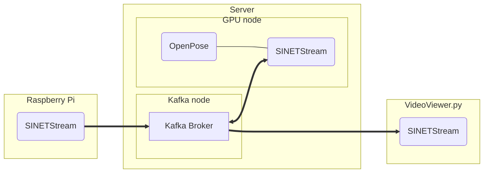
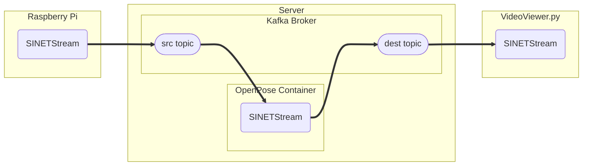

# OpenPose

Build a server to process the image stream captured by the Raspberry Pi camera with [OpenPose](https://github.com/CMU-Perceptual-Computing-Lab/openpose).


<!--

-->

## 1. Configuration

The server consists of two nodes, one to run the Kafka broker and one to run OpenPose, which requires an NVIDIA GPU. Kafka and OpenPose can be run on the same node.

The Kafka broker we will build here will have the following configuration:

* No encryption in the communication channel
* No authentication in the broker
* 1 node configuration

## 2. Preparation

### 2.1. Docker

Kafka and OpenPose, which are run on the server, are both run as Docker containers. Therefore, it is necessary to install Docker Engine or other software beforehand.

#### 2.1.1. Docker Engine

Please refer to "[Install Docker Engine](https://docs.docker.com/engine/install/)" to install Docker Engine. Version 19.03.0 or later of Docker is required.

#### 2.1.2. Docker Compose

In this procedure, we will use [Docker Compose](https://github.com/docker/compose) to manage multiple containers at once. Docker Compose is a tool that facilitates the management of multiple containers by describing container parameters in a configuration file `docker-compose.yml`. Please refer to the article "[Where to get Docker Compose - Linux](https://github.com/docker/compose#linux)" to install Docker Compose. Docker Compose version 1.27.1 or higher is required.

#### 2.1.3. NVIDIA Docker

Nvidia driver and [NVIDIA Docker (NVIDIA Container Toolkit)](https://github.com/NVIDIA/nvidia-docker) are required for GPU nodes running OpenPose.

The installation procedure for the NVIDIA driver can be found at [CUDA Toolkit Download](https://developer.nvidia.com/cuda-downloads?target_os=Linux&target_arch=x86_64). After that, refer to the "[Installation Guide](https://docs.nvidia.com/datacenter/cloud-native/container-toolkit/install-guide.html#docker)" for NVIDIA driver installation instructions.

### 2.2. Deploying Materials

Place the files in the subdirectories `kafka/` and `openpose/` on the node where Kafka and OpenPose will run, respectively.

## 3. Parameter Settings

Parameters of Kafka and OpenPose are set by environment variables of the container. Container environment variables can be set in `.env`, which is placed in the same directory as `docker-compose.yml`.

### 3.1. Format

The format of `.env` is as follows: `.env` is a file in which each line is formatted as "(parameter name) = (value)". An example is shown below.

```
BROKER_HOSTNAME=kafka.example.org
KAFKA_MESSAGE_MAX_BYTES=20971520
```

In this example, for the parameters `BROKER_HOSTNAME` and `KAFKA_MESSAGE_MAX_BYTES`, the values are `kafka.example.org` and `20971520`, respectively.

See [Docker Compose/Environment File#Syntax rules](https://docs.docker.com/compose/env-file/#syntax-rules) for details on the format of `.env`.

### 3.2. Kafka Container

#### 3.2.1. BROKER_HOSTNAME

Specify the hostname or IP address to be given to the client as the address of the KAFKA broker.

The client must be able to access the address using the value specified here, or if an IP address is specified, the client must be able to access it using that IP address. If you specify a hostname, the hostname must be resolvable and accessible via DNS or `/etc/hosts` in the client environment.

#### 3.2.2. Kafka Broker Properties

The parameters for the Kafka broker are the properties described in "[Kafka Documentation - 3.1 Broker Configs](https://kafka.apache.org/documentation/#brokerconfigs)". In the Confluent [Kafka Container](https://hub.docker.com/r/confluentinc/cp-kafka) used in this construction procedure, the properties of the Kafka broker can be set by the environment variables of the container. The environment variable name to be specified is the name of the Kafka broker property translated by the following rules.

* Prefix the environment variable name with `KAFKA_`
* Convert to all uppercase
* Convert periods `. ` to underscores `_`
* Replace hyphens `-` with a 2-letter underscore `__`.
* replace an underscore `_` with a three-letter underscore `___`

For example, the property `message.max.bytes` is specified as the environment variable `KAFKA_MESSAGE_MAX_BYTES`.

For details on how to specify environment variables, see [Confluent Kafka configuration](https://docs.confluent.io/platform/current/installation/docker/config-reference.html#confluent-ak-configuration).

### 3.3. OpenPose Container

The OpenPose container reads images from the source topic, processes them with OpenPose, and writes them to the destination topic.


<!--

-->

The OpenPose container uses SINETStream for accessing source and destination topics; SINETStream requires a configuration file `.sinetstream_config.yml` containing the address and topic name of the broker to be connected. In this container image, you can directly prepare the SINETStream configuration file and specify the parameters via a [bind mount](https://docs.docker.com/storage/bind-mounts/) to the container. A simpler method of specifying parameters is to use the container's environment variables. The following is a description of how to specify each method.

#### 3.3.1. Specifying by Environment Variables

The parameters of the services described in the SINETStream configuration file are specified by environment variables converted according to the rules. The term "service" here is an abstraction of the broker to which SINETStream is connected, and is a concept that allows parameters related to the broker to be handled collectively. The conversion rules for environment variables are as follows:

* Convert to all uppercase letters
* Prefix the parameters of the service from which the image is acquired with `SSSRC_`
* Parameters for the service to which the image is sent are prefixed with `SSDST_`
* Parameters common to both source and destination services are prefixed with `SS_`
* When specifying parameters with multiple layers, specify two underscores `__` to delimit the layers

The following is an example of conversion from a SINETStream configuration file to an environment variable. Consider the following configuration file to be used from SINETStream. The service names `image-src` and `image-dest` in the configuration file are the default values for the service names that the OpenPose container will treat as the source and destination of images, respectively.

```yaml
image-src:
  brokers: kafka.example.org:9092
  type: kafka
  consistency: AT_LEAST_ONCE
  topic: sinetstream.image.camera
  group_id: openpose-001

image-dest:
  brokers: kafka.example.org:9092
  type: kafka
  consistency: AT_LEAST_ONCE
  topic: sinetstream.image.openpose
```

If you want to specify the same contents of the above configuration file in a container environment variable, you can do so as follows.

```
SS_BROKERS=kafka.example.org:9092
SS_CONSISTENCY=AT_LEAST_ONCE
SSSRC_TOPIC=sinetstream.image.camera
SSSRC_GROUP_ID=openpose-001
SSDST_TOPIC=sinetstream.image.openpose
```

Write the above as `.env` in the directory where you placed `openpose/docker-compose.yml` to set it as an environment variable for the OpenPose container.

The default value of the broker types `SSSRC_TYPE` and `SSDST_TYPE` is `kafka`, which can be omitted in the specification by environment variables.

#### 3.3.2. Specifying by Bind Mount

For complex specifications, you can directly write a SINETStream configuration file `.sinetstream_config.yml` and bind mount it to the OpenPose container. The file will be located in `/srv/openpose/.sinetstream_config.yml`.

The following is an example of `docker-compose.yml` with bind mount.

```yaml
version: '3.7'
services:
  openpose:
    image: openpose
    build: . /build
    runtime: nvidia
    restart: always
    init: true
  volumes:
    - . /.sinetstream_config.yml:/srv/openpose/.sinetstream_config.yml
```

Instead of placing `openpose/docker-compose.yml` on the node running OpenPose, place `docker-compose.yml` with the above contents in the same directory as the SINETStream configuration file `.sinetstream_config.yml`.

## 4. Execution

The following are the execution steps for each of the Kafka broker and OpenPose containers.

### 4.1. Kafka broker

Execute the following command in the directory where you placed the `kafka/docker-compose.yml` and the `.env` file of the Kafka broker:

```console
$ docker compose up -d
```

> Here is an example of running Docker Compose v2; if you are using v1, use `docker-compose` instead of `docker compose`.

Check the state of the container:

```console
$ docker compose ps 
NAME                COMMAND                  SERVICE             STATUS              PORTS
broker              "/etc/confluent/dock…"   broker              running             
zookeeper           "/etc/confluent/dock…"   zookeeper           running             
```

Make sure that the STATUS of `broker` and `zookeeper` containers are both `running`.
If the STATUS value is not `running`, check the container logs to determine the cause of the error.

```console
$ docker compose logs
```

### 4.2. OpenPose

Build the OpenPose container image. Run the following command in the directory where you placed the files in `openpose/`. Building the container image will take about an hour.

```console
$ docker compose build
```

> The container image build itself does not require a GPU; if you are using an AWS EC2 instance or similar as a GPU node, you can save money on cloud usage by switching to an instance type without a GPU while the container image is being built.

Run the container:

```console
$ docker compose up -d
```

Check the state of the container:

```console
$ docker compose ps 
```

Make sure that both container states (STATUS) are ``running``.

If you specify a hostname (not an IP address) as the `BROKER_HOSTNAME` value in the `.env` of the Kafka broker, the OpenPose environment must be able to resolve the name of the host. If you specify a hostname that is not registered in DNS, etc. as `BROKER_HOSTNAME`, please make sure to enable name resolution for the Kafka broker by specifying [extra_hosts](https://docs.docker.com/compose/compose-file/compose-file-v3/#extra_hosts) in `docker-compose.yml`. An example of specifying extra_hosts in `docker-compose.yml` is shown below with the change diff. In this example, an entry for the Kafka broker `kafka.example.org` with IP address `192.168.1.100` is registered in `extra_hosts`.

```diff
@@ -7,3 +7,5 @@
     restart: always
     init: true
     env_file: .env
+    extra_hosts:
+      - "kafka.example.org:192.168.1.100"
```

## 5. Check Processing Result

Use the image stream viewer [VideoViewer.py](../../Viewer/README.en.md) to check the result of OpenPose processing. When displaying the result of OpenPose processing, specify the topic name of the OpenPose output destination in the target topic name of VideoViewer.py.
