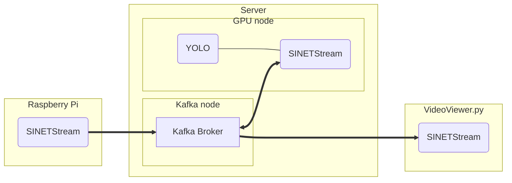
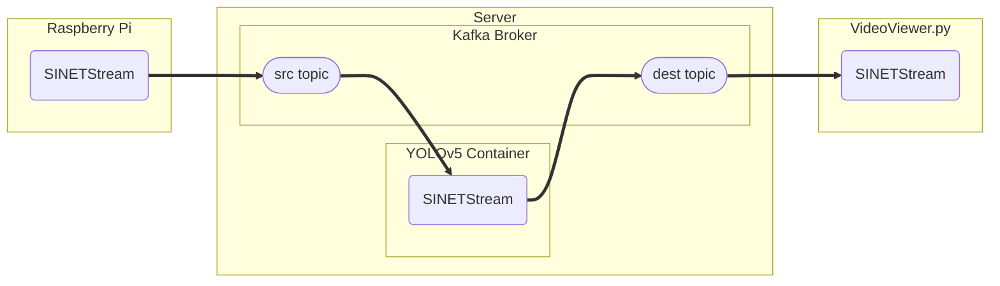

# YOLO

Raspberry Piのカメラで撮影した画像ストリームを[YOLOv5](https://docs.ultralytics.com/)で処理するサーバを構築します。


<!--

-->

## 1. 構成について

サーバはKafkaブローカを実行するノードとYOLOv5を実行するノードの２つのノードで構成されます。YOLOv5を実行するノードでは NVIDIA GPU を必要とします。KafkaとYOLOv5を同一のノードで実行することもできます。

ここで構築するKafkaブローカは以下の構成となります。

* 通信路の暗号化なし
* ブローカでの認証なし
* 1ノード構成

## 2. 準備

### 2.1. Docker

サーバで実行する Kafka, YOLOv5 は、いずれも Docker コンテナとして実行します。そのため Docker Engine などを事前にインストールしておく必要があります。

#### 2.1.1. Docker Engine

「[Install Docker Engine](https://docs.docker.com/engine/install/)」などを参考に Docker Engine のインストールを行ってください。Dockerのバージョンは 19.03.0 以上が必要となります。

#### 2.1.2. Docker Compose

この構築手順では複数のコンテナをまとめて管理するために[Docker Compose](https://github.com/docker/compose)を利用します。Docker Composeはコンテナに関するパラメータなどを設定ファイル`docker-compose.yml`に記述することで複数コンテナの管理を容易にするツールです。「[Where to get Docker Compose - Linux](https://github.com/docker/compose#linux)」などを参考にインストールを行ってください。Docker Compose のバージョンは 1.27.1 以上が必要となります。

#### 2.1.3. NVIDIA Docker

YOLOv5 を実行するGPU ノードではNvidia driverと[NVIDIA Docker(NVIDIA Container Toolkit)](https://github.com/NVIDIA/nvidia-docker)が必要となります。

NVIDIA driver のインストール手順は[CUDA Toolkit Download](https://developer.nvidia.com/cuda-downloads?target_os=Linux&target_arch=x86_64)で確認することができます。その後「[Installation Guide](https://docs.nvidia.com/datacenter/cloud-native/container-toolkit/install-guide.html#docker)」などを参考にNVIDIA Docker(NVIDIA Container Toolkit)をインストールしてください。

### 2.2. 資材の配置

サブディレクトリ`kafka/`, `yolo/` にあるファイルをそれぞれ Kafkaを実行するノード、YOLOv5を実行するノードに配置して下さい。

## 3. パラメータの設定

Kafka, YOLOv5のパラメータはコンテナの環境変数により設定を行います。コンテナの環境変数は`docker-compose.yml`と同じディレクトリに配置する `.env` に記述することで設定できます。

### 3.1. 書式

`.env` は各行が「（パラメータ名）=（値）」の形式になっているファイルとなります。記述例を以下に示します。

```
BROKER_HOSTNAME=kafka.example.org
KAFKA_MESSAGE_MAX_BYTES=20971520
```

この例では`BROKER_HOSTNAME`, `KAFKA_MESSAGE_MAX_BYTES` というパラメータに対して、それぞれ `kafka.example.org`, `20971520` を値として指定しています。

`.env`の書式の詳細については[Docker Compose/Environment File#Syntax rules](https://docs.docker.com/compose/env-file/#syntax-rules)を参照してください。

### 3.2. Kafkaコンテナ

#### 3.2.1. BROKER_HOSTNAME

KAFKAブローカのアドレスとしてクライアントに知らせるホスト名またはIPアドレスを指定します。

クライアントからはここで指定した値でアクセスできる必要があります。IPアドレスを指定した場合は、そクライアントからそのIPアドレスでアクセス可能となっている必要があります。ホスト名を指定した場合はDNSまたはクライアント環境の `/etc/hosts` などで名前解決できアクセス可能となっている必要があります。

#### 3.2.2. Kafka ブローカのプロパティ

Kafkaブローカに対するパラメータは「[Kafka Documentation - 3.1 Broker Configs](https://kafka.apache.org/documentation/#brokerconfigs)」に記されているプロパティを指定することになります。この構築手順で利用するConfluentの[Kafkaコンテナ](https://hub.docker.com/r/confluentinc/cp-kafka)では、コンテナの環境変数によりKafkaブローカのプロパティを設定することができます。指定する環境変数名は以下のようなルールでKafkaブローカのプロパティ名を変換したものになります。

* 環境変数名のプレフィックスに `KAFKA_` をつける
* 全て大文字に変換する
* ピリオド `.` を アンダースコア `_` に置き換える
* ハイフン `-` を ２文字のアンダースコア `__` に置き換える
* アンダースコア`_` を ３文字のアンダースコア `___` に置き換える

例えば、プロパティ`message.max.bytes`は環境変数`KAFKA_MESSAGE_MAX_BYTES`として指定します。

環境変数の指定方法の詳細については[Confluent Kafka configuration](https://docs.confluent.io/platform/current/installation/docker/config-reference.html#confluent-ak-configuration)を参照してください。

### 3.3. YOLOv5コンテナ

YOLOv5コンテナは入力元となるトピックから画像を読み込み、YOLOv5 で処理を行い、出力先となるトピックに書き出します。


<!--

-->

YOLOv5コンテナでは送信元トピックと出力先トピックのアクセスに SINETStream を利用します。SINETStreamでは接続対象となるブローカのアドレスやトピック名を設定ファイル `.sinetstream_config.yml` に記述します。このコンテナイメージでは直接SINETStreamの設定ファイルを用意し、それをコンテナに[bind mount](https://docs.docker.com/storage/bind-mounts/)することでパラメータを指定することが出来ます。またより簡易に指定する方法としてコンテナの環境変数による指定方法を提供しています。それぞれの指定方法を以下に記します。

#### 3.3.1. 環境変数による指定方法

SINETStreamの設定ファイルに記述するサービスのパラメータをルールに従い変換した環境変数で指定します。ここでの「サービス」とはSINETStreamが接続するブローカを抽象化した概念で、ブローカに関するにパラメータをひとまとめにして扱えるようにしたものです。環境変数への変換ルールを以下に示します。

* 全て大文字に変換する
* 画像の取得元となるサービスのパラメータはプレフィックスに `SSSRC_` をつける
* 画像の送信先となるサービスのパラメータはプレフィックスに `SSDST_` をつける
* 取得元、送信先のサービスに共通するパラメータはプレフィックスに `SS_` をつける
* 複数階層をもつパラメータを指定する場合は階層の区切りに２文字のアンダースコア `__` を指定する

SINETStream設定ファイルから環境変数への変換例を示します。以下のような設定ファイルをSINETStreamから利用する場合を考えます。設定ファイルのなかのサービス名`image-src`, `image-dest`は、それぞれYOLOv5コンテナが画像の取得元、送信先として扱うサービス名のデフォルト値となります。

```yaml
image-src:
  brokers: kafka.example.org:9092
  type: kafka
  consistency: AT_LEAST_ONCE
  topic: sinetstream.image.camera
  group_id: yolo-001

image-dest:
  brokers: kafka.example.org:9092
  type: kafka
  consistency: AT_LEAST_ONCE
  topic: sinetstream.image.yolo
```

上記の設定ファイルと同じ内容をコンテナの環境変数で指定する場合は以下のようになります。

```
SS_BROKERS=kafka.example.org:9092
SS_CONSISTENCY=AT_LEAST_ONCE
SSSRC_TOPIC=sinetstream.image.camera
SSSRC_GROUP_ID=yolo-001
SSDST_TOPIC=sinetstream.image.yolo
```

`yolo/docker-compose.yml`を配置したディレクトリに上記の内容を `.env` として書き込むことでYOLOv5コンテナの環境変数に設定されます。

ブローカタイプ`SSSRC_TYPE`, `SSDST_TYPE`のデフォルト値は`kafka`になるので環境変数による指定では省略することができます。

#### 3.3.2. bind mountによる指定方法

複雑な指定を行う場合はSINETStreamの設定ファイル`.sinetstream_config.yml`を直接記述し、それをYOLOv5コンテナに bind mount することもできます。YOLOv5コンテナにおけるSINETStreamの設定ファイルは`/srv/yolo/.sinetstream_config.yml`に配置されるのでbind mountに設定してください。

bind mount を行う場合の`docker-compose.yml`の記述例を以下に示します。

```yaml
version: '3.7'
services:
  yolo:
    image: yolo
    build: ./build
    runtime: nvidia
    restart: always
    init: true
  volumes:
    - ./.sinetstream_config.yml:/srv/yolo/.sinetstream_config.yml
```

YOLOv5を実行するノードには `yolo/docker-compose.yml`を配置するかわりに上記の内容の`docker-compose.yml`を配置し、同じディレクトリにSINETStreamの設定ファイル`.sinetstream_config.yml`を配置することになります。

## 4. 実行

Kafkaブローカ、YOLOv5のそれぞれのコンテナの実行手順を示します。

### 4.1. Kafkaブローカ

`kafka/docker-compose.yml`とKafkaブローカの`.env`ファイルを配置したディレクトリで以下のコマンドを実行します。

```console
$ docker compose up -d
```

> ここでは Docker Compose v2 の実行例を示しています。v1を利用している場合は`docker compose`のかわりに`docker-compose`を用いてください。

コンテナの状態を確認します。

```console
$ docker compose ps 
NAME                COMMAND                  SERVICE             STATUS              PORTS
broker              "/etc/confluent/dock…"   broker              running             
zookeeper           "/etc/confluent/dock…"   zookeeper           running             
```

`broker`コンテナ`zookeeper`コンテナの状態(STATUS)がいずれも`running`となっていることを確認してください。
STATUSの値が`running`となっていない場合はコンテナのログなどを確認することによりエラーの原因を調査してください。

```console
$ docker compose logs
```

### 4.2. YOLOv5

YOLOv5のコンテナイメージをビルドします。`yolo/`にあるファイルを配置したディレクトリで以下のコマンドを実行してください。コンテナイメージのビルドは１０分弱程度を要します。

```console
$ docker compose build
```

コンテナを実行します。

```console
$ docker compose up -d
```

コンテナの状態を確認します。

```console
$ docker compose ps 
```

コンテナの状態(STATUS)がいずれも`running`となっていることを確認してください。

Kafkaブローカの`.env`に指定した`BROKER_HOSTNAME`の値が（IPアドレスでない）ホスト名の場合、YOLOv5 の環境からそのホストの名前解決が可能である必要があります。DNSなどに登録していないホスト名を`BROKER_HOSTNAME`に指定した場合は`docker-compose.yml`の[extra_hosts](https://docs.docker.com/compose/compose-file/compose-file-v3/#extra_hosts)の指定などを利用してKafkaブローカの名前解決が可能なようにしてください。`docker-compose.yml`にextra_hostsを指定する場合の例を変更差分で以下に示します。この例では Kafkaブローカ `kafka.example.org` のIPアドレス `192.168.1.100`のエントリをextra_hostsに登録しています。

```diff
@@ -10,3 +10,5 @@
       stack: 67108864
     restart: always
     env_file: .env
+    extra_hosts:
+      - "kafka.example.org:192.168.1.100"
```

## 5. 処理結果の確認

画像ストリームビューア[VideoViewer.py](../../Viewer/README.md)を利用することで YOLOv5 の処理結果を確認することができます。YOLOv5の処理結果を表示する場合、VideoViewer.pyの対象とするトピック名にはYOLOv5の出力先のトピック名を指定して下さい。
