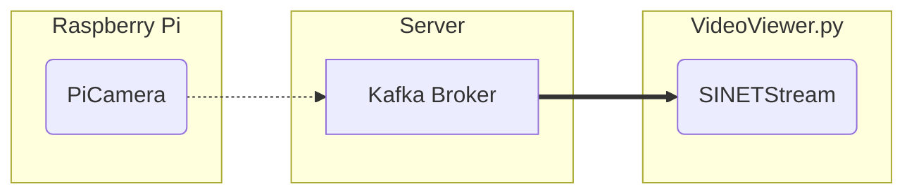

# Display Images in the Broker

Images sent from Raspberry Pi and processed by OpenPose/YOLO are temporarily stored in the Kafka broker on the server. This section shows how to run `VideoViwer.py`, which displays the image stream from the Kafka broker on the client.



## 1. Preparation

### 1.1. Prerequisites

The following are the prerequisites for running the image stream viewer `VideoViwer.py`.

* OS
  * Linux + X11
  * Windows
  * macOS
* Python
  * 3.7 or later

The Kafka broker, which is the destination for the image stream, must also be available. The Kafka broker must be pre-built with one of the following configurations.

* [VideoStreaming/Server/Kafka-OpenPose](../Server/Kafka-OpenPose/README.en.md)
* [VideoStreaming/Server/Kafka-YOLO](../Server/Kafka-YOLO/README.en.md)
* [option/Server/Kafka](../../option/Server/Kafka/README.en.md)

### 1.2. Installing the Library

Install the Python libraries that ``VideoViewer.py`` uses:

```console
pip install -U --user sinetstream-kafka sinetstream-type-image
```

> If you get an error because of conflicts with libraries you have already installed, use [venv](https://docs.python.org/ja/3/library/venv.html) or [pipenv](https://github.com/pypa/pipenv). Also, the `pip` command may be `pip3` in some environments. Replace it as necessary.

### 1.3. Configuration File

In `VideoViewer.py`, images are retrieved from the Kafka broker using the [SINETStream](https://www.sinetstream.net/) library. SINETStream requires parameters such as the address of the accessing broker, topic name, etc. to be described in the configuration file `.sinetstream_config.yml`. An example of the configuration file is shown below.

```yaml
camera:
  topic: sinetstream.image.camera
  brokers: kafka.example.org:9092
  type: kafka
  group_id: video-viewer-camera
  consistency: AT_LEAST_ONCE
```

Modify the values of `brokers` and `topic` to match your environment. See [SINETStream - Configuration File](https://www.sinetstream.net/docs/userguide/config.html) for details on how to write `.sinetstream_config.yml`, including how to specify other parameters.

## 2. Running the Viewer

Here is how to specify the command line arguments for ``VideoViewer.py``.

```console
usage: VideoViewer.py -s <service name> [-T <window title>]
  -s/--service  Service name
  -T/--title    Viewer window title
```

The service name specified in ``-s`` is a required field. The SINETStream configuration file `.sinetstream_config.yml` can contain multiple parameter sets. The identifier of each parameter set is called the service name in SINETStream. The service name is described as a key in the top-level map of the configuration file. For example, the example configuration file [example_sinetstream_config.yml](example_sinetstream_config.yml) in this directory describes three parameter sets and the service names are `camera`, `openpose`, and `yolo`.
