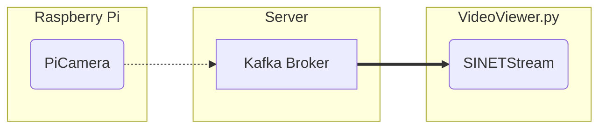

# ブローカの画像を表示する

Raspberry Pi から送信した画像や OpenPose/YOLO で処理された画像はサーバの Kafka ブローカに一時的に格納されています。ここでは Kafka ブローカの画像ストリームをクライアントで表示する `VideoViwer.py` の実行手順を示します。



## 1. 準備

### 1.1. 前提条件

画像ストリームビューア `VideoViwer.py` を実行するための前提条件を以下に示します。

* OS
  * Linux + X11
  * Windows
  * macOS
* Python
  * 3.7 以降

また画像ストリームの取得先となる Kafka ブローカが利用可能な状態になっている必要があります。以下に示すいずれかの構成でKafkaブローカを事前に構築してください。

* [VideoStreaming/Server/Kafka-OpenPose](../Server/Kafka-OpenPose/README.md)
* [VideoStreaming/Server/Kafka-YOLO](../Server/Kafka-YOLO/README.md)
* [option/Server/Kafka](../../option/Server/Kafka/README.md)

### 1.2. ライブラリのインストール

`VideoViewer.py`が利用する Python ライブラリをインストールします。

```console
pip install -U --user sinetstream-kafka sinetstream-type-image
```

> 既にインストールしているライブラリとconflictしてしまいエラーとなる場合は [venv](https://docs.python.org/ja/3/library/venv.html) や [pipenv](https://github.com/pypa/pipenv) などの仮想環境の利用を検討してください。また環境によっては `pip` コマンドは `pip3` となっていることがあります。必要に応じて読み替えて下さい。

### 1.3. 設定ファイル

`VideoViewer.py`では[SINETStream](https://www.sinetstream.net/)ライブラリを利用して Kafka ブローカから画像を取得します。SINETStreamではアクセスするブローカのアドレス、トピック名などのパラメータを設定ファイル`.sinetstream_config.yml`に記述しておく必要があります。設定ファイルの記述例を以下に示します。

```yaml
camera:
  topic: sinetstream.image.camera
  brokers: kafka.example.org:9092
  type: kafka
  group_id: video-viewer-camera
  consistency: AT_LEAST_ONCE
```

`brokers` と `topic` の値を実行環境に合せて修正してください。他のパラメータの指定方法など `.sinetstream_config.yml` の記述方法の詳細については [SINETStream - 設定ファイル](https://www.sinetstream.net/docs/userguide/config.html) を参照してください。

## 2. ビューアの実行

`VideoViewer.py`のコマンドライン引数の指定方法を以下に示します。

```console
usage: VideoViewer.py -s <service name> [-T <window title>]
  -s/--service サービス名
  -T/--title   ビューアのウィンドウタイトル
```

`-s` に指定するサービス名は必須項目となります。SINETStreamの設定ファイル `.sinetstream_config.yml` には複数のパラメータセットを記述することができます。それぞれのパラメータセットの識別子をSINETStreamではサービス名と呼んでいます。サービス名は設定ファイルのトップレベルのマップのキーとして記述されています。例えば、このディレクトリにある設定ファイルの記述例 [example_sinetstream_config.yml](example_sinetstream_config.yml) には３つのパラメータセットが記述されており、サービス名は `camera`, `openpose`, `yolo` となっています。
