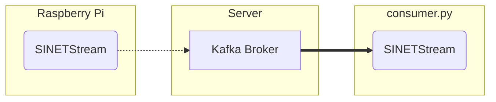

# Display text data sent to the broker

Sensor readings and other data sent from the Raspberry Pi are temporarily stored in the Kafka broker on the server. Here is the procedure for running `consumer.py`, which displays the text data sent to the Kafka broker on the client.



## 1. Preparation

### 1.1. Prerequisites

The following are the prerequisites for running `consumer.py`.

* Python
  * Python 3.8 or later

The Kafka broker from which the text data will be retrieved must be available. Please pre-build the Kafka broker with one of the following configurations.

* [option/Server/Kafka](../../../Server/Kafka/README.en.md)
* [NumericalSensorData/Server/Kafka-Grafana](../../../../NumericalSensorData/Server/Kafka-Grafana/README.en.md)
* [NumericalSensorData/Server/Kafka-Zabbix](../../../../NumericalSensorData/Server/Kafka-Zabbix/README.en.md)

### 1.2. Library Installation

Install the Python libraries used by ``consumer.py``.

```console
pip install -U --user sinetstream-kafka sinetstream-mqtt
```

> If you get an error because of conflicts with libraries you have already installed, you can use [venv](https://docs.python.org/ja/3/library/venv.html) or [pipenv](https://github.com/pypa/pipenv). Also, the `pip` command may be `pip3` in some environments. Replace it as necessary.

### 1.3. Configuration Files

In `consumer.py`, we use the [SINETStream](https://www.sinetstream.net/) library to retrieve sensor data from the Kafka broker. SINETStream requires parameters such as the address of the message brokers to be accessed (brokers), topic name (topic) and type (type) to be described in the configuration file `.sinetstream_config.yml`. An example of the configuration file is shown below.

```yaml
sensors:
  topic: sinetstream.sensor
  brokers: kafka.example.org:9092
  type: kafka
  consistency: AT_LEAST_ONCE
  group_id: text-consumer-001
```

Modify the values of `brokers` and `topic` to match your environment. See [SINETStream - Configuration File](https://www.sinetstream.net/docs/userguide/config.html) for details on how to write `.sinetstream_config.yml`, including how to specify other parameters.

> An example file of `.sinetstream_config.yml` can be found in [example_sinetstream_config.yml](example_sinetstream_config.yml). Use it as a template.

## 2. Execution

Here is how to specify the command line arguments for ``consumer.py``.

```console
usage: consumer.py [-s <service name>] [-c <config name>]
  -s/--service  Service name
  -c/--config   Config name
```

`-s` specifies the service name. The SINETStream configuration file `.sinetstream_config.yml` can contain multiple parameter sets. The identifier of each parameter set is called the service name in SINETStream. The service name is described as a key in the top-level map of the configuration file. For example, the service name in the example configuration file description [example_sinetstream_config.yml](example_sinetstream_config.yml) in this directory is `sensors`.

If you want to use a config server without using a local file configuration file, specify the config name with `-c`.
