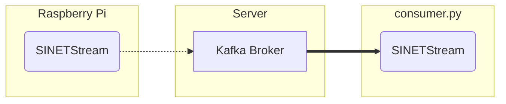

# ブローカに送られたテキストデータを表示する

Raspberry Pi から送信したセンサーの測定値などはサーバの Kafka ブローカに一時的に格納されています。ここでは Kafka ブローカに送られたテキストデータをクライアントで表示する `consumer.py` の実行手順を示します。


<!--

-->

## 1. 準備

### 1.1. 前提条件

`consumer.py` を実行するための前提条件を以下に示します。

* Python
  * 3.7 以降

テキストデータの取得先となる Kafka ブローカが利用可能な状態になっている必要があります。以下に示すいずれかの構成でKafkaブローカを事前に構築してください。

* [option/Server/Kafka](../../../Server/Kafka/README.md)
* [NumericalSensorData/Server/Kafka-Grafana](../../../../NumericalSensorData/Server/Kafka-Grafana/README.md)
* [NumericalSensorData/Server/Kafka-Zabbix](../../../../NumericalSensorData/Server/Kafka-Zabbix/README.md)

### 1.2. ライブラリのインストール

`consumer.py`が利用する Python ライブラリをインストールします。

```console
$ pip install -U --user sinetstream-kafka sinetstream-mqtt
```

> 既にインストールしているライブラリとconflictしてしまいエラーとなる場合は [venv](https://docs.python.org/ja/3/library/venv.html) や [pipenv](https://github.com/pypa/pipenv) などの仮想環境の利用を検討してください。また環境によっては `pip` コマンドは `pip3` となっていることがあります。必要に応じて読み替えて下さい。

### 1.3. 設定ファイル

`consumer.py`では[SINETStream](https://www.sinetstream.net/)ライブラリを利用して Kafka ブローカからセンサーデータを取得します。SINETStreamではアクセスするメッセージブローカのアドレス(brokers)、トピック名(topic)、タイプ(type)などのパラメータを設定ファイル`.sinetstream_config.yml`に記述しておく必要があります。設定ファイルの記述例を以下に示します。

```yaml
sensors:
  topic: sinetstream.sensor
  brokers: kafka.example.org:9092
  type: kafka
  consistency: AT_LEAST_ONCE
  group_id: text-consumer-001
```

`brokers` と `topic` の値を実行環境に合せて修正してください。他のパラメータの指定方法など `.sinetstream_config.yml` の記述方法の詳細については [SINETStream - 設定ファイル](https://www.sinetstream.net/docs/userguide/config.html) を参照してください。

> `.sinetstream_config.yml` の記述例となるファイルが [example_sinetstream_config.yml](example_sinetstream_config.yml) にあります。テンプレートとして利用してください。

## 2. 実行

`consumer.py`のコマンドライン引数の指定方法を以下に示します。

```console
usage: consumer.py [-s <service name>] [-c <config name>]
  -s/--service サービス名
  -c/--config  コンフィグ名
```

`-s` でサービス名を指定します。SINETStreamの設定ファイル `.sinetstream_config.yml` には複数のパラメータセットを記述することができます。それぞれのパラメータセットの識別子をSINETStreamではサービス名と呼んでいます。サービス名は設定ファイルのトップレベルのマップのキーとして記述されています。例えば、このディレクトリにある設定ファイルの記述例 [example_sinetstream_config.yml](example_sinetstream_config.yml) のサービス名は`sensors`になります。

ローカルファイルの設定ファイルを使わずに、コンフィグサーバを利用する場合は`-c`でコンフィグ名を指定してください。
