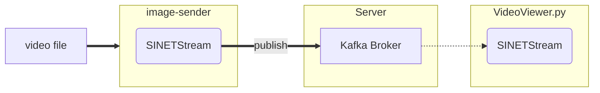

# 動画から切り出した画像をサーバに送信する

動画ファイルから切り出した画像をサーバに送信する環境を構築する手順を示します。



## 1. 準備

### 1.1. 前提条件

`image-sender` を実行するための前提条件を以下に示します。

* Python
  * 3.8 以降

また画像ストリームの送信先となる Kafka ブローカが利用可能な状態になっている必要があります。以下に示すいずれかの構成でKafkaブローカを事前に構築してください。

* [option/Server/Kafka](../../../Server/Kafka/README.md)
* [VideoStreaming/Server/Kafka-OpenPose](../../../../VideoStreaming/Server/Kafka-OpenPose/README.md)
* [VideoStreaming/Server/Kafka-YOLO](../../../../VideoStreaming/Server/Kafka-YOLO/README.md)

### 1.2. ライブラリのインストール

`image-sender`が利用する Python ライブラリをインストールします。

```console
pip install -U --user sinetstream-kafka sinetstream-type-image
```

> 既にインストールしているライブラリとconflictしてしまいエラーとなる場合は [venv](https://docs.python.org/ja/3/library/venv.html) や [pipenv](https://github.com/pypa/pipenv) などの仮想環境の利用を検討してください。また環境によっては `pip` コマンドは `pip3` となっていることがあります。必要に応じて読み替えて下さい。

### 1.3. 設定ファイル

`image-sender`では[SINETStream](https://www.sinetstream.net/)ライブラリを利用して Kafka ブローカへと画像を送信します。SINETStreamではアクセスするブローカのアドレス、トピック名などのパラメータを設定ファイル`.sinetstream_config.yml`に記述しておく必要があります。設定ファイルの記述例を以下に示します。

```yaml
video:
  topic: sinetstream.image.video
  brokers: kafka.example.org:9092
  type: kafka
  consistency: AT_LEAST_ONCE
```

`brokers` と `topic` の値を実行環境に合せて修正してください。他のパラメータの指定方法など `.sinetstream_config.yml` の記述方法の詳細については [SINETStream - 設定ファイル](https://www.sinetstream.net/docs/userguide/config.html) を参照してください。

## 2. 実行

`image-sender`のコマンドライン引数の指定方法を以下に示します。

```console
usage: image-sender -i INPUT_VIDEO [-s SERVICE] [-r FRAME_RATE] [-R SAMPLE_RATE]
  -i/--input-video    動画ファイル名
  -s/--service        サービス名
  -r/--frame-rate     フレームレート
  -R/--sampling-rate  サンプリングレート
```

`-i`に指定する入力ビデオファイル名は必須項目となります。

`-s`に指定するサービス名のデフォルト値は `video`となります。これは SINETStream設定ファイルの記述例 [example_sinetstream_config.yml](example_sinetstream_config.yml) にあるサービス名に合せてあります。

`-r`で指定するフレームレートは Kafka ブローカに画像を送信するレートになります。デフォルトでは入力の動画ファイルのフレームレートと同じ値となります。

`-R`で指定するサンプリングレートは、入力動画ファイルから画像を切り出す際にどの程度間引くかの指定となります。デフォルトでは動画に含まれるすべてのフレームを画像として切り出しKafkaブローカに送信します。
