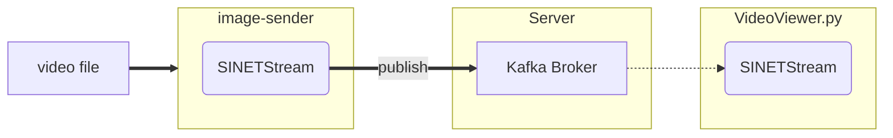

# Send images cut from a video file to a server

The following is the procedure for building an environment to send images cut from a video file to a server.


<!--

-->

## 1. Preparation

### 1.1. Prerequisites

The following are the prerequisites for running `image-sender`.

* Python
  * 3.7 or later

The Kafka broker to which the image stream will be sent must be available. Please pre-build the Kafka broker with one of the following configurations.

* [option/Server/Kafka](../../../Server/Kafka/README_en.md)
* [VideoStreaming/Server/Kafka-OpenPose](../../../../VideoStreaming/Server/Kafka-OpenPose/README_en.md)
* [VideoStreaming/Server/Kafka-YOLO](../../../../VideoStreaming/Server/Kafka-YOLO/README_en.md)

### 1.2. Library installation

Install the Python libraries that ``image-sender`` uses.

```console
$ pip install -U --user sinetstream-kafka sinetstream-type-image
```

> If you get an error because of conflicts with libraries you have already installed, use [venv](https://docs.python.org/ja/3/library/venv.html) or [pipenv](https://github.com/pypa/pipenv). Also, the `pip` command may be `pip3` in some environments. Replace it as necessary.

### 1.3. Configuration files

The `image-sender` uses the [SINETStream](https://www.sinetstream.net/) library to send images to the Kafka broker. SINETStream requires parameters such as the address of the accessing broker, topic name, etc. to be described in the configuration file `.sinetstream_config.yml`. An example of the configuration file is shown below.

```yaml
video:
  topic: sinetstream.image.video
  brokers: kafka.example.org:9092
  type: kafka
  consistency: AT_LEAST_ONCE
```

Modify the values of `brokers` and `topic` to match your environment. See [SINETStream - Configuration File](https://www.sinetstream.net/docs/userguide/config.html) for details on how to write `.sinetstream_config.yml`, including how to specify other parameters.

## 2. Execution

Here is how to specify the command line arguments for ``image-sender``.

```console
usage: image-sender -i INPUT_VIDEO [-s SERVICE] [-r FRAME_RATE] [-R SAMPLE_RATE]
  -i/--input-video    Video file name
  -s/--service        Service name
  -r/--frame-rate     Frame rate
  -r/--sampling-rate  Sampling rate
```

The input video file name specified in `-i` is a required field.

The default value of the service name specified in ``-s`` is ``video``. This matches the service name in the SINETStream configuration file description example [example_sinetstream_config.yml](example_sinetstream_config.yml).

The frame rate specified by `-r` is the rate at which images are sent to the Kafka broker. By default, it is the same as the frame rate of the input video file.

The sampling rate specified by `-R` specifies how much to thin out the image from the input video file. By default, all frames in the video are cropped and sent to the Kafka broker as an image.