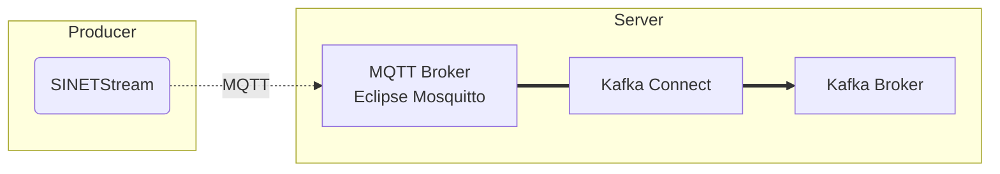

# Forward MQTT messages to the Kafka broker

Forward messages sent to the MQTT broker using SINETStream to the Kafka broker. Use [Kafka Connect](https://kafka.apache.org/documentation/#connect) to forward messages.

## 1. Configuration



### 1.1. Version

The version of each software component is shown below.

| Software                                                     | Version |
|--------------------------------------------------------------|---------|
| [Apache Kafka](https://kafka.apache.org/)                    | 3.4.0   |
| [Eclipse Mosquitto](https://mosquitto.org/)                  | 2.0.15  |
| [Stream Reactor](https://github.com/lensesio/stream-reactor) | 3.0.1   |

### 1.2. Prerequisites

The Kafka broker must be available. Please refer to the following procedures and others to build the Kafka broker.

* [option/Server/Kafka](../Kafka/README.en.md)

Use [Docker](https://www.docker.com/) and [Docker Compose](https://github.com/docker/compose) to run Kafka Connector and Mosquitto (MQTT broker). Please refer to the following links for installation.

* [Install Docker Engine
  * [Install Docker Engine on CentOS](https://docs.docker.com/engine/install/centos/)
  * [Install Docker Engine on Ubuntu](https://docs.docker.com/engine/install/ubuntu/)
  * [Install Docker Engine on Debian](https://docs.docker.com/engine/install/debian/)
* Docker Compose
  * [Docker Compose v2 - Where to get Docker Compose](https://github.com/docker/compose#linux)

Docker Engine requires at least version 19.03.0 and Docker Compose requires at least 1.27.1.

## 2. Building the MQTT broker

Build the MQTT broker using the container of [Eclipse Mosquitto](https://mosquitto.org/), which serves as the MQTT broker. The configuration of the MQTT broker to be built here is shown below.

* Port number
  * 1883
* No authentication
* No encryption of communication channel

### 2.1. Deploying Materials

Place the files in the subdirectory `mqtt/` on the node where you want to run the MQTT broker.

### 2.2. Executing the container

Execute the following command on the node where the MQTT broker is to be executed.

```console
docker compose up -d
```

Check the status of the container, making sure that the STATUS is ``running``.

```console
$ docker compose ps 
NAME                    COMMAND                  SERVICE             STATUS              PORTS
mosquitto-mosquitto-1   "/docker-entrypoint.…"   mosquitto           running             0.0.0.0:1883->1883/tcp, :::1883->1883/tcp
```

If you specify a hostname (not an IP address) as the `BROKER_HOSTNAME` in the `.env` of the Kafka broker, Kafka Connect must be able to resolve the name of the host in its environment. If you specify a hostname that is not registered in DNS, etc. as `BROKER_HOSTNAME`, please make sure to enable name resolution for the Kafka broker by specifying [extra_hosts](https://docs.docker.com/compose/compose-file/compose-file-v3/#extra_hosts) in `docker-compose.yml`. An example of specifying extra_hosts in `docker-compose.yml` is shown below with the modified difference. In this example, an entry for the Kafka broker `kafka.example.org` with IP address `192.168.1.100` is registered in `extra_hosts`.

```diff
@@ -19,3 +19,5 @@ services:
       CONNECT_PLUGIN_PATH: /usr/share/java,/usr/share/confluent-hub-components,/usr/share/java/stream-reactor
     ports:
       - "${REST_PORT:-8083}:8083"
+    extra_hosts:
+      - "kafka.example.org:192.168.1.100"
```

### 2.3. Check Operation

You can confirm that the MQTT broker is available by running the test producer and consumer. For instructions on how to run each of the test programs, please review the procedures described in the links below.

* Producer
  * [NumericalSensorData/Sensor/template/README.en.md](../../../NumericalSensorData/Sensor/template/README.en.md)
* Consumer
  * [option/Consumer/NumericalSensorData/text-consumer/README.en.md](../../Consumer/NumericalSensorData/text-consumer/README.en.md)

However, please specify `mqtt` as the type (type) and the address of the MQTT broker as the address of the message broker (brokers) in the `.sinetstream_config.yml` configuration file for SINETStream. An example of a configuration file is shown below.

```yaml
sensors:
  topic: sinetstream.sensor
  brokers: mqtt.example.org:1883
  type: mqtt
  consistency: AT_LEAST_ONCE
```

## Building Kafka Connect

### 3.1. Deploying Materials

Place the files in the subdirectory `kafka-connect-mqtt/` on the node where you want to run Kafka Connect.

### 3.2. Parameter Settings

Set parameters as environment variables for the container. Create `.env` in the directory where you placed `docker-compose.yml` and write the parameters there. The parameters are listed in the following table.

|environment variable name|required|description|example|
|---|---|---|---|
|BROKER_HOSTNAME|&check;|Hostname of the Kafka broker|BROKER_HOSTNAME=kafka.example.org|
|KAFKA_TOPIC|&check;|Topic name of the Kafka broker to which you are forwarding|KAFKA_TOPIC=sinetstream.sensor|
|MQTT_URL|&check;|MQTT broker address|MQTT_URL=tcp://mqtt.example.org:1883|
|MQTT_TOPIC|-|Topic name of MQTT broker from which to forward<br>Default value: value specified in KAFKA_TOPIC|MQTT_TOPIC=sinetstream.sensor|
|MQTT_QOS|-|QoS specification for MQTT<br>Default value: 1|MQTT_QOS=1|
|REST_PORT|-|Kafka Connect REST API port number<br>Default value: 8083|REST_PORT=8083|

An example of `.env` description can be found in [kafka-connect-mqtt/example_dot_env](kafka-connect-mqtt/example_dot_env). Use it as a template for creating `.env`.

### 3.3. Running the Container

Run the following command on the node where you want to run Kafka Connect.

```console
docker compose up -d
```

Check the status of the container, making sure that the STATUS is ``running``.

```console
$ docker compose ps
NAME                                      COMMAND                  SERVICE              STATUS              PORTS
kafka-connect-mqtt-kafka-connect-mqtt-1   "/etc/confluent/dock…"   kafka-connect-mqtt   running (healthy)   0.0.0.0:8083->8083/tcp, :::8083->8083/tcp
```

After the container is started, it takes a few minutes for the Kafka Connect startup process to complete; STATUS is `running (starting)` during the Kafka Connect startup process, but becomes `running (healthy)` when the startup process is complete.

### 3.4. Registering Connectors

Register connectors according to the parameters set in `.env`. Run `register.sh` in the same directory as `docker-compose.yml`.

```console
. /register.sh
````

Running `register.sh` will register the following connectors.

* mqtt-source

You can check the status of connector registrations and tasks by running the Kafka Connect REST API.

```console
$ curl -s -X GET http://localhost:8083/connectors | jq .
[
  "mqtt-source"
]
$ curl -s -X GET http://localhost:8083/connectors/mqtt-source/tasks/0/status  | jq .
{
  "id": 0,
  "state": "RUNNING",
  "worker_id": "kafka-connect-mqtt:8083"
}
```

To change the ``.env`` parameters and re-register the connector, delete the already registered connector. To remove a connector, issue the following command.

```console
curl -s -X DELETE http://localhost:8083/connectors/mqtt-source
```

For more information on Kafka Connect's REST API, see [Connect REST Interface](https://docs.confluent.io/platform/current/connect/references/restapi.html).
