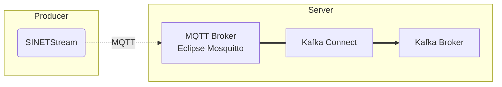

# Forward MQTT messages to the Kafka broker

Forward messages sent to the MQTT broker using SINETStream to the Kafka broker. Use [Kafka Connect](https://kafka.apache.org/documentation/#connect) to forward messages.

## 1. Configuration



### 1.1. Version

The version of each software component is shown below.

| Software                                                     | Version |
|--------------------------------------------------------------|---------|
| [Apache Kafka](https://kafka.apache.org/)                    | 3.4.0   |
| [Eclipse Mosquitto](https://mosquitto.org/)                  | 2.0.15  |
| [Stream Reactor](https://github.com/lensesio/stream-reactor) | 3.0.1   |

### 1.2. Prerequisites

Use [Docker](https://www.docker.com/) and [Docker Compose](https://github.com/docker/compose) to run Zookeeper, Kafka broker, Kafka Connector and Mosquitto (MQTT broker). Please refer to the following links for installation.

* [Install Docker Engine
  * [Install Docker Engine on CentOS](https://docs.docker.com/engine/install/centos/)
  * [Install Docker Engine on Ubuntu](https://docs.docker.com/engine/install/ubuntu/)
  * [Install Docker Engine on Debian](https://docs.docker.com/engine/install/debian/)
* Docker Compose
  * [Docker Compose v2 - Where to get Docker Compose](https://github.com/docker/compose#linux)

Docker Engine requires at least version 19.03.0 and Docker Compose requires at least 1.27.1.

## 2. Building and deploying the Zookeeper, Kafka broker, Kafka Connector and Mosquitto (MQTT broker)

### 2.1 General information about the MQTT broker

The MQTT broker uses [Eclipse Mosquitto](https://mosquitto.org/). The configuration of the MQTT broker to be built here is shown below.

* Port number
  * 1883
* No authentication
* No encryption of communication channel


### 2.2. Building and Executing the containers

Execute the following command.
```bash
docker compose up -d
```

### 2.3 Make sure containers are running
```bash
docker compose ps
```
Expected output
```text
NAME                     IMAGE                              COMMAND                  SERVICE             CREATED             STATUS                            PORTS
connect                  kafka-mqtt-connect                 "/etc/confluent/dock…"   connect             5 seconds ago       Up 3 seconds (health: starting)   0.0.0.0:8083->8083/tcp, :::8083->8083/tcp, 9092/tcp
kafka                    confluentinc/cp-kafka:latest       "/etc/confluent/dock…"   kafka               5 seconds ago       Up 3 seconds                      0.0.0.0:9092->9092/tcp, :::9092->9092/tcp, 0.0.0.0:29092->29092/tcp, :::29092->29092/tcp
kafka-mqtt-mosquitto-1   eclipse-mosquitto:2.0.15           "/docker-entrypoint.…"   mosquitto           5 seconds ago       Up 4 seconds                      0.0.0.0:1883->1883/tcp, :::1883->1883/tcp
zookeeper                confluentinc/cp-zookeeper:latest   "/etc/confluent/dock…"   zookeeper           5 seconds ago       Up 4 seconds                      2888/tcp, 0.0.0.0:2181->2181/tcp, :::2181->2181/tcp, 3888/tcp

```
Note that you must wait until container `connect` status switch from `(health: starting)` to `(healthy)`

Connections to the kafka broker are made using its hostname `kafka`

# 3 Registering Connectors: allow Kafka Connector to forward MQTT msg from MQTT-broker to Kafka-broker

Set key `"connect.mqtt.hosts"` in [mqtt-source-config.json](./mqtt-source-config.json) with the IP address of the MQTT-borker.
```bash
mqtt_broker_ip=$(docker inspect kafka-mqtt-mosquitto-1 | jq '.[0]["NetworkSettings"]["Networks"]["kafka-mqtt_default"]["IPAddress"]' | tr -d '"')
sed -i "/\"connect.mqtt.hosts\"/c\         \"connect.mqtt.hosts\": \"tcp://$mqtt_broker_ip:1883\"," mqtt-source-config.json
```
Send the configuration to the Kafka Connector
```bash
curl -s -X POST -H 'Content-Type: application/json' --data @mqtt-source-config.json http://localhost:8083/connectors | jq .
```
The output should be the content of the file [mqtt-source-config.json](./mqtt-source-config.json).
The IP (172.22.0.2) might be different.
```json
{
  "name": "source-mqtt",
  "config": {
    "connector.class": "com.datamountaineer.streamreactor.connect.mqtt.source.MqttSourceConnector",
    "tasks.max": "1",
    "connect.mqtt.hosts": "tcp://172.22.0.2:1883",
    "connect.mqtt.converter.throw.on.error": "true",
    "connect.mqtt.service.quality": "2",
    "connect.mqtt.kcql": "INSERT INTO kafka-topic SELECT * FROM mqtt-topic",
    "name": "source-mqtt"
  },
  "tasks": [],
  "type": "source"
}
```
- `http://localhost:8083` allows to read/write files in the container `connect` using [the kafka-connect REST API](https://developer.confluent.io/courses/kafka-connect/rest-api/)
- traffic from mqtt-topic `mqtt-topic` will be redirected to kafka-topic `kafka-topic`

### 4 Check Operation

## 4.1 Kafka connector

Check that the connector has been created
```bash
curl -s -X GET http://localhost:8083/connectors | jq .
```
Expected output
```
[
  "mqtt-source"
]
```

## 4.2 Check that messages are forwarded

### 4.2.1 Send MQTT messages to MQTT-broker

Start sending messages (`mqtt-topic` is the topic defined in [mqtt-source-config.json](./mqtt-source-config.json))

Note that `client.py` requires to install the python library `paho-mqtt` (e.g. using `pip install paho-mqtt`)

```bash
mqtt_broker_ip=$(docker inspect kafka-mqtt-mosquitto-1 | jq '.[0]["NetworkSettings"]["Networks"]["kafka-mqtt_default"]["IPAddress"]' | tr -d '"')
./client.py $mqtt_broker_ip mqtt-topic
```
Expected output
```text
[  setup  ] selected MQTT topic: mqtt-topic
PING 172.22.0.2 (172.22.0.2) 56(84) bytes of data.
64 bytes from 172.22.0.2: icmp_seq=1 ttl=64 time=0.038 ms

--- 172.22.0.2 ping statistics ---
1 packets transmitted, 1 received, 0% packet loss, time 0ms
rtt min/avg/max/mdev = 0.038/0.038/0.038/0.000 ms
[  ping   ] pinging 172.22.0.2...[telemetry] starting thread
PING 172.22.0.2 (172.22.0.2) 56(84) bytes of data.
64 bytes from 172.22.0.2: icmp_seq=1 ttl=64 time=0.026 ms

--- 172.22.0.2 ping statistics ---
1 packets transmitted, 1 received, 0% packet loss, time 0ms
rtt min/avg/max/mdev = 0.026/0.026/0.026/0.000 ms
...OK.
[  ping   ] sleeping for 119.25819000117056s
[  main   ] starting loop
[  main   ] telemetry ON
[telemetry] sending to `172.22.0.2' topic: `mqtt-topic'; payload: `iOc262KX9PeDXMqWUWFp14ff7vJ7Nj'
[telemetry] sleeping for 5.0s
[telemetry] sending to `172.22.0.2' topic: `mqtt-topic'; payload: `yraitkDqFOraBHFlTZKITib1RKNIHC'
...
```

### 4.2.2 Optional: make sure the mqtt broker receives the messages
```bash
mqttbroker_container_name="kafka-mqtt-mosquitto-1"
docker container exec -it $mqttbroker_container_name mosquitto_sub -t "#"
```

### 4.2.3 Make sure the kafka broker receives the messages
```bash
docker container exec kafka /bin/kafka-console-consumer --topic kafka-topic --from-beginning --bootstrap-server localhost:9092
```
Expected output
```text
[2023-12-20 07:31:09,417] WARN [Consumer clientId=console-consumer, groupId=console-consumer-18086] Error while fetching metadata with correlation id 2 : {kafka-topic=LEADER_NOT_AVAILABLE} (org.apache.kafka.clients.NetworkClient)
{"schema":{"type":"bytes","optional":false},"payload":"aU9jMjYyS1g5UGVEWE1xV1VXRnAxNGZmN3ZKN05q"}
{"schema":{"type":"bytes","optional":false},"payload":"eXJhaXRrRHFGT3JhQkhGbFRaS0lUaWIxUktOSUhD"}
{"schema":{"type":"bytes","optional":false},"payload":"YmtSNHA5VWlhVkJ0RzdycGVZS1VXYzJCTzZkWlln"}
...
```

# 5 Modify parameters of the connector
To change the parameters and re-register the connector, delete the already registered connector. To remove a connector, issue the following command.

```console
curl -s -X DELETE http://localhost:8083/connectors/mqtt-source
```
# 6 clean up 

## 6.1 Stop containers

```bash
docker compose stop
```

## 6.2 Remove containers
```bash
docker compose rm -f
```