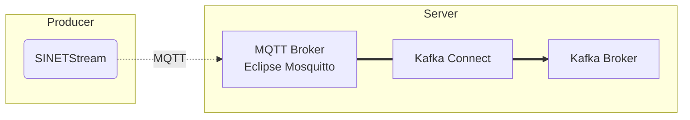

# MQTTのメッセージをKafkaブローカに転送する

SINETStreamを利用してMQTTブローカに送信されたメッセージをKafkaブローカに転送します。メッセージの転送には[Kafka Connect](https://kafka.apache.org/documentation/#connect)を利用します。

## 1. 構成



### 1.1. バージョン

各ソフトウェアコンポーネントのバージョンを以下に示します。

|ソフトウェア|バージョン|
|---|---|
|[Apache Kafka](https://kafka.apache.org/)|3.4.0|
|[Eclipse Mosquitto](https://mosquitto.org/)|2.0.15|
|[Stream Reactor](https://github.com/lensesio/stream-reactor)|3.0.1|

### 1.2. 前提条件

Kafkaブローカが利用可能な状態になっている必要があります。以下に示す手順などを参照してKafkaブローカを構築してください。

* [option/Server/Kafka](../Kafka/README.md)

Kafka Connector, Mosquitto(MQTTブローカ)の実行には [Docker](https://www.docker.com/), [Docker Compose](https://github.com/docker/compose)を利用します。以下のリンク先を参考にインストールを行ってください。

* Docker Engine
  * [Install Docker Engine on CentOS](https://docs.docker.com/engine/install/centos/)
  * [Install Docker Engine on Ubuntu](https://docs.docker.com/engine/install/ubuntu/)
  * [Install Docker Engine on Debian](https://docs.docker.com/engine/install/debian/)
* Docker Compose
  * [Docker Compose v2 - Where to get Docker Compose](https://github.com/docker/compose#linux)

Docker Engine は 19.03.0 以上、Docker Compose は 1.27.1 以上が必要となります。

## 2. MQTTブローカの構築

MQTTブローカとなる[Eclipse Mosquitto](https://mosquitto.org/)のコンテナを利用してMQTTブローカを構築します。ここ構築するMQTTブローカの構成を以下に示します。

* ポート番号
  * 1883
* 認証なし
* 通信路の暗号化なし

### 2.1. 資材の配置

サブディレクトリ`mqtt/`にあるファイルをMQTTブローカを実行するノードに配置してください。

### 2.2. コンテナの実行

MQTTブローカを実行するノードで以下のコマンドを実行してください。

```console
docker compose up -d
```

コンテナの状態を確認します。STATUSが`running`となっていることを確認してください。

```console
$ docker compose ps 
NAME                    COMMAND                  SERVICE             STATUS              PORTS
mosquitto-mosquitto-1   "/docker-entrypoint.…"   mosquitto           running             0.0.0.0:1883->1883/tcp, :::1883->1883/tcp
```

Kafkaブローカの`.env`に指定した`BROKER_HOSTNAME`の値が（IPアドレスでない）ホスト名の場合、Kafka Connectの環境からそのホストの名前解決が可能である必要があります。DNSなどに登録していないホスト名を`BROKER_HOSTNAME`に指定した場合は`docker-compose.yml`の[extra_hosts](https://docs.docker.com/compose/compose-file/compose-file-v3/#extra_hosts)の指定などを利用してKafkaブローカの名前解決が可能なようにしてください。`docker-compose.yml`にextra_hostsを指定する場合の例を変更差分で以下に示します。この例では Kafkaブローカ `kafka.example.org` のIPアドレス `192.168.1.100`のエントリをextra_hostsに登録しています。

```diff
@@ -19,3 +19,5 @@ services:
       CONNECT_PLUGIN_PATH: /usr/share/java,/usr/share/confluent-hub-components,/usr/share/java/stream-reactor
     ports:
       - "${REST_PORT:-8083}:8083"
+    extra_hosts:
+      - "kafka.example.org:192.168.1.100"
```

### 2.3. 動作確認

テスト用のプロデューサとコンシューマを実行することで MQTT ブローカが利用可能な状態になっていることを確認することができます。それぞれのテストプログラムの実行方法については以下のリンク先に記された手順を確認してください。

* プロデューサ
  * [NumericalSensorData/Sensor/template/README.md](../../../NumericalSensorData/Sensor/template/README.md)
* コンシューマ
  * [option/Consumer/NumericalSensorData/text-consumer/README.md](../../Consumer/NumericalSensorData/text-consumer/README.md)

ただし、SINETStreamの設定ファイル`.sinetstream_config.yml`に記述するタイプ(type)には`mqtt`を指定し、メッセージブローカのアドレス(brokers)にはMQTTブローカのアドレスを指定して下さい。設定ファイルの記述例を以下に示します。

```yaml
sensors:
  topic: sinetstream.sensor
  brokers: mqtt.example.org:1883
  type: mqtt
  consistency: AT_LEAST_ONCE
```

## 3. Kafka Connect の構築

### 3.1. 資材の配置

サブディレクトリ`kafka-connect-mqtt/`にあるファイルをKafka Connectを実行するノードに配置してください。

### 3.2. パラメータの設定

コンテナの環境変数としてパラメータの設定を行います。`docker-compose.yml`を配置したディレクトリに `.env` を作成し、そこでパラメータの記述を行ってください。パラメータを次表に示します。

|環境変数名|必須|説明|指定例|
|---|---|---|---|
|BROKER_HOSTNAME|&check;|Kafkaブローカのホスト名|BROKER_HOSTNAME=kafka.example.org|
|KAFKA_TOPIC|&check;|転送先となるKafkaブローカのトピック名|KAFKA_TOPIC=sinetstream.sensor|
|MQTT_URL|&check;|MQTTブローカアドレス|MQTT_URL=tcp://mqtt.example.org:1883|
|MQTT_TOPIC||転送元となるMQTTブローカのトピック名<br>デフォルト値: KAFKA_TOPICに指定された値|MQTT_TOPIC=sinetstream.sensor|
|MQTT_QOS||MQTTのQoS指定<br>デフォルト値: 1|MQTT_QOS=1|
|REST_PORT||Kafka Connect REST APIのポート番号<br>デフォルト値: 8083|REST_PORT=8083|

`.env`の記述例が [kafka-connect-mqtt/example_dot_env](kafka-connect-mqtt/example_dot_env) にあります。`.env`を作成する際のテンプレートとして利用してください。

### 3.3. コンテナの実行

Kafka Connectを実行するノードで以下のコマンドを実行してください。

```console
docker compose up -d
```

コンテナの状態を確認します。STATUSが`running`となっていることを確認してください。

```console
$ docker compose ps
NAME                                      COMMAND                  SERVICE              STATUS              PORTS
kafka-connect-mqtt-kafka-connect-mqtt-1   "/etc/confluent/dock…"   kafka-connect-mqtt   running (healthy)   0.0.0.0:8083->8083/tcp, :::8083->8083/tcp
```

コンテナが起動してからKafka Connectの起動処理が完了するまでに数分程度かかります。Kafka Connect の起動処理中は STATUS が `running (starting)`となっていますが、起動処理が完了すると`running (health)`となります。

### 3.4. コネクタの登録

`.env`に設定されているパラメータに応じたコネクタを登録します。`docker-compose.yml`と同じディレクトリにある `register.sh`を実行してください。

```console
./register.sh
```

`register.sh` を実行すると次のコネクタが登録されます。

* mqtt-source

コネクタの登録状態やタスクの状態は Kafka Connect のREST API を実行することで確認できます。

```console
$ curl -s -X GET http://localhost:8083/connectors | jq .
[
  "mqtt-source"
]
$ curl -s -X GET http://localhost:8083/connectors/mqtt-source/tasks/0/status  | jq .
{
  "id": 0,
  "state": "RUNNING",
  "worker_id": "kafka-connect-mqtt:8083"
}
```

`.env`のパラメータを変更してコネクタを登録しなおす場合は、登録済のコネクタを削除してください。コネクタを削除するには以下のコマンドを実行してください。

```console
curl -s -X DELETE http://localhost:8083/connectors/mqtt-source
```

Kafka ConnectのREST APIの詳細については[Connect REST Interface](https://docs.confluent.io/platform/current/connect/references/restapi.html)を参照してください。
