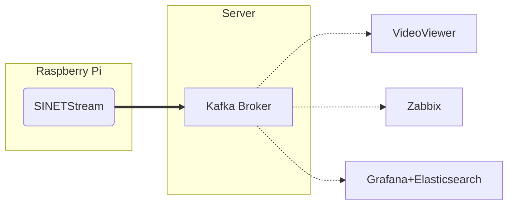

# Kafka ブローカの構築

Raspberry Piのカメラやセンサーなどで取得したデータを、ViewerやZabbix/Grafanaなどの可視化ツールとの間で受け渡す役割を果たす[Kafkaブローカ](https://kafka.apache.org/)を構築します。



## 1. 構成について

ここで示す手順で構築されるKafkaブローカは以下の構成となっています。

* 通信路の暗号化なし
* ブローカでの認証なし
* 1ノード構成

## 2. 準備

### 2.1. Docker

Kafkaブローカは Docker コンテナで実行します。そのため Docker Engine などを事前にインストールしておく必要があります。

#### 2.1.1. Docker Engine

「[Install Docker Engine](https://docs.docker.com/engine/install/)」などを参考に Docker Engine のインストールを行ってください。Dockerのバージョンは 19.03.0 以上が必要となります。

#### 2.1.2. Docker Compose

複数のコンテナをまとめて管理するために[Docker Compose](https://github.com/docker/compose)を利用します。Docker Composeはコンテナの起動パラメータなどを設定ファイル`docker-compose.yml`に記述することでコンテナの管理を容易にするツールです。「[Where to get Docker Compose - Linux](https://github.com/docker/compose#linux)」などを参考にインストールを行ってください。Docker Compose のバージョンは 1.27.1 以上が必要となります。

### 2.2. 資材の配置

このディレクトリにあるファイルをKafkaブローカを構築するノードに配置してください。

## 3. パラメータの設定

Kafkaブローカのパラメータはコンテナの環境変数として設定を行います。コンテナの環境変数は`docker-compose.yml`と同じディレクトリに `.env` を作成し、そのファイルの記述により設定が行われます。

### 3.1. フォーマット

`.env` は各行が「（パラメータ名）=（値）」の形式になっているファイルとなります。記述例を以下に示します。

```bash
BROKER_HOSTNAME=kafka.example.org
KAFKA_MESSAGE_MAX_BYTES=20971520
```

この例では`BROKER_HOSTNAME`, `KAFKA_MESSAGE_MAX_BYTES` というパラメータに対して、それぞれ `kafka.example.org`, `20971520` を値として指定しています。

`.env`のフォーマットの詳細については[Docker Compose/Environment File#Syntax rules](https://docs.docker.com/compose/env-file/#syntax-rules)を参照してください。

### 3.2. BROKER_HOSTNAME

KAFKAブローカのアドレスとしてクライアントに知らせるホスト名またはIPアドレスを指定します。

クライアントからはここで指定した値でアクセスできる必要があります。IPアドレスを指定した場合は、そクライアントからそのIPアドレスでアクセス可能となっている必要があります。ホスト名を指定した場合はDNSまたはクライアント環境の `/etc/hosts` などで名前解決できアクセス可能となっている必要があります。

### 3.3. Kafka ブローカのプロパティ

Kafkaブローカに対する設定パラメータは [Kafka Documentation - 3.1 Broker Configs](https://kafka.apache.org/documentation/#brokerconfigs) に記されているものを指定することができます。ここで利用するConfluentのKafkaコンテナでは、コンテナの環境変数によりKafkaブローカのプロパティを設定することができます。この際に指定する環境変数名は、以下のようなルールでKafkaブローカに設定するプロパティ名を変換したものになります。

* 環境変数名のプレフィックスに `KAFKA_` をつける
* 全て大文字に変換する
* ピリオド `.` を アンダースコア `_` に置き換える
* ハイフン `-` を ２文字のアンダースコア `__` に置き換える
* アンダースコア`_` を ３文字のアンダースコア `___` に置き換える

例えば、プロパティ`message.max.bytes`は環境変数`KAFKA_MESSAGE_MAX_BYTES`として指定します。

環境変数の指定方法の詳細については[Confluent Kafka configuration](https://docs.confluent.io/platform/current/installation/docker/config-reference.html#confluent-ak-configuration)を参照してください。

## 4. 実行

`docker-compose.yml`を配置したディレクトリで以下のコマンドを実行してください。

```console
docker compose up -d
```

> ここでは Docker Compose v2 の実行例を示しています。v1を利用している場合は`docker compose`のかわりに`docker-compose`を用いてください。

コンテナの状態を確認します。

```console
$ docker compose ps 
NAME                COMMAND                  SERVICE             STATUS              PORTS
broker              "/etc/confluent/dock…"   broker              running             
zookeeper           "/etc/confluent/dock…"   zookeeper           running             
```

`broker`コンテナ`zookeeper`コンテナの状態(STATUS)がいずれも`running`となっていることを確認してください。

STATUSの値が`running`となっていない場合はコンテナのログなどを確認することによりエラーの原因を調査してください。

```console
docker compose logs
```
